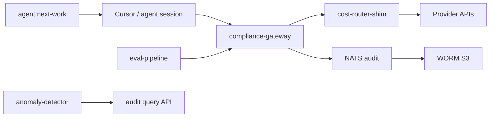

# Agent topology — gtcx-infrastructure

Named AI engines with distinct responsibilities (SIGNAL L2→L3 criterion #1).

## Engines

| Engine                     | Package / path                              | Responsibility                                              | Deploy surface   |
| -------------------------- | ------------------------------------------- | ----------------------------------------------------------- | ---------------- |
| **compliance-gateway**     | `03-platform/tools/compliance-gateway/`     | Server-side LLM inference, compliance queries, signed audit | staging/prod EKS |
| **compliance-gateway-mcp** | `03-platform/tools/compliance-gateway-mcp/` | Read-only MCP tool discovery for agents                     | staging          |
| **eval-pipeline**          | `03-platform/tools/eval-pipeline/`          | Model benchmarks + injection red-team                       | CI + manual      |
| **anomaly-detector**       | `03-platform/tools/anomaly-detector/`       | Ops rules on audit/query patterns                           | staging CronJob  |

## Control plane (criterion #2)

| Component                               | Role                               |
| --------------------------------------- | ---------------------------------- |
| `pnpm agent:next-work`                  | Protocol 22 story selection        |
| `.baseline/launch-focus.json`           | Session launch focus               |
| NATS `gtcx.audit.*`                     | Event bus for signed audit records |
| baseline-os `cost-route` / `cost-stats` | LLM routing + spend SoR            |

## Trace correlation (INF-007)

Every coordination handoff carries `trace_id` (UUID). Gateway cost-router emits `gtcx.trace_id` span marker when `GTCX_TRACE_ID` is set.

Evidence: `01-docs/05-audit/evidence/signal-trace-pilot-latest.json`

## RACI

| Engine             | Accountable                      | Responsible     | Consulted                |
| ------------------ | -------------------------------- | --------------- | ------------------------ |
| compliance-gateway | @amanianai (infra Human Lead)    | platform agents | compliance-os, protocols |
| eval-pipeline      | AI reliability owner (protocols) | infra agents    | security-engineer        |
| anomaly-detector   | @amanianai                       | infra agents    | compliance-officer       |
