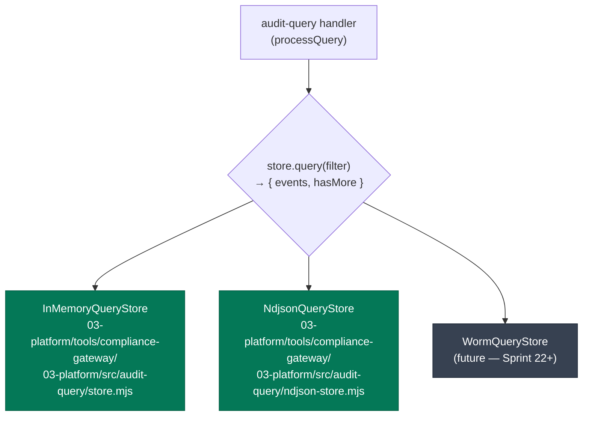

# ADR-022: Pluggable Audit-Query Store with Three Backends

## Status

Accepted

## Date

2026-05-25

## Context

The `POST /audit/query` endpoint (MOB-W1-004, per gtcx-infrastructure#52) needs to read ingested audit events back out for the web portal's audit-review page and the future MCP `query_audit` tool. Three constraints shape the backend choice:

1. **Production reality:** Audit events are written to WORM S3 as NDJSON batches by the `audit-flush` sidecar. Reading those batches at query-time requires AWS S3 access (`GetObject` + range reads), which is gated on EXT-003 (audit-flush container image) and the `feat/audit-bundles-verifier` PR (#56) landing in production.

2. **Pilot timing:** The W4 Zimbabwe go-live (Sprint MOB-W1) needs `/audit/query` working in staging before #56 + EXT-003 land. The portal team needs to wire `AUDIT_HOST` and remove the "DEMO DATA" banner.

3. **Test ergonomics:** Unit tests for the handler need a fast, in-process store with predictable contents and no I/O.

Choosing a single backend would have served exactly one of these constraints. The pluggable approach serves all three at once.

## Decision

The query store is a **pluggable interface** with three implementations selected by environment variable at gateway startup:



### The interface

```javascript
interface QueryStore {
  query(filter: {
    tenantId: string;        // REQUIRED — tenant isolation is structural
    agentId?: string;
    actorDid?: string;       // matched against event.metadata.actorDid
    outcome?: 'continue' | 'complete' | 'escalate' | 'failure';
    from?: string;           // ISO 8601 inclusive lower bound
    to?: string;             // ISO 8601 inclusive upper bound
    limit?: number;          // default 100
  }): Promise<{
    events: AgentOutputEvent[];
    hasMore: boolean;        // true when more results exist beyond `limit`
  }>;
}
```

The interface deliberately encodes the `min(matched, limit + 1)` semantics from the cross-team Q9 answer (gtcx-infrastructure#52). No store computes an exact match count — over a WORM-backed event store, exact counts don't scale.

### The three backends

| Backend                   | Use                                                                      | Selection                                                        |
| ------------------------- | ------------------------------------------------------------------------ | ---------------------------------------------------------------- |
| `InMemoryQueryStore`      | Dev, unit tests, ephemeral demos                                         | Default when `AUDIT_QUERY_NDJSON_DIR` unset                      |
| `NdjsonQueryStore`        | Staging — durable across gateway restarts, faithful to WORM-batch layout | `AUDIT_QUERY_NDJSON_DIR=/path/to/tenant-partitioned-ndjson-root` |
| `WormQueryStore` (future) | Production                                                               | Wires when EXT-003 + #56 land                                    |

The NDJSON store reads from `<root>/<tenantId>/*.ndjson` — same shape audit-flush writes to WORM S3. A staging operator can seed `<root>/<tenantId>/seed.ndjson` with mobile-side fixtures and immediately get a live query surface.

### Tenant isolation is two-layer

1. **Handler-layer:** refuses to call the store without a `tenantId` (resolved from `X-GTCX-Tenant-Id` header or token-bound fallback).
2. **Store-layer:** every implementation refuses to query without `tenantId`, and only reads from that tenant's partition (subfolder for NdjsonQueryStore, map key for InMemoryQueryStore, S3 prefix for the future WormQueryStore).

Same structural-isolation property as ADR-015's per-tenant JetStream subject routing — a misbehaving caller cannot leak cross-tenant data because the data plane is partitioned.

## Alternatives Considered

| Option                                                      | Pros                                                                                                                                    | Cons                                                                                                                  |
| ----------------------------------------------------------- | --------------------------------------------------------------------------------------------------------------------------------------- | --------------------------------------------------------------------------------------------------------------------- |
| Single in-memory store, defer durable backend to production | Simple now                                                                                                                              | Staging operators can't validate the query surface; portal team blocks on production cutover                          |
| Single SQL-backed store from day one (Postgres / SQLite)    | Production-grade indexing, sortable scans                                                                                               | Different storage layer from the audit-flush write path; introduces a 2nd source of truth that has to be kept in sync |
| Direct S3 reads on every query                              | One backend across staging + production                                                                                                 | S3 GetObject latency per query is hundreds of ms; multi-batch queries fan out poorly; staging needs AWS creds         |
| Pre-indexing pipeline (Lambda / Athena / Elasticsearch)     | Production-scale query performance                                                                                                      | Substantial pipeline complexity; out of scope for substrate primitives                                                |
| **Pluggable store with three backends**                     | Each environment uses the backend that fits; production interface is the same as staging; staging can swap to NDJSON on the way to WORM | Three implementations to maintain (but two are simple; the third is future)                                           |

The decision: **adopt the pluggable approach** — the cost of maintaining two simple backends (in-memory + NDJSON) is much lower than the cost of blocking the portal team on production cutover.

## Consequences

**Positive:**

- Staging can run `/audit/query` against durable NDJSON fixtures **before** EXT-003 / #56 / WORM ingestion are live
- Production migration to WORM is a one-file change in `server.mjs` — the handler depends only on the `query()` interface, not on any specific backend
- Tests stay fast (`InMemoryQueryStore` is sync, no I/O)
- Tenant isolation is **always** structural — none of the three backends can leak across tenants because the partition is in the implementation, not in user-supplied filter values

**Negative:**

- Three implementations to maintain (mitigated: in-memory is 100 lines; NDJSON is 130 lines; WormQueryStore will be ~200 lines and lands once)
- Operators must know which backend is active (the `/health` endpoint surfaces the choice via a future telemetry expansion)
- `hasMore` semantics differ subtly from "exact count" — the portal renders `totalMatched` as a hint, not authoritative. This is **the** Q9 trade-off and is mobile-team-blessed

**Neutral:**

- The interface is small enough that adopting a fourth backend later (e.g., dedicated `Elasticsearch` cluster for high-volume tenants) requires only writing the new implementation and adding it to the startup switch in `server.mjs`. No handler change needed.

## Implementation

Landed across 7 atomic commits on `feat/audit-query` (PR #58):

| Commit         | Purpose                                                                       |
| -------------- | ----------------------------------------------------------------------------- |
| AQ-1 `35ce7db` | Zod schemas (request, response, AgentOutputEvent)                             |
| AQ-2 `df56d3b` | `InMemoryQueryStore` + the pluggable interface contract                       |
| AQ-3 `26175df` | Handler with bearer auth + tenant isolation + min(matched, limit+1) semantics |
| AQ-4 `24b997a` | Server route + feature flag (`AUDIT_QUERY_ENABLED=1`)                         |
| AQ-5 `1a003d5` | Audit-of-the-query signing (`audit-query.served` records)                     |
| AQ-6 `7a600e4` | `NdjsonQueryStore` — durable, mtime-cached, tenant-partitioned                |
| AQ-7 `120a296` | Prometheus metrics (per-tenant + status + truncation counters)                |

The OpenAPI spec landed separately on `main` (`c7c02e4`).

The future `WormQueryStore` lands in Sprint 22+ — after EXT-003 ships and the audit-bundles ingestion path is live in production.

## Threat coverage

| Threat (from `01-docs/09-security/threat-model-2026-05.md`) | Coverage under this ADR                                                                                                                |
| ----------------------------------------------------------- | -------------------------------------------------------------------------------------------------------------------------------------- |
| I-2 (cross-tenant data leakage)                             | Closed — two-layer structural isolation: handler requires tenantId, store partitions by tenantId                                       |
| I-1 (regulator can read other tenant's audit corpus)        | Closed — same mechanism; query results always scoped                                                                                   |
| D-3 (DoS via expensive count queries)                       | Mitigated — `min(matched, limit+1)` instead of exact count means worst-case query reads `limit + 1` events, not the full tenant corpus |

## References

- ADR-014 — NATS JetStream as the Audit Record Transport (the write path this store reads back from)
- ADR-015 — Per-Tenant JetStream Subject Routing (the partition model this store mirrors)
- ADR-019 — Workspace Package Boundary Discipline (the in-memory → durable migration pattern)
- gtcx-infrastructure#52 — cross-team contract recording Q8/Q9/Q10 wire-shape answers
- PR #58 — implementation
- `03-platform/tools/compliance-gateway/03-platform/src/audit-query/` — source
- `gtcx-mobile/apps/web/portal/lib/audit-client.ts` — canonical schema source
