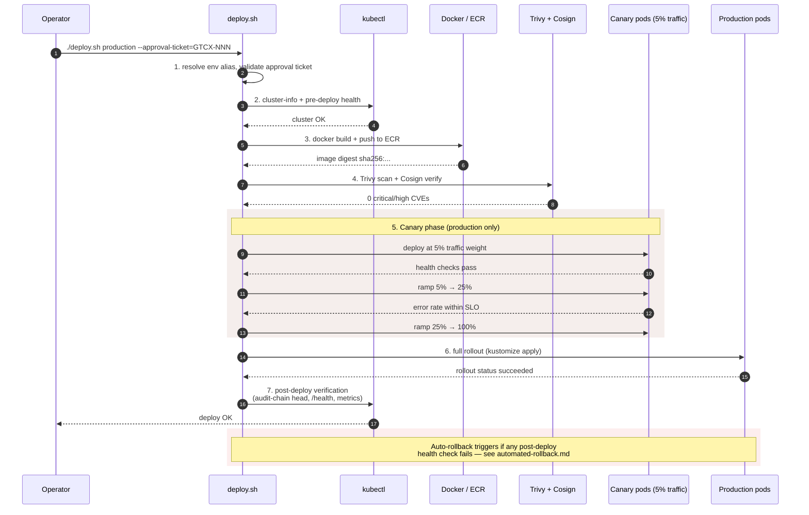

# Deploy Runbook — gtcx-infrastructure

Process for deploying GTCX services to any environment using `./04-ship/03-platform/scripts/deploy.sh`.

> **Deprecation notice (2026-06-05):** `deploy.sh` is in maintenance mode.
> Critical safety decisions already delegate to `03-platform/tools/deployment-guard/` (typed,
> tested Node.js). Target full deprecation: 2026-Q3 — migrate to `gtcx-ctl deploy`
> or GitOps (ArgoCD/Flux) once staging parity is proven. See IR-6.4.

---

## Prerequisites

Before any deployment:

- [ ] CI gates pass: `pnpm lint`, `pnpm typecheck`, `pnpm test`, `pnpm build`
- [ ] Trivy security scan clean (no HIGH/CRITICAL findings)
- [ ] `kubectl cluster-info` connects to the target cluster
- [ ] `gtcx-secrets` secret exists in the target namespace
- [ ] For production: approval ticket `GTCX-XXX` is in hand

---

## Environments

| Environment   | Namespace         | Command                                                                         |
| ------------- | ----------------- | ------------------------------------------------------------------------------- |
| `development` | `gtcx-dev`        | `./04-ship/03-platform/scripts/deploy.sh development`                           |
| `staging`     | `gtcx-staging`    | `./04-ship/03-platform/scripts/deploy.sh staging` _(requires human approval)_   |
| `production`  | `gtcx-production` | `./04-ship/03-platform/scripts/deploy.sh production --approval-ticket=GTCX-XXX` |

**Never** run `./04-ship/03-platform/scripts/deploy.sh production` without `--approval-ticket`. The script enforces this and will exit 1 if the flag is missing.

---

## Deploy Script Sequence

The script runs these steps in order. Production (canary path) shown; staging skips step 5.



The script runs these steps in order:

### 1. Input Validation

- Resolves environment alias (e.g. `prod` → `production`, `stg` → `staging`)
- Maps environment to K8s namespace
- Verifies `--approval-ticket` is present for production (non-rollback)
- Checks `kubectl cluster-info` — fails if not connected

### 2. Pre-deployment Checks

- Creates the namespace if it does not exist
- Verifies `gtcx-secrets` secret exists in the namespace — **fails hard if missing**
- Prints current deployment status
- For production: prompts `Type 'DEPLOY' to confirm` — you must type `DEPLOY` exactly

### 3. Image Build

- Determines version from `git rev-parse --short HEAD` or `--version=` flag
- Builds `gtcx/agx:{version}` from `04-ship/docker/Dockerfile.platforms`
- Builds `gtcx/protocols:{version}` from `04-ship/docker/Dockerfile.protocols`
- Intelligence services are deployed separately via `03-platform/scripts/deploy-intelligence.sh`

### 4. Security Scan

- Runs Trivy against both mainline images: `gtcx/agx:{version}` and `gtcx/protocols:{version}`
- **Production**: exits on any HIGH/CRITICAL finding — no exceptions
- **Non-production**: logs warning but continues

### 5. Canary Deployment (Production only)

- Default canary: 5% of replicas (minimum 1), configurable via `--canary=N`
- Runs `kubectl set image` to update the deployment with the new tag
- Monitors for 300 seconds (5 minutes) checking for error rate
- **If errors detected**: automatically calls `rollback_deployment` and exits 1
- If automatic rollback fails: **escalate immediately** — do not attempt to recover manually without human

### 6. Deploy

- Updates image tags in the overlay for `gtcx/agx` and `gtcx/protocols`
- Applies: `kubectl apply -k overlays/{environment}`
- Waits for rollout: `kubectl rollout status deployment/... --timeout=300s`

### 7. Post-deployment Verification

- Lists all pods in the namespace matching `app.kubernetes.io/part-of=gtcx`
- Health check: `wget -q --spider http://localhost:3000/health` inside the API pod
- **Health check failure in production**: automatically calls rollback
- Records deployment to `deployment.log`: `timestamp | env | version | ticket | SUCCESS`

---

## Rollback

```bash
# Roll back production to the previous image
./04-ship/03-platform/scripts/deploy.sh production --rollback

# Roll back staging
./04-ship/03-platform/scripts/deploy.sh staging --rollback
```

Rollback runs `kubectl rollout undo` on each deployment labeled `app.kubernetes.io/part-of=gtcx` in the target namespace, then waits for rollout status.

After rollback, capture evidence with:

```bash
./04-ship/03-platform/scripts/capture-rollback-evidence.sh staging \
  --reason=manual-rollback \
  --scenario="manual rollback after failed deploy" \
  --previous-revision=sha-previous \
  --failed-revision=sha-failed \
  --smoke-base-url=https://api.testnet.gtcx.trade
```

Use the generated `rollback-evidence.json` as `ROLLBACK_EVIDENCE_PATH` for the intelligence deployment smoke evidence gate.

**Before deploying to production**: always confirm the previous stable image tag so rollback target is known.

---

## Flags Reference

| Flag                         | Effect                                               |
| ---------------------------- | ---------------------------------------------------- |
| `--approval-ticket=GTCX-XXX` | Required for production non-rollback deploys         |
| `--version=<tag>`            | Override image tag (default: git short SHA)          |
| `--rollback`                 | Undo last deployment — skips build, scan, and canary |
| `--canary=<percent>`         | Canary traffic percentage (default: 5)               |

---

## Escalation Triggers

Escalate to human review immediately if:

- Canary failure detected but automatic rollback did **not** trigger
- Health check fails in production and rollback did not complete within 5 minutes
- `gtcx-secrets` is missing from the namespace — do not create it manually, investigate source
- Trivy reports critical findings in an image that must deploy — ticket required before proceeding

---

## Reference

- [`04-ship/03-platform/scripts/deploy.sh`](../../../04-ship/03-platform/scripts/deploy.sh) — deploy script
- [`01-docs/01-agents/safety-rules.md`](../../agents/workflows/agent-safety-rules.md) — authority tiers
- [`01-docs/architecture/system-overview.md`](../../architecture/system-overview.md) — full stack overview
- [`01-docs/04-ops/runbooks/migrate.md`](./migrate.md) — migration process
