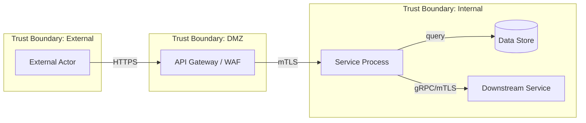
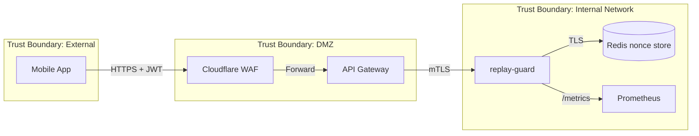

# STRIDE Threat Model Template

**Version:** 1.0
**Date:** 2026-05-08

Use this template for every service or significant architectural change. Complete before design review.

---

## Service Information

| Field          | Value                                       |
| -------------- | ------------------------------------------- |
| Service name   | {service name}                              |
| Owner          | {team or individual}                        |
| Date           | {YYYY-MM-DD}                                |
| Reviewer       | {security champion}                         |
| Classification | {Public / Internal / Confidential / Secret} |
| Last updated   | {YYYY-MM-DD}                                |

---

## Data Flow Diagram

Replace the placeholder below with the actual data flow for your service. Include every external actor, process, data store, and data flow.

---

## Trust Boundaries

Identify every boundary where the level of trust changes.

| Boundary              | From            | To          | Authentication  | Notes                                      |
| --------------------- | --------------- | ----------- | --------------- | ------------------------------------------ |
| Internet to DMZ       | External client | API Gateway | TLS + JWT       | WAF inspects traffic                       |
| DMZ to Internal       | API Gateway     | Service     | mTLS            | Gateway validates JWT before forwarding    |
| Service to Data Store | Service         | Database    | IAM credentials | Encrypted connection, least-privilege role |
| Service to Service    | Service A       | Service B   | mTLS + SPIFFE   | Linkerd mesh identity                      |

---

## STRIDE Assessment

For each threat category, evaluate whether it applies to this change. If yes, describe the specific threat, the mitigation you have implemented, and any residual risk.

### S — Spoofing

Can an attacker pretend to be someone or something they are not?

| #   | Threat Description                            | Applies? | Mitigation Implemented | Residual Risk        |
| --- | --------------------------------------------- | -------- | ---------------------- | -------------------- |
| S1  | Forged JWT claims to impersonate another user | Yes / No | {describe}             | {describe or "None"} |
| S2  | Replay of expired authentication token        | Yes / No | {describe}             | {describe or "None"} |
| S3  | DNS spoofing to redirect service traffic      | Yes / No | {describe}             | {describe or "None"} |

### T — Tampering

Can an attacker modify data in transit or at rest?

| #   | Threat Description                                   | Applies? | Mitigation Implemented | Residual Risk        |
| --- | ---------------------------------------------------- | -------- | ---------------------- | -------------------- |
| T1  | Request body modification between client and service | Yes / No | {describe}             | {describe or "None"} |
| T2  | Database record modification by unauthorized actor   | Yes / No | {describe}             | {describe or "None"} |
| T3  | Log tampering to hide attack evidence                | Yes / No | {describe}             | {describe or "None"} |

### R — Repudiation

Can an actor deny performing an action?

| #   | Threat Description                         | Applies? | Mitigation Implemented | Residual Risk        |
| --- | ------------------------------------------ | -------- | ---------------------- | -------------------- |
| R1  | User denies submitting a transaction       | Yes / No | {describe}             | {describe or "None"} |
| R2  | Admin denies making a configuration change | Yes / No | {describe}             | {describe or "None"} |

### I — Information Disclosure

Can sensitive data leak to unauthorized parties?

| #   | Threat Description                        | Applies? | Mitigation Implemented | Residual Risk        |
| --- | ----------------------------------------- | -------- | ---------------------- | -------------------- |
| I1  | Sensitive data exposed in error responses | Yes / No | {describe}             | {describe or "None"} |
| I2  | PII visible in application logs           | Yes / No | {describe}             | {describe or "None"} |
| I3  | Data exfiltration via SSRF                | Yes / No | {describe}             | {describe or "None"} |

### D — Denial of Service

Can an attacker degrade or destroy service availability?

| #   | Threat Description                         | Applies? | Mitigation Implemented | Residual Risk        |
| --- | ------------------------------------------ | -------- | ---------------------- | -------------------- |
| D1  | Resource exhaustion via oversized payloads | Yes / No | {describe}             | {describe or "None"} |
| D2  | Redis connection pool exhaustion           | Yes / No | {describe}             | {describe or "None"} |
| D3  | Algorithmic complexity attack (ReDoS)      | Yes / No | {describe}             | {describe or "None"} |

### E — Elevation of Privilege

Can an attacker gain capabilities beyond their authorization?

| #   | Threat Description                              | Applies? | Mitigation Implemented | Residual Risk        |
| --- | ----------------------------------------------- | -------- | ---------------------- | -------------------- |
| E1  | Privilege escalation via JWT claim manipulation | Yes / No | {describe}             | {describe or "None"} |
| E2  | Container escape to host                        | Yes / No | {describe}             | {describe or "None"} |
| E3  | RBAC bypass through API parameter injection     | Yes / No | {describe}             | {describe or "None"} |

---

## Risk Summary

| Risk ID | Category | Description | Severity                       | Status                      |
| ------- | -------- | ----------- | ------------------------------ | --------------------------- |
| {S1}    | Spoofing | {brief}     | Critical / High / Medium / Low | Mitigated / Accepted / Open |

---

## Completed Example: replay-guard Service

### Data Flow

### Trust Boundaries

| Boundary         | From         | To             | Authentication   | Notes                                      |
| ---------------- | ------------ | -------------- | ---------------- | ------------------------------------------ |
| Internet to DMZ  | Mobile app   | Cloudflare WAF | TLS 1.3 + JWT    | WAF applies OWASP CRS                      |
| DMZ to Internal  | API Gateway  | replay-guard   | mTLS (Linkerd)   | Gateway validates JWT signature            |
| Service to Redis | replay-guard | Redis          | AUTH token + TLS | Dedicated Redis instance, no shared access |

### STRIDE Assessment

**S — Spoofing**

| #   | Threat Description                    | Applies? | Mitigation Implemented                                                                            | Residual Risk                                           |
| --- | ------------------------------------- | -------- | ------------------------------------------------------------------------------------------------- | ------------------------------------------------------- |
| S1  | Forged JWT to bypass nonce validation | Yes      | Ed25519 DID-based signature verification in `crypto/did-verify.mjs`; keys pinned to known issuers | None — forging requires private key compromise          |
| S2  | Replay of valid JWT with same nonce   | Yes      | Nonce stored in Redis with TTL; duplicate nonce rejected by `store/` layer                        | None — replay is the core threat this service mitigates |

**T — Tampering**

| #   | Threat Description                              | Applies? | Mitigation Implemented                                                     | Residual Risk                                    |
| --- | ----------------------------------------------- | -------- | -------------------------------------------------------------------------- | ------------------------------------------------ |
| T1  | Modified JWT payload between mobile and service | Yes      | JWT signature verified before any payload processing                       | None                                             |
| T2  | Redis nonce record deletion to allow replay     | Yes      | Redis ACL restricts replay-guard to SET/GET/EXISTS only; no DEL permission | Low — compromised Redis credentials could bypass |

**R — Repudiation**

| #   | Threat Description                     | Applies? | Mitigation Implemented                                                    | Residual Risk |
| --- | -------------------------------------- | -------- | ------------------------------------------------------------------------- | ------------- |
| R1  | Client denies submitting a transaction | Yes      | Signed JWT with nonce logged to append-only audit database (`gtcx_audit`) | None          |

**I — Information Disclosure**

| #   | Threat Description                     | Applies? | Mitigation Implemented                                               | Residual Risk |
| --- | -------------------------------------- | -------- | -------------------------------------------------------------------- | ------------- |
| I1  | Nonce values leaked in error responses | Yes      | Error responses return opaque error codes; no internal state exposed | None          |
| I2  | JWT contents visible in logs           | Yes      | Structured logging redacts JWT payload; only hash logged             | None          |

**D — Denial of Service**

| #   | Threat Description                            | Applies? | Mitigation Implemented                                                                             | Residual Risk                            |
| --- | --------------------------------------------- | -------- | -------------------------------------------------------------------------------------------------- | ---------------------------------------- |
| D1  | Flood of verification requests exhausts Redis | Yes      | Rate limiting at API Gateway (100 req/s per client); Redis connection pooling with circuit breaker | Low — sustained DDoS beyond WAF capacity |
| D2  | Oversized JWT payload causes memory pressure  | Yes      | Max body size enforced at 64KB in middleware                                                       | None                                     |

**E — Elevation of Privilege**

| #   | Threat Description                         | Applies? | Mitigation Implemented                                                     | Residual Risk      |
| --- | ------------------------------------------ | -------- | -------------------------------------------------------------------------- | ------------------ |
| E1  | JWT claim manipulation to gain admin scope | Yes      | Claims validated against allowlist in `policy/`; unknown scopes rejected   | None               |
| E2  | Container escape                           | Yes      | Non-root container, read-only filesystem, seccomp profile, no capabilities | Low — kernel 0-day |

---

## Maintenance

- Review this threat model when the service architecture changes
- Re-assess annually even without changes
- Update after any security incident involving this service
- Security champion reviews during quarterly security sync
