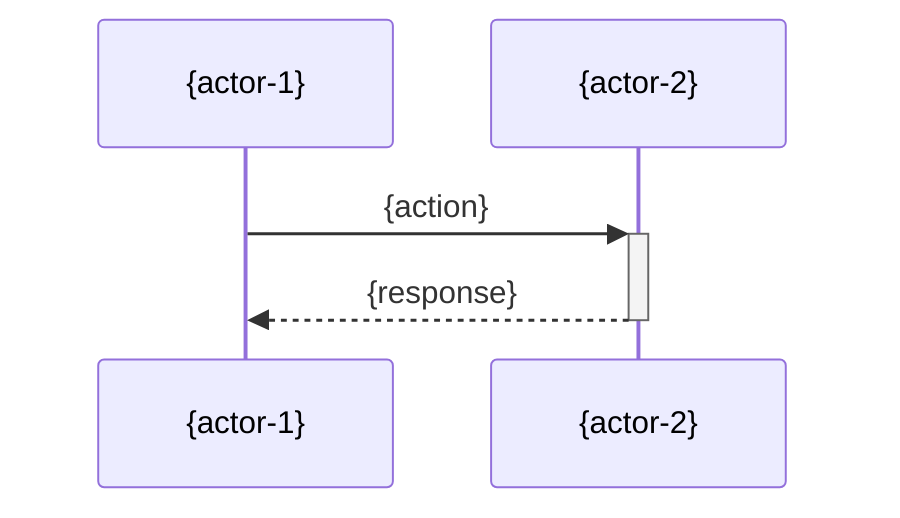

# Technical Spec — {feature-name}

## Overview

{Describe what this implements and why. Link to the product spec or initiative that drives this work.}

## Background

{Provide context for readers unfamiliar with this area. Include:}

- {Related product spec or PRD.}
- {Prior art — how this problem was solved before, if applicable.}
- {Relevant architectural decisions (link to ADRs).}

## Proposed Solution

{Describe the technical approach in detail. Include:}

- {High-level design and how components interact.}
- {Key algorithms or processing logic.}
- {Technology choices and rationale.}

## Data Model Changes

### New Tables

| Table   | Column   | Type   | Constraints                | Description   |
| ------- | -------- | ------ | -------------------------- | ------------- |
| {table} | {column} | {type} | {PK, FK, NOT NULL, UNIQUE} | {description} |

### Modified Tables

| Table   | Column   | Change | Migration Notes |
| ------- | -------- | ------ | --------------- | ----- | ---------------------------------- |
| {table} | {column} | {ADD   | ALTER           | DROP} | {backfill strategy, default value} |

### Migrations

- {Migration file name or description.}
- {Rollback strategy.}

## API Changes

### New Endpoints

| Method   | Path    | Description   |
| -------- | ------- | ------------- |
| {METHOD} | {/path} | {description} |

### Modified Endpoints

| Method   | Path    | Change                 |
| -------- | ------- | ---------------------- |
| {METHOD} | {/path} | {what changed and why} |

## UI Changes

{If applicable, describe new screens, components, or user flows.}

- **{Screen/Component}**: {What it does, key interactions.}
- **Wireframes**: {Link to mockups or design files.}

{If not applicable, state "No UI changes required."}

## Testing Strategy

| Test Type   | Scope                        | Coverage Target |
| ----------- | ---------------------------- | --------------- |
| Unit        | {what is unit tested}        | {target %}      |
| Integration | {what is integration tested} | {target %}      |
| E2E         | {critical user flows tested} | {key scenarios} |

### Edge Cases

- {Edge case 1 and how it is handled.}
- {Edge case 2 and how it is handled.}

## Rollout Plan

1. **Feature Flag**: {flag name and default state.}
2. **Migration**: {database migration steps, if any.}
3. **Staged Rollout**: {rollout percentage progression and criteria to advance.}
4. **Rollback Plan**: {how to revert if issues are detected.}
5. **Monitoring**: {what to watch during rollout — error rates, latency, business metrics.}

## Security Considerations

- **Authentication**: {how auth is enforced for this feature.}
- **Authorization**: {permission checks, role requirements.}
- **Input Validation**: {validation rules, sanitization.}
- **Data Exposure**: {PII handling, data leakage prevention.}

## Performance Considerations

- **Expected Load**: {requests per second, data volume.}
- **Bottlenecks**: {identified hotspots and mitigations.}
- **Benchmarks**: {performance targets — p50, p95, p99 latency.}
- **Caching**: {caching strategy, TTLs, invalidation.}

## Alternatives Considered

| Alternative     | Why Not                  |
| --------------- | ------------------------ |
| {alternative-1} | {reason it was rejected} |
| {alternative-2} | {reason it was rejected} |

## Open Questions

- [ ] {Unresolved technical decision.}
- [ ] {Area needing prototyping or benchmarking.}
- [ ] {Dependency on another team's work.}
