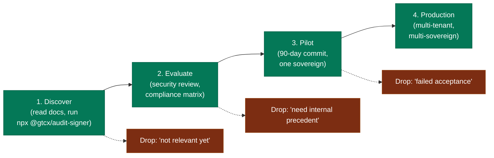
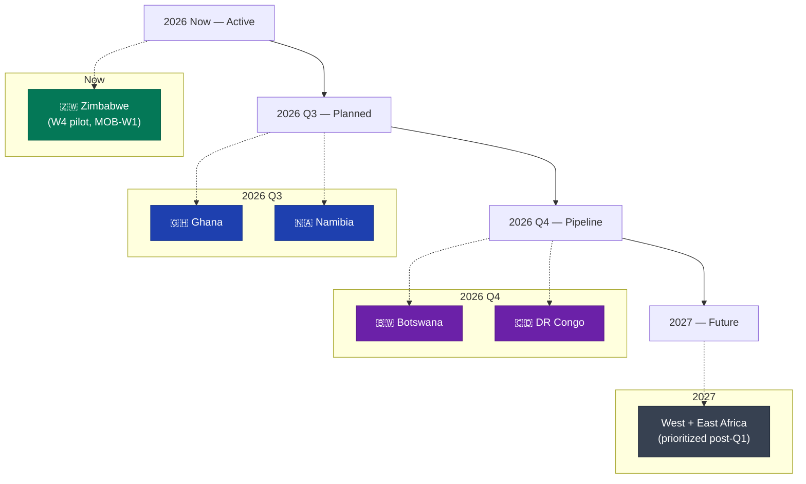

# Adoption Model — GTCX Compliance Substrate

> **Audience:** Sales, product, partnership, and pilot-operations teams.
> **Companion docs:** [`business-logic.md`](./business-logic.md), [`../gtm/00-executive-brief.md`](../gtm/00-executive-brief.md).

## Scope

How participants adopt the substrate — from first technical evaluation through pilot through mass adoption. Includes partner channels and geographic rollout. **Not** about specific pilot terms or pricing (lives in pilot agreements).

## Adoption funnel

Four stages, each with distinct evidence requirements + commitment shape:



| Stage             | Activities                                                                                                                                      | Evidence consumed                                                                                                                                                                                                                                                                                | Typical duration |
| ----------------- | ----------------------------------------------------------------------------------------------------------------------------------------------- | ------------------------------------------------------------------------------------------------------------------------------------------------------------------------------------------------------------------------------------------------------------------------------------------------ | ---------------- |
| **1. Discover**   | Read [`../gtm/00-executive-brief.md`](../gtm/00-executive-brief.md), run `npx @gtcx/audit-signer verify` against a sample WORM batch, scan ADRs | Executive brief, npm package, GitHub source                                                                                                                                                                                                                                                      | 1-2 weeks        |
| **2. Evaluate**   | Security team reads STRIDE; compliance team reads framework matrix; engineering reviews architecture deep-dive                                  | [`../gtm/01-security-posture.md`](../gtm/01-security-posture.md), [`../gtm/02-compliance-matrix.md`](../gtm/02-compliance-matrix.md), [`./compliance-substrate-deep-dive.md`](./compliance-substrate-deep-dive.md), [`../security/threat-model-2026-05.md`](../security/threat-model-2026-05.md) | 4-8 weeks        |
| **3. Pilot**      | 90-day commit, one sovereign, real transactions, end-to-end audit verification                                                                  | Pilot agreement, audit runbook, signed MOU                                                                                                                                                                                                                                                       | 90 days          |
| **4. Production** | Multi-tenant, multi-sovereign, public regulator integration                                                                                     | Production agreement, SLA, joint roadmap                                                                                                                                                                                                                                                         | Ongoing          |

## Self-service vs. sales-led paths

```mermaid
graph TB
    Audience{"Who is adopting?"}
    Audience -->|"Engineering team<br/>(open-source primitive)"| Self
    Audience -->|"Sovereign government<br/>(full substrate)"| SalesLed

    subgraph Self["Self-service — substrate primitives"]
        SInstall["npm install @gtcx/audit-signer<br/>(no GTCX touch)"]
        STerra["terraform module aws-compliance-db<br/>(no GTCX touch)"]
        SMCP["@gtcx/compliance-gateway-mcp<br/>(stdio per-agent)"]
    end

    subgraph SalesLed["Sales-led — pilot engagement"]
        Eval["Technical evaluation<br/>(2-3 sessions)"]
        Pilot["Pilot agreement<br/>(90-day commit)"]
        Onboard["Pilot onboarding<br/>(30-day window)"]
        GoLive["Pilot go-live<br/>(W4 baseline)"]
    end

    Self -.-> Visibility["GTCX sees: npm download +<br/>GitHub clone telemetry"]
    Visibility -.-> SalesLed
    SalesLed -.-> Production["Production multi-sovereign"]

    classDef self fill:#1e40af,stroke:#1e3a8a,color:#fff;
    classDef sales fill:#6b21a8,stroke:#581c87,color:#fff;
    classDef end fill:#047857,stroke:#065f46,color:#fff;
    class SInstall,STerra,SMCP self;
    class Eval,Pilot,Onboard,GoLive sales;
    class Production,Visibility end;
```

The two paths intentionally feed each other: self-service primitive adoption is the lowest-friction discovery channel, and downstream npm telemetry surfaces evaluators who'd otherwise be invisible. The sales-led path then activates them into the full substrate.

## Partner channels

| Channel                                                                 | Activation mode                              | Substrate exposure                    |
| ----------------------------------------------------------------------- | -------------------------------------------- | ------------------------------------- |
| **Direct sovereign engagement**                                         | Government-to-GTCX MOU                       | Full substrate (runtime + primitives) |
| **Adjacent platforms (gtcx-platforms, gtcx-mobile, gtcx-intelligence)** | Co-deployed in same cluster; share substrate | Full substrate (sibling repos)        |
| **Independent compliance-platform adopters (compliance-os)**            | Downstream consumer of substrate APIs        | Primitives + audit-bundle ingestion   |
| **AI agent runtimes (Claude Desktop, custom MCP hosts)**                | MCP server install                           | Read-only discovery surface           |
| **npm-distribution consumers**                                          | `npm install @gtcx/audit-signer`             | Single primitive only                 |
| **Terraform-registry consumers**                                        | `terraform-aws-compliance-db` module         | Single primitive only                 |

## Geographic rollout

Pilot priority sequence — ordered by readiness of regulatory partner + presence of substrate consumer (gtcx-mobile, gtcx-platforms) in-region:



Per-sovereign deployment cost (after Zimbabwe baseline established) is amortized — the substrate code is identical across sovereigns; per-country effort is limited to (a) tenant-id provisioning, (b) regulator-specific WORM access grants, (c) jurisdiction-specific policy plug-ins in the compliance-gateway.

## Activation metrics

The substrate measures funnel health by these signals at each stage:

| Stage      | Leading indicator                                                     | Conversion target                               |
| ---------- | --------------------------------------------------------------------- | ----------------------------------------------- |
| Discover   | Weekly npm downloads of `@gtcx/audit-signer`                          | 50+ weekly by 2026-Q4                           |
| Discover   | GitHub stars on `gtcx-infrastructure` + `terraform-aws-compliance-db` | 100+ combined by 2026-Q4                        |
| Evaluate   | Security/compliance team docs reads (proxy: traffic to `/gtm/` paths) | 10+ qualified evaluators in pipeline by 2026-Q4 |
| Pilot      | Active pilot count                                                    | 3 sovereigns by 2027-Q1                         |
| Production | Multi-tenant active substrate count                                   | 1 production (ZW) by 2026-Q4                    |

Distribution snapshot lands daily via [`tools/scripts/distribution-snapshot.mjs`](../../tools/scripts/distribution-snapshot.mjs); historical series committed under `docs/audit/distribution-snapshots/` by the [`distribution-snapshot.yml`](../../.github/workflows/distribution-snapshot.yml) workflow.

## Onboarding lead times

Typical durations, measured from pilot agreement signature:

| Phase                                              | Duration       | Owner                              |
| -------------------------------------------------- | -------------- | ---------------------------------- |
| Pilot kickoff (provision tenant, WORM bucket, IAM) | 3-5 days       | Platform engineering               |
| First end-to-end signed transaction                | Within 14 days | Joint (us + sovereign engineering) |
| Regulator verification onboarding                  | 14-30 days     | Joint (us + regulator)             |
| Pilot full production transactions                 | 60 days        | Pilot operator                     |
| Pilot acceptance review                            | 90 days        | Sovereign + GTCX product           |

Zimbabwe MOB-W1 sprint is the live baseline — see [`../agile/execution-roadmap-2026-05-22.md`](../agile/execution-roadmap-2026-05-22.md) §Sprint MOB-W1.

## What slows adoption (honest)

| Friction                                                           | Mitigation in place                                                              | Status                                                                                                                   |
| ------------------------------------------------------------------ | -------------------------------------------------------------------------------- | ------------------------------------------------------------------------------------------------------------------------ |
| "No precedent" — government compliance teams reluctant to be first | ZW go-live in flight becomes the precedent                                       | Active                                                                                                                   |
| Threat model unfamiliarity                                         | STRIDE doc written for non-cryptographer audiences                               | Active                                                                                                                   |
| Operator concern about "are we trapped if we want to leave?"       | Documented exit path: WORM bucket is operator-owned; old verifier remains usable | Documented in pilot agreement                                                                                            |
| HSM provisioning (sovereign-side)                                  | Standalone workstream; doesn't block substrate ingest at pilot scale             | Tracked in [`../decisions/ADR-021-npm-publish-discipline.md`](../decisions/ADR-021-npm-publish-discipline.md) follow-ups |
| Cross-region replication (DR posture for regulators)               | Roadmap item, post-pilot                                                         | Acknowledged in [`./compliance-substrate-deep-dive.md`](./compliance-substrate-deep-dive.md) §Scaling story              |

## Related documents

- [`business-logic.md`](./business-logic.md) — revenue model + value chain
- [`../gtm/00-executive-brief.md`](../gtm/00-executive-brief.md) — one-pager
- [`../gtm/01-security-posture.md`](../gtm/01-security-posture.md) — security posture
- [`./system-overview.md`](./system-overview.md) — system architecture
- [`./ecosystem-integration.md`](./ecosystem-integration.md) — ecosystem map
- [`../agile/execution-roadmap-2026-05-22.md`](../agile/execution-roadmap-2026-05-22.md) — current sprint state (including MOB-W1)
