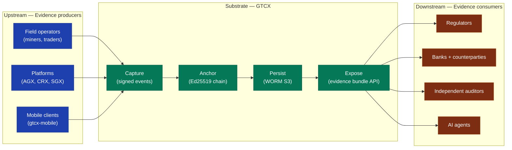
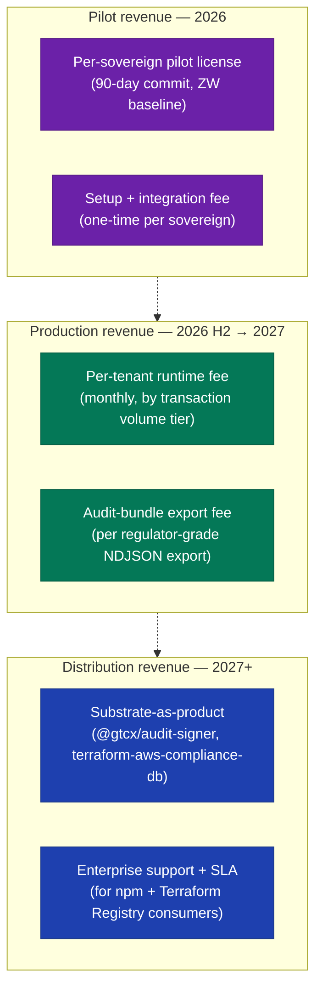
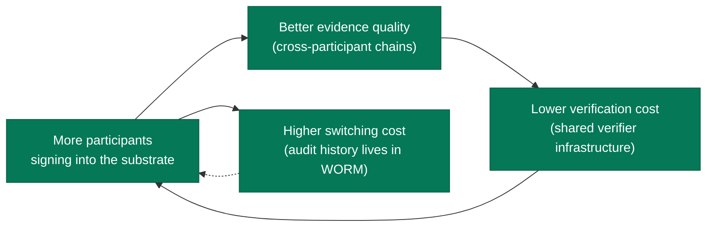

# Business Logic — GTCX Compliance Substrate

> **Audience:** Investors, board members, partner-team product leads.
> **Companion docs:** [`adoption-model.md`](./adoption-model.md), [`../gtm/00-executive-brief.md`](../gtm/00-executive-brief.md).

## Scope

What the substrate sells, how it captures value, where the moat is, and how network effects compound. **Not** about specific pilot pricing (that lives in pilot agreements) or sales motions (that lives in [`adoption-model.md`](./adoption-model.md)).

## Value chain

The substrate sits between two markets — regulated commodity participants who must produce compliance evidence, and regulators / counterparties / auditors who must verify it. The substrate's value is the **verifiability differential**: an evidence artifact produced by the substrate is provably more trustworthy than one produced by a conventional compliance database, at lower verification cost per transaction.

## Revenue model

Three revenue streams, each at a different maturity:

| Stream                      | Status                     | Unit                      | Captures                                           |
| --------------------------- | -------------------------- | ------------------------- | -------------------------------------------------- |
| Per-sovereign pilot license | Active (ZW)                | Annual contract           | Government-owned compliance substrate operation    |
| Per-tenant runtime fee      | Pre-revenue                | Monthly, tiered by volume | Operational cost + margin on substrate runtime     |
| Audit-bundle export         | Pre-revenue                | Per export                | Regulator-paid evidence packaging                  |
| Substrate-as-product        | npm published; pre-revenue | Per support contract      | Adoption by adjacent platforms                     |
| Enterprise support + SLA    | Pre-revenue                | Annual                    | Critical-support coverage for substrate primitives |

Open-source distribution (`@gtcx/audit-signer` on npm, `terraform-aws-compliance-db` on GitHub) is **deliberately free**. The substrate's strategic moat is adoption depth, not license-fee extraction.

## Network effects

The substrate gets more valuable as more participants adopt it, in three compounding ways:

1. **Evidence quality compounds.** Cross-participant audit chains (e.g., shipper → bank → customs) become possible only when each link is on the substrate. The N+1 participant gets retroactive lift on chains they're already in.
2. **Verification cost falls per participant.** Regulators amortize their integration cost (one `verifyChain` integration) across every transaction from every participant they oversee.
3. **Switching cost is the WORM bucket.** Audit history landed at a participant's WORM prefix cannot be migrated to a competitor's substrate without losing the cryptographic continuity. After 6+ months of substrate operation, switching means abandoning historical verifiability.

## What competes with the substrate

| Competitor archetype                                 | What they offer                               | Why the substrate still wins                                                                                                                                                                                               |
| ---------------------------------------------------- | --------------------------------------------- | -------------------------------------------------------------------------------------------------------------------------------------------------------------------------------------------------------------------------- |
| Conventional compliance SaaS                         | Audit dashboard, control matrix tracking      | Operator-controlled audit DB → trust depends on operator. Substrate inverts that with WORM + cryptographic chain.                                                                                                          |
| Blockchain-based audit (e.g., public-chain anchored) | Immutable chain, but on public infrastructure | Public-chain anchoring is expensive per record, has unpredictable settlement times, and exposes tenant data to public observers. Substrate uses WORM Object Lock with same immutability but private + sub-cent per record. |
| In-house audit databases                             | Custom-built, fully controlled                | Same trust-the-operator problem. Substrate is adoptable as a primitive — operators can run the substrate themselves, in-country, with the same independent verifiability properties.                                       |
| Regulatory portals (operator-side)                   | Specific to one regulator                     | Each portal is a custom integration. Substrate is one integration that serves every regulator who consumes WORM.                                                                                                           |

## Where the moat is

Three reinforcing properties:

1. **Cryptographic guarantee, not commercial promise.** The substrate's claim ("this audit trail is tamper-evident") is mathematical. Competitors who don't ship this primitive can't catch up with marketing.
2. **Cross-repo composability.** Three substrate primitives (`@gtcx/audit-signer`, `terraform-aws-compliance-db`, `@gtcx/compliance-gateway-mcp`) are independently adoptable. Partners take what they need; that adoption itself becomes evidence the substrate is trusted.
3. **Regulator-side verifier is open.** The verifier is an npm package. Regulators run it. No GTCX-side trust step is required. Lowering the regulator's cost-of-trust is the moat.

## Unit economics

Operational cost per signed record at pilot scale:

| Cost driver             | Per-record cost             | Notes                               |
| ----------------------- | --------------------------- | ----------------------------------- |
| KMS sign operation      | ~$0.000003                  | One sign per consequential decision |
| NATS JetStream publish  | <$0.000001                  | Amortized broker cost               |
| WORM S3 PUT (batched)   | ~$0.00001                   | Batched at 500-1000 records         |
| WORM S3 storage         | ~$0.000004 / record / month | af-south-1 IA pricing               |
| **Total marginal cost** | **~$0.000018 / record**     | Storage + compute + KMS             |

At 1M records/month (well above pilot scale), substrate marginal cost is <$20/month per tenant. Pricing is therefore not cost-driven — it's verifiability-value-driven.

## Related documents

- [`adoption-model.md`](./adoption-model.md) — pilot → mass adoption funnel
- [`../gtm/00-executive-brief.md`](../gtm/00-executive-brief.md) — one-pager
- [`../gtm/01-security-posture.md`](../gtm/01-security-posture.md) — security posture
- [`./system-overview.md`](./system-overview.md) — system architecture
- [`./ecosystem-integration.md`](./ecosystem-integration.md) — ecosystem map
