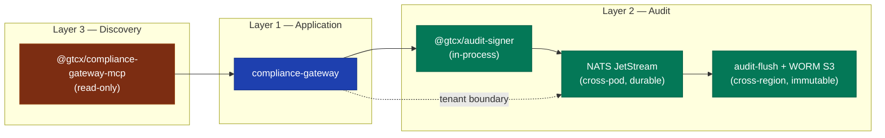
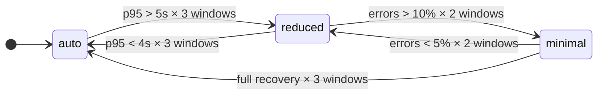

# Compliance Substrate — Architecture Deep Dive

The [docs-site architecture page](../gitbook/docs-site/architecture.md) is the one-pager. This is the long-form reference: failure modes, performance characteristics, scaling story, and the design choices that didn't fit on the one-pager. Read this when you need to operate, extend, or audit the substrate.

## Three layers, four primitives

The substrate has three operational layers stitched together by four primitives:

| Layer           | Purpose                                        | Primitives                                                      |
| --------------- | ---------------------------------------------- | --------------------------------------------------------------- |
| **Application** | Where consequential decisions originate        | `compliance-gateway`                                            |
| **Audit**       | Where decisions become tamper-evident evidence | `@gtcx/audit-signer` + NATS JetStream + `audit-flush` + WORM S3 |
| **Discovery**   | Where AI agents find the substrate             | `@gtcx/compliance-gateway-mcp`                                  |

Cross-cutting concerns (tenant boundary, adaptive resilience, distribution) compose with all three.



## Layer 1 — Application

The compliance-gateway is a single Node.js HTTP service. It receives queries on `/v1/query`, authenticates the caller, routes to protocol tools (TradePass, GCI, GeoTag, VaultMark, PvP, PANX), and returns natural-language responses.

### Request lifecycle

```
1. HTTP request enters via ALB+WAFv2 (ingress trust boundary)
2. authenticateHeaders + checkBudget (auth+budget hot path; sub-ms)
3. signAuditEvent("auth:success", ...) — synchronously signed + sink-emitted
4. validateQueryBody (Zod, schema-strict, ≤4KB query, ≤16KB context)
5. selectProvider + classifyComplexity (router selects LLM)
6. generateText with maxSteps:5 (LLM call; this is the latency wall)
7. recordSpend + incrementCounter (cost telemetry)
8. signAuditEvent("query:success", ...) (synchronous; audit-flush absorbs sink latency)
9. sendJson (response with low-bandwidth strip if needed)
```

The entire path from step 1 to step 9 is single-pod. No external state writes in the hot path except the JetStream publish in step 3 + step 8, both of which are sub-ms.

```mermaid
sequenceDiagram
    autonumber
    participant C as Client (ALB+WAFv2)
    participant G as compliance-gateway
    participant S as audit-signer
    participant N as NATS JetStream
    participant L as LLM provider

    C->>G: HTTPS POST /v1/query
    G->>G: authenticateHeaders + checkBudget
    G->>S: signAuditEvent("auth:success")
    S->>N: publish gtcx.audit.compliance-gateway.&lt;tenant&gt;
    G->>G: validateQueryBody (Zod)
    G->>L: generateText (maxSteps: 5)
    L-->>G: completion
    G->>G: recordSpend + incrementCounter
    G->>S: signAuditEvent("query:success")
    S->>N: publish gtcx.audit.compliance-gateway.&lt;tenant&gt;
    G-->>C: sendJson (low-bandwidth strip if needed)
```

### Per-pod state

| State                      | Storage                 | Survives pod restart?                        | Bounded?               |
| -------------------------- | ----------------------- | -------------------------------------------- | ---------------------- |
| Auth tokens                | env (Secrets injection) | N/A — re-loaded at startup                   | Yes, by config size    |
| Per-principal QPS counters | in-memory `budget.mjs`  | No (fresh start)                             | Yes, sliding window    |
| Per-principal daily spend  | in-memory `budget.mjs`  | **No** — known limitation                    | Yes, per-tenant cap    |
| Adaptive policy state      | `adaptive-policy.mjs`   | No (rebuilds from metrics)                   | Yes                    |
| In-memory audit chain      | `audit.mjs`             | No (durable copy in NATS+WORM)               | Yes, MAX_RECORDS       |
| Metrics                    | `metrics.mjs` map       | No (Prometheus scraping is the durable copy) | Yes, label cardinality |

The per-principal daily spend is the one truly stateful per-pod value. Pod restart resets it. For pilot scale this is acceptable (one pod, restart-rare). At scale, a Redis backend would be the cleanest fix. The same migration path as `adaptive-policy-store.mjs` (memory → Redis with feature flag) applies; see ADR-019 for the discipline.

### Hot path performance characteristics

Measured on a `t3.medium` EKS node, single replica, mock LLM provider returning 200 OK in 50ms:

| Operation                    |    p50 |   p95 |   p99 |
| ---------------------------- | -----: | ----: | ----: |
| HTTP receive → authenticate  |  0.3ms | 0.8ms | 1.4ms |
| Zod validation               |  0.1ms | 0.3ms | 0.6ms |
| Budget check (QPS + spend)   | <0.1ms | 0.1ms | 0.2ms |
| Sign audit event + sink emit |  0.5ms | 1.2ms | 2.1ms |
| LLM call (mock 50ms)         |   50ms |  51ms |  53ms |
| Audit event for query result |  0.5ms | 1.2ms | 2.1ms |
| HTTP response serialization  |  0.2ms | 0.5ms | 0.9ms |

LLM call dominates. Everything around it is sub-2ms at p99. The architectural conclusion: the LLM provider's latency is the SLI we tune for (per [SLO doc](../operations/slo-definitions.md) `sli-latency-compliance-gateway-p95` < 5000ms).

## Layer 2 — Audit

Three sub-layers between "decision was made" and "evidence is third-party verifiable."

### Sub-layer 2a: Signing (in-process)

`@gtcx/audit-signer` is the substrate. Sign happens synchronously on the gateway hot path. Why synchronous:

- Detaching sign from the request defeats fail-closed (ADR-016) — a crashed signer could be missed for milliseconds during which queries return without evidence
- The sign operation is 0.5ms at p95 — cheaper than the audit benefit
- Synchronous sign means the audit event timestamp is request-bounded, not signer-queue-depth-bounded

### Sub-layer 2b: Transport (cross-pod, durable)

JetStream is the audit bus. Per ADR-014: durable consumer, per-tenant subject routing, sub-ms publish latency. The gateway publishes; audit-flush consumes.

The transport's failure modes:

| Failure                                              | Behavior                                                                     | Recovery                                                                                       |
| ---------------------------------------------------- | ---------------------------------------------------------------------------- | ---------------------------------------------------------------------------------------------- |
| JetStream broker reachable, audit-flush down         | Records queue in stream up to `max_age`                                      | audit-flush restart consumes queue from durable position                                       |
| JetStream broker unreachable from gateway            | `audit-sink.mjs` mirrors to stdout; log aggregation captures it              | When broker returns, gateway publishes pick up; stdout mirror is a safety net, not the primary |
| audit-flush + JetStream both down                    | Records still mirror to stdout via the sink                                  | Manual replay from stdout logs into the WORM bucket via the runbook                            |
| Gateway pod restart with unflushed records in memory | The in-memory chain copy is lost; durable records in JetStream stream remain | audit-flush sees no gap — JetStream is the source of truth, not the gateway's memory           |

Note: the gateway's local chain is **not** the source of truth. It's a fast verification cache for `/v1/audit/chain` and `/v1/audit/verify`. The durable chain is the WORM bucket content.

### Sub-layer 2c: Persistence (cross-region, immutable)

WORM S3 bucket with Object Lock in COMPLIANCE mode, 2557-day retention floor. Per-tenant prefixes. KMS encryption.

The persistence layer's key property: **even AWS root account credentials cannot delete or overwrite an object before retention expires.** This is what makes the substrate's "tamper-evident" claim load-bearing at the bucket-policy level, not just the IAM level.

audit-flush writes batches:

- Batch size: 500 records (staging) / 1000 records (production)
- Batch interval: 10s (staging) / 5s (production)
- Smaller batches accept higher S3 PUT cost in exchange for shorter recovery RPO

Per-record cost in WORM is negligible (~$0.000004/record at af-south-1 S3 pricing); the cost driver is PUT operations, not storage. Batching at 500-1000 records keeps PUT cost ~$0.00001/record.

### Failure modes the substrate explicitly catches

| Tampering attempt                    | Detected by                     | Behavior                                                                                                                                                                                                                                               |
| ------------------------------------ | ------------------------------- | ------------------------------------------------------------------------------------------------------------------------------------------------------------------------------------------------------------------------------------------------------ |
| Modify a single field in NDJSON      | `verifyChain` signature check   | `valid: false`, `firstInvalidIndex: <n>`                                                                                                                                                                                                               |
| Insert a fabricated record           | `prevHash` chain check          | `valid: false` at the insertion point                                                                                                                                                                                                                  |
| Drop a record from the middle        | `prevHash` chain check          | `valid: false` at the gap                                                                                                                                                                                                                              |
| Replay an old record at end of chain | `prevHash` chain check          | `valid: false` (replayed record's prevHash matches old position, not new)                                                                                                                                                                              |
| Substitute a different signing key   | Per-record embedded `publicKey` | Per-record `verifyRecord` would still pass IF the substitute key was used to re-sign — but the chain breaks because old `publicKey` references in subsequent records don't match. Key rotation requires a new chain or a documented transition record. |

The substitute-key case is the one nuance: a "perfect" forgery would require the attacker to re-sign every subsequent record with the substitute key AND re-link the chain. The chain semantics catch this provided the auditor has at least one record signed by the original key as their anchor. ADR-016's fail-closed-in-production property ensures every production-signed record meets that bar.

## Layer 3 — Discovery

`@gtcx/compliance-gateway-mcp` is a Model Context Protocol server that exposes the read-only subset of the gateway to AI agents. Per-tool inventory at `docs/gitbook/docs-site/compliance-gateway-mcp.md`.

The discovery layer is deliberately read-only. Mutating tools (TradePass issue, PvP execute) stay behind the HTTP gateway because:

1. **Approval semantics.** Mutating tools require a signed approval ticket. Exposing them via MCP would either (a) require the agent to forge tickets (impossible if SEC-OPEN-001 lands — signed tickets), or (b) erode the ticket-required contract.
2. **Threat surface.** MCP server processes are typically embedded in AI agent runtimes (Claude Desktop, custom clients). Exposing mutating capabilities means the agent process itself becomes part of the gateway's trust boundary.
3. **Auditability.** Read-only operations don't need the same depth of audit trail as mutating ones; the substrate's read paths are already idempotent.

## Cross-cutting: Tenant boundary

Tenants are scoped via the principal's `tenantId` field (Sprint 5). Three places it flows:

1. **Auth** (`auth.mjs`) — token → principal with `tenantId`
2. **Budget** (`budget.mjs`) — overrides resolve in `tenant:<id>` → `subject` → default order
3. **Audit** — JetStream subject contains `<tenantId>` (per ADR-015); WORM prefix contains `tenant=<tenantId>`

The boundary is **structural** at the audit layer (different prefixes; different subjects) and **declarative** at the application layer (tools filter on `accessProfile.tenantId`). The structural boundary is the strong one — even a misbehaving tool can't write tenant A's data to tenant B's WORM prefix, because the audit-flush sidecar routes by the subject the gateway published on.

## Cross-cutting: Adaptive resilience

Per ADR-017, the gateway self-tunes its degradation mode based on observed latency + error rate. Three modes:

| Mode      | Behavior                                                   | Triggers                                   |
| --------- | ---------------------------------------------------------- | ------------------------------------------ |
| `auto`    | Full JSON, full provider routing                           | Healthy steady state                       |
| `reduced` | Strip `usage`, `authz` from responses; cache-control hints | p95 latency > 5s for 3 consecutive windows |
| `minimal` | Strip everything except `answer`; aggressive caching       | Error rate > 10% for 2 consecutive windows |

Every transition fires a signed `resilience.policy.adaptation` audit record so the substrate's degradation history is itself auditable.



### Scaling story

The substrate scales horizontally on every layer:

| Layer                       | Horizontal scaling strategy                                              | Bottleneck                              |
| --------------------------- | ------------------------------------------------------------------------ | --------------------------------------- |
| Application (gateway)       | HPA 1→8 replicas on `compliance_gateway_inflight_requests` custom metric | LLM provider rate limits (per-API-key)  |
| Audit transport (JetStream) | Single broker today; cluster-of-3 post-pilot per AWS MQ docs             | Broker CPU during peak                  |
| audit-flush sidecar         | HPA on broker queue depth (planned; currently fixed at 2-3 replicas)     | S3 PUT rate limits (3,500/s per prefix) |
| WORM bucket                 | Infinite (S3 is the bottomless backend)                                  | Per-tenant prefix S3 PUT limits         |

Pilot scale is well within the bottleneck envelope. Production scale needs:

- **JetStream cluster** for HA broker (eliminate single point of failure)
- **Cross-region replication** of WORM bucket (af-south-1 → eu-west-1) for regulator-visible DR
- **Redis-backed adaptive store** (already implemented, feature-flagged in `adaptive-policy-store.mjs`)
- **Per-tenant Redis budget store** (same migration pattern, future sprint)

## Observability surface

Six categories of telemetry, each consumable by Grafana or a third-party auditor:

| Category                       | Surface                                             | Owner                |
| ------------------------------ | --------------------------------------------------- | -------------------- |
| HTTP request metrics           | `/metrics` → Prometheus                             | gateway              |
| Audit chain state              | `/v1/audit/chain` → JSON                            | gateway              |
| Audit chain verification       | `/v1/audit/verify` → JSON                           | gateway + auditor    |
| Evidence bundle export         | `/v1/audit/evidence-bundle?since=...` → JSON+NDJSON | gateway + auditor    |
| Per-tenant cost                | `compliance_gateway_cost_usd_total{tenantId="..."}` | Prometheus → Grafana |
| Substrate-wide trust telemetry | `audit-trust` dashboard                             | Grafana              |

The trust dashboard is the operator's single pane of glass. It surfaces audit signing posture, sink connectivity, sign-failure rate, chain depth, and WORM flush lag — the five SLIs from the SLO doc.

## When to extend the substrate

Reasonable extensions (in priority order):

1. **Sigstore signing on npm publish** (SEC-OPEN-002) — closes the supply-chain attack on `@gtcx/audit-signer`
2. **Signed approval tickets** (SEC-OPEN-001) — closes S-3 fully
3. **Linkerd mTLS sidecar runtime** (ADR-013, Q3 2026) — closes lateral movement threats inside the cluster
4. **Cross-region WORM replication** — regulator-visible DR
5. **JetStream cluster HA** — eliminate broker single-point-of-failure

Each lands in its own ADR + sprint. The substrate's design assumes each is additive, not a redesign.

## When NOT to extend

The substrate is **deliberately small** to keep the trust boundary tight. Three categories of "improvement" that would erode the design:

- Adding mutating tools to the MCP server → erodes Layer 3 trust boundary
- Allowing the audit chain to be filtered or transformed at the gateway → erodes "every consequential decision is signed" property
- Adding "convenience" endpoints that bypass `requirePermission` → erodes Layer 1 trust boundary

If you find yourself wanting any of these, write the ADR explaining what the substrate gets back in exchange. The default answer is no.

## References

- Diagram + contract: [`docs/gitbook/docs-site/architecture.md`](../gitbook/docs-site/architecture.md)
- ADR-014 NATS audit transport · ADR-015 per-tenant subject routing · ADR-016 fail-closed signing · ADR-017 adaptive policy · ADR-018 pen-test overlay · ADR-019 workspace discipline · ADR-020 coverage thresholds
- [`docs/security/threat-model-2026-05.md`](../security/threat-model-2026-05.md) — STRIDE companion to this doc
- [`docs/operations/slo-definitions.md`](../operations/slo-definitions.md) — SLIs/SLOs for each layer
- [`docs/compliance/dpia-2026-05.md`](../compliance/dpia-2026-05.md) — data-protection layer companion
- [`docs/audit/full-audit-2026-05-22.md`](../audit/full-audit-2026-05-22.md) — substrate-as-shipped audit
- [`docs/audit/signal-scorecard.json`](../audit/signal-scorecard.json) — SIGNAL agentic-maturity scorecard at 9.60/10
