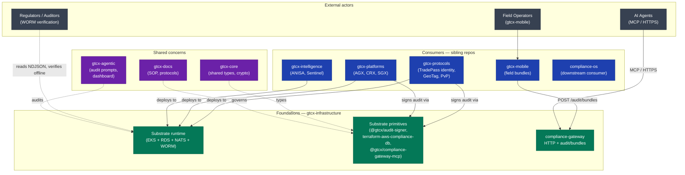
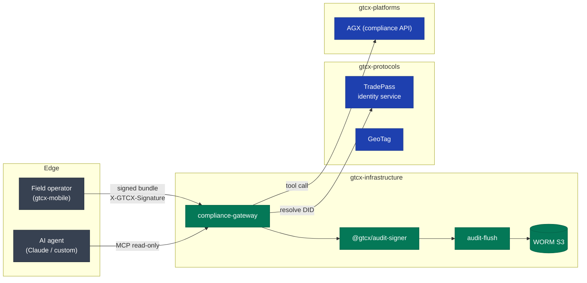
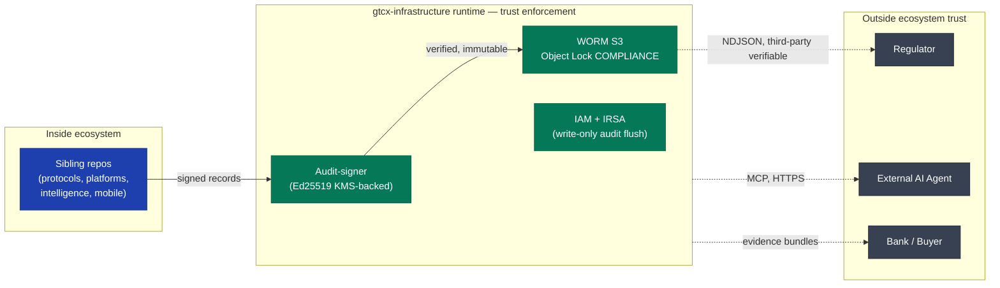

# Ecosystem Integration — gtcx-infrastructure

> **Status:** Current
> **Date:** 2026-05-24
> **Owner:** Frontier Infrastructure Engineer
> **Read this** before adding a new cross-repo dependency.

`gtcx-infrastructure` is the **substrate** that every other GTCX repo deploys onto, audits against, or pulls primitives from. It does not contain product logic. It contains the runtime, the deployment pipeline, the audit trail, the security boundary, and the public primitives that make the rest of the ecosystem composable.

## Scope

- **In scope:** Cross-repo data flows, integration maturity by sibling, public primitives this repo publishes, the trust + compliance boundary the substrate enforces.
- **Out of scope:** Individual sibling repos' internal architecture (each has its own `system-overview.md`).

## Where this repo fits

Three concentric rings: foundations the substrate provides, consumers of those foundations, and external observers (regulators, agents, mobile field operators) who interact with the substrate without joining the ecosystem.

## Cross-repo data flows

The substrate is the **only** repo with three properties simultaneously: (a) holds cryptographic signing keys, (b) writes to the WORM bucket, (c) operates the per-tenant boundary. Every cross-repo data path that touches one of those three crosses this repo.

## Public primitives this repo publishes

The substrate's reusability lives in three packages published outside this repo. Each is consumable independently — adopting one does not force adopting the others.

| Primitive                                                                | What it is                                                                    | Distribution                                            | Consumers                                                       |
| ------------------------------------------------------------------------ | ----------------------------------------------------------------------------- | ------------------------------------------------------- | --------------------------------------------------------------- |
| [`@gtcx/audit-signer`](https://www.npmjs.com/package/@gtcx/audit-signer) | Ed25519 signed hash-linked audit chain with RFC 8785 JCS canonicalization     | npm (public)                                            | Any team needing tamper-evident audit, internally or externally |
| `terraform-aws-compliance-db`                                            | Two-database PostgreSQL (operational + audit) + KYC bucket as a single module | GitHub source (Terraform Registry submission in flight) | Any team wanting the dual-DB pattern without reimplementing     |
| `@gtcx/compliance-gateway-mcp`                                           | MCP server exposing the read-only subset of the compliance-gateway            | npm (publish-ready)                                     | AI agent runtimes (Claude Desktop, custom MCP hosts)            |

Distribution discipline: see [`../decisions/ADR-021-npm-publish-discipline.md`](../decisions/ADR-021-npm-publish-discipline.md).

## Integration maturity by sibling

Maturity reflects the depth of integration **at this repo's boundary**, not the sibling's overall maturity.

| Sibling repo                                                               | Integration mode                                                    | Maturity                          | Reference                                                                              |
| -------------------------------------------------------------------------- | ------------------------------------------------------------------- | --------------------------------- | -------------------------------------------------------------------------------------- |
| [`gtcx-mobile`](https://github.com/gtcx-ecosystem/gtcx-mobile)             | Inbound: POST `/audit/bundles` signed-edge envelope                 | Pilot (Sprint MOB-W1)             | [`../agile/execution-roadmap-2026-05-22.md`](../agile/execution-roadmap-2026-05-22.md) |
| [`gtcx-protocols`](https://github.com/gtcx-ecosystem/gtcx-protocols)       | Outbound: DID resolution via `${TRADEPASS}/identity/${did}`         | Pilot (blocked on #60 deployment) | [`../../docs/architecture/system-overview.md`](./system-overview.md)                   |
| [`gtcx-platforms`](https://github.com/gtcx-ecosystem/gtcx-platforms)       | Outbound: compliance-gateway tool calls to AGX, CRX, SGX            | Production (testnet running)      | [`../audit/full-audit-2026-05-22.md`](../audit/full-audit-2026-05-22.md)               |
| [`gtcx-intelligence`](https://github.com/gtcx-ecosystem/gtcx-intelligence) | Co-deployed in `intelligence` namespace; consumes substrate runtime | Production (af-south-1)           | [`./system-overview.md`](./system-overview.md) §Deployed Services                      |
| [`gtcx-core`](https://github.com/gtcx-ecosystem/gtcx-core)                 | Shared types + crypto primitives                                    | Stable                            | n/a                                                                                    |
| [`gtcx-docs`](https://github.com/gtcx-ecosystem/gtcx-docs)                 | Governs documentation standards (Protocol 1, Protocol 13)           | Active                            | This doc is a result                                                                   |
| [`gtcx-agentic`](https://github.com/gtcx-ecosystem/gtcx-agentic)           | Audit prompts + ecosystem dashboard                                 | Active                            | [`../audit/`](../audit/)                                                               |
| [`compliance-os`](https://github.com/gtcx-ecosystem/compliance-os)         | Downstream consumer of substrate audit-bundle ingest path           | Pilot (W1 coordination)           | n/a                                                                                    |

## Trust boundary at the ecosystem edge

The substrate is the **last** trust boundary before external observers (regulators, AI agents, partners) see GTCX. Anything signed inside this repo's runtime gets the substrate's mathematical guarantees; anything signed elsewhere is consumer-attested.

## What this repo does NOT do for the ecosystem

- **No business logic.** Substrate is policy-enforcement + audit + deployment. Product semantics live in `gtcx-protocols` / `gtcx-platforms`.
- **No mobile client code.** The `/audit/bundles` endpoint verifies inbound mobile signatures but does not ship mobile SDK code.
- **No application-layer compliance.** SOC 2 / PCI / FIPS controls at the application layer are the consuming repo's responsibility; platform-level controls live here.
- **No identity issuance.** TradePass identity issuance is `gtcx-protocols`; we only resolve DIDs against their service.

## Related documents

- [`system-overview.md`](./system-overview.md) — internal architecture of this repo
- [`compliance-substrate-deep-dive.md`](./compliance-substrate-deep-dive.md) — failure modes + scaling story
- [`../decisions/README.md`](../decisions/README.md) — 21 ADRs covering substrate decisions
- [`../agile/execution-roadmap-2026-05-22.md`](../agile/execution-roadmap-2026-05-22.md) — current cross-repo coordination state
- [`../audit/full-audit-2026-05-22.md`](../audit/full-audit-2026-05-22.md) — substrate-as-shipped audit
- Protocol 1: [`gtcx-docs/system-sop/1-protocols/1-docs-structure/protocol.md`](https://github.com/gtcx-ecosystem/gtcx-docs/blob/main/system-sop/1-protocols/1-docs-structure/protocol.md)
- Protocol 13: [`gtcx-docs/system-sop/1-protocols/13-architecture-diagrams/protocol.md`](https://github.com/gtcx-ecosystem/gtcx-docs/blob/main/system-sop/1-protocols/13-architecture-diagrams/protocol.md)
