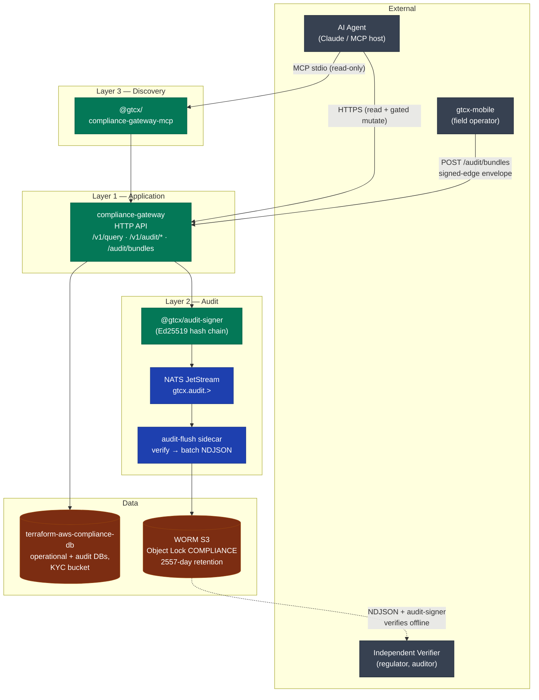
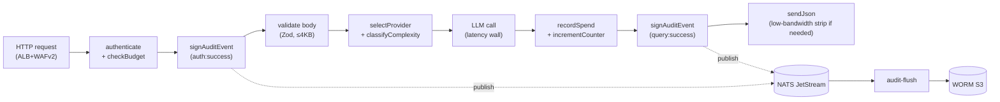
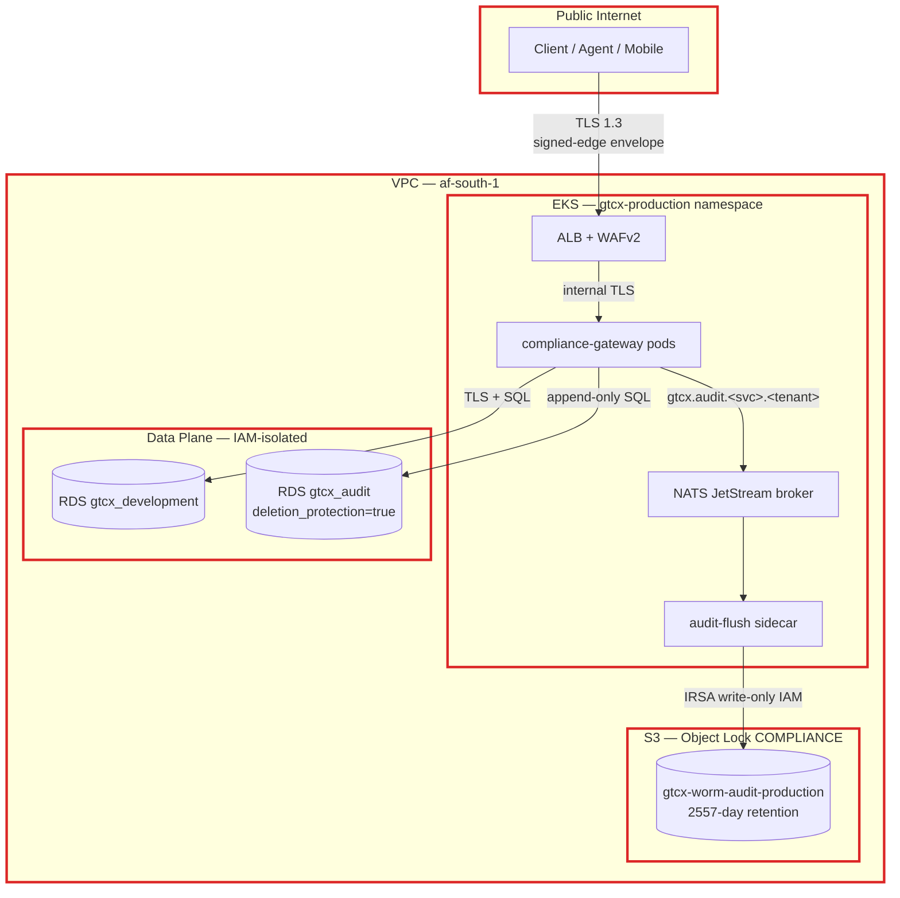
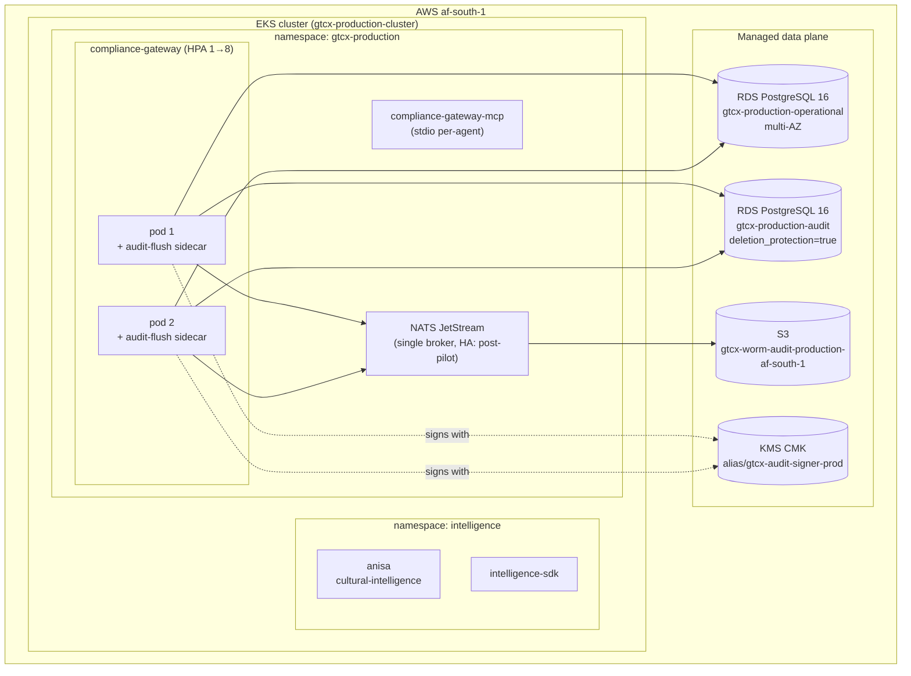

# System Overview — gtcx-infrastructure

> **Status:** Current
> **Date:** 2026-05-24
> **Owner:** Frontier Infrastructure Engineer
> **Read this first** before making any cross-module change.

`gtcx-infrastructure` owns all deployment, IaC, and operational tooling for the GTCX ecosystem. It has no application logic. It orchestrates, deploys, and operates the services defined in other repos.

**Compliance boundary:** `gtcx-infrastructure` also owns platform-level compliance (SOC 2, pen-test, shared policies). Service repos inherit platform compliance and only maintain application-layer controls. See [`platform-compliance-governance.md`](../compliance/platform-compliance-governance.md).

---

## Scope

- **In scope:** Container images, Kubernetes manifests, Terraform modules, deployment scripts, the compliance-substrate runtime (compliance-gateway, audit-signer, audit-flush sidecar, replay-protection), shared CI policies, master-validation gates.
- **Out of scope:** Application/protocol business logic (lives in `gtcx-protocols`, `gtcx-platforms`, `gtcx-intelligence`), mobile/web frontends (live in `gtcx-mobile`), individual protocol specs.

## Architecture Principles

1. **Tamper-evident by default.** Every consequential decision the substrate makes produces a signed audit record (`@gtcx/audit-signer`) that flows to WORM S3 via NATS+JetStream. No code path bypasses signing.
2. **Fail-closed in production.** Production gateways refuse to start without a configured signing key (`process.exit(78)`). The contract is mathematical, not best-effort.
3. **Tenant boundary is structural, not declarative.** Per-tenant JetStream subjects and WORM prefixes (ADR-015) — even a misbehaving tool cannot write tenant A's data to tenant B's prefix.
4. **Trust boundaries map to AWS account + namespace + IAM.** No cross-tenant trust crosses an IAM role; no cross-namespace trust crosses a Kubernetes NetworkPolicy.
5. **Substrate, not framework.** The substrate ships primitives (audit-signer, compliance-db, compliance-gateway-mcp). Consumers compose them; we don't dictate consumer architecture.

---

## System architecture

The substrate has three operational layers and four primitives. The compliance-gateway is the policy enforcement point; the audit-signer + NATS + audit-flush + WORM is the tamper-evidence pipeline; the MCP server is the discovery surface for AI agents.



## Data flow

Every consequential request follows the same write path through signing → durable transport → immutable persistence. Reads short-circuit at the gateway or hit the WORM bucket directly for evidence bundles.



## Trust boundaries

Four boundaries inside the substrate, each mapped to an AWS / Kubernetes / cryptographic enforcement primitive. STRIDE companion at [`docs/security/threat-model-2026-05.md`](../security/threat-model-2026-05.md).



## Deployment topology

EKS in `af-south-1` (primary pilot region), three overlays (testnet / staging / production), HPA scales the gateway on a custom in-flight requests metric, audit-flush sidecar runs alongside each gateway pod.



---

## Full Stack

```
infra/
  docker/                   Docker images and Compose configs
    Dockerfile.platforms      Platform service image (AGX and related apps)
    Dockerfile.protocols      Unified protocols service image
    Dockerfile.intelligence   Intelligence SDK image
    Dockerfile.node           Node.js application image
    docker-compose.infra.yml  Infrastructure services only (DBs, observability)
    docker-compose.dev.yml    Application services (requires source code)
    docker-compose.test.yml   Test environment
    init-scripts/             Database init SQL (postgres/, postgres-audit/)
    observability/            Prometheus, Loki, Grafana configs
  kubernetes/               K8s manifests (Kustomize)
    base/                     Shared base — namespace, configmaps, services
    overlays/
      development/            Dev overrides
      staging/                Staging overrides
      production/             Production — ingress, network policies, pod security
  terraform/                Infrastructure as Code
    modules/
      vpc/                    Multi-cloud VPC / network isolation
      database/               PostgreSQL (operational + audit) — RDS
    environments/
      template/               Copy and fill per deployment environment
  migrations/               Database migration stack (Rails)
    config/                   Per-environment YAML config
    scripts/                  Migration utilities (check_docs.py, generate_docs.py)
  security/                 Security posture
    policies/                 Access control, data protection, incident response
    scripts/                  (security-status.js moved to tools/scripts/)
    reports/                  Audit reports
  scripts/                  Operational scripts
    deploy.sh                 Production deployment (canary, rollback)
    migrate.sh                Database migration runner
    seed.sh                   Data seeding
    setup.sh                  Environment bootstrap
  edge-proxy/               Edge proxy configuration
```

---

## Environments

| Environment   | K8s Namespace     | Usage                                    |
| ------------- | ----------------- | ---------------------------------------- |
| `development` | `gtcx-dev`        | Local K8s, feature development           |
| `staging`     | `gtcx-staging`    | Integration testing, pre-prod validation |
| `production`  | `gtcx-production` | Live — requires `--approval-ticket`      |

---

## Local Infrastructure Services

Defined in `infra/docker/docker-compose.infra.yml` (compose name: `gtcx-infra`):

| Service          | Image                         | Port(s)                                        | Purpose                    |
| ---------------- | ----------------------------- | ---------------------------------------------- | -------------------------- |
| `postgres`       | postgres:16-alpine            | 5432                                           | Operational database       |
| `postgres-audit` | postgres:16-alpine            | 5433                                           | Append-only audit database |
| `redis`          | redis:7-alpine                | 6379                                           | Cache, rate limiting       |
| `prometheus`     | prom/prometheus:v2.48.0       | 9090                                           | Metrics                    |
| `grafana`        | grafana/grafana:10.2.2        | 3030 (maps from 3000)                          | Dashboards                 |
| `jaeger`         | jaegertracing/all-in-one:1.52 | 16686 (UI), 4317 (OTLP gRPC), 4318 (OTLP HTTP) | Distributed tracing        |
| `loki`           | grafana/loki:2.9.2            | 3100                                           | Log aggregation            |

### Two-Database Architecture

This is a hard constraint — never merge, never cross-write:

| Instance         | DB Name            | Port | User         | Purpose                    |
| ---------------- | ------------------ | ---- | ------------ | -------------------------- |
| `postgres`       | `gtcx_development` | 5432 | `gtcx`       | All application read/write |
| `postgres-audit` | `gtcx_audit`       | 5433 | `gtcx_audit` | Append-only audit events   |

The audit database is write-once. `DROP` and `TRUNCATE` are never run against it. Deletion protection is always enabled (`deletion_protection = true` in Terraform regardless of environment).

---

## Kubernetes Architecture

### Base Resources (`infra/kubernetes/base/`)

- `namespace.yaml` — namespace definition
- `configmaps/base-config.yaml` — shared configuration
- `services/api.yaml` — AGX deployment and service
- `services/protocols.yaml` — unified protocols deployment and service
- `services/platform.yaml` — shared platform service account

ConfigMap keys: `GTCX_VERSION`, `GTCX_LOG_LEVEL` (info), `GTCX_LOG_FORMAT` (json)

Images managed in the main stack: `gtcx/agx`, `gtcx/protocols` — tags set per overlay via `kustomize edit set image`.

Secrets: `gtcx-secrets` (DATABASE_URL, SECRET_KEY_BASE) — base contains placeholders; overlays must override before deployment. The secret must exist in the namespace before `kubectl apply`.

Intelligence is deployed separately in `infra/kubernetes/overlays/production/intelligence` under the `intelligence` namespace.

### Environment Overlays

| Overlay       | Notable Additions                                               |
| ------------- | --------------------------------------------------------------- |
| `development` | Minimal overrides, local image tags                             |
| `staging`     | Staging-specific resource limits, staging DB endpoints          |
| `production`  | Ingress (`ingress.yaml`), network policies, pod security policy |

Production overlay is security-sensitive: `network-policies.yaml` (deny-all + explicit allow), `pod-security-policy.yaml` (no root, no privileged). Changes require human approval.

---

## Terraform Architecture

### Module: `infra/terraform/modules/database/`

Provisions two RDS PostgreSQL 16.1 instances per environment:

| Instance    | Identifier               | Storage   | Backup Retention | Notes                        |
| ----------- | ------------------------ | --------- | ---------------- | ---------------------------- |
| Operational | `gtcx-{env}-operational` | 100GB gp3 | 30 days          | Auto-scaling to 200GB        |
| Audit       | `gtcx-{env}-audit`       | 200GB gp3 | 90 days          | `deletion_protection = true` |

Security configuration:

- `storage_encrypted = true` — at-rest encryption always
- `publicly_accessible = false` — no public access
- `multi_az = true` (default) — high availability
- `manage_master_user_password = true` — credentials via AWS Secrets Manager
- SSL enforced (`ssl = 1`, `ssl_min_protocol_version = TLSv1.2`)
- CloudWatch logs: `postgresql`, `upgrade`
- Performance Insights enabled

### Module: `infra/terraform/modules/vpc/`

Multi-cloud VPC and network isolation. Used by the database module and cluster networking.

---

## Deployed Services

The main K8s overlays currently deploy:

- `gtcx-agx` — platform API service
- `gtcx-protocols` — unified protocol runtime

Production intelligence is managed separately:

- `anisa` — cultural intelligence service in the `intelligence` namespace
- `intelligence-sdk` — SDK/orchestration service in the `intelligence` namespace

---

## Key Commands

```bash
# Start local infrastructure only (databases + observability)
docker compose -f infra/docker/docker-compose.infra.yml up -d

# Start full local dev stack (application + infrastructure)
docker compose -f infra/docker/docker-compose.dev.yml up -d

# Deploy to staging
./infra/scripts/deploy.sh staging

# Deploy to production (requires ticket)
./infra/scripts/deploy.sh production --approval-ticket=GTCX-123

# Roll back production
./infra/scripts/deploy.sh production --rollback

# Run migrations (development only — autonomously)
./infra/scripts/migrate.sh development

# Run migrations with dry-run
./infra/scripts/migrate.sh staging --dry-run

# Terraform plan (read-only, requires human to apply)
cd infra/terraform/environments/{env} && terraform plan

# Security scan
node tools/scripts/security-status.js

# Lint and typecheck scripts
pnpm lint && pnpm typecheck
```

---

## Key architectural decisions

| Decision                                             | Rationale                                                                                                         | Trade-off                                                              |
| ---------------------------------------------------- | ----------------------------------------------------------------------------------------------------------------- | ---------------------------------------------------------------------- |
| Two-database PostgreSQL (operational + audit)        | Append-only audit isolated from operational mutations; survives root-account compromise via `deletion_protection` | Operational complexity (two backup policies, two connection pools)     |
| Kustomize over Helm                                  | Declarative overlays per environment; fewer template indirection layers (ADR-007)                                 | No package manager ergonomics; PRs touch each overlay explicitly       |
| NATS JetStream as audit transport                    | Per-tenant subject routing, sub-ms publish, durable consumer (ADR-014)                                            | Single broker is a pilot SPOF; HA cluster post-pilot                   |
| Fail-closed audit signing in production              | `process.exit(78)` if no signing key configured (ADR-016)                                                         | A misconfigured deploy fails fast instead of silently running unsigned |
| Per-tenant JetStream subjects + WORM prefixes        | Structural tenant isolation, not just declarative (ADR-015)                                                       | Slightly higher cardinality in subject space                           |
| Coverage gate at 85% branches for compliance-gateway | Documented deviation from 90% baseline due to startup-listener and broker-integration paths (ADR-020)             | Per-package threshold introduces variance                              |

## Related documents

- [`compliance-substrate-deep-dive.md`](./compliance-substrate-deep-dive.md) — long-form failure modes, scaling story, observability surface
- [`../security/threat-model-2026-05.md`](../security/threat-model-2026-05.md) — STRIDE
- [`../operations/slo-definitions.md`](../operations/slo-definitions.md) — SLIs / SLOs
- [`../decisions/README.md`](../decisions/README.md) — ADR registry (21 ADRs)

## Reference

- [`docs/agents/onboarding/orientation.md`](../agents/onboarding/orientation.md) — session-start reading order
- [`docs/agents/workflows/agent-safety-rules.md`](../agents/workflows/agent-safety-rules.md) — authority tiers
- [`docs/operations/runbooks/deploy.md`](../operations/runbooks/deploy.md) — deploy process
- [`docs/operations/runbooks/migrate.md`](../operations/runbooks/migrate.md) — migration discipline
