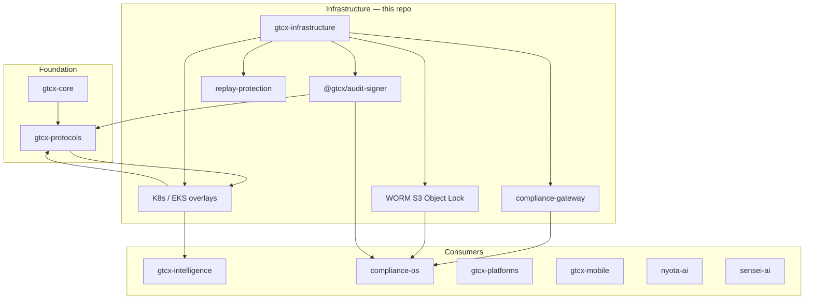

# GTCX Infrastructure — 10/10 Remediation Plan

> **Baseline audits:** [master-audit-2026-05-28.md](./master-audit-2026-05-28.md) (certified 8.8) · [internal-10-10-signoff-2026-05-28.md](./internal-10-10-signoff-2026-05-28.md) (internal **10.0**) · [external-dependencies-register-2026-05-28.md](./external-dependencies-register-2026-05-28.md) · [latest.json](./latest.json)  
> **Scoring:** `gtcx-docs/tools/audit/audit-framework/SCORING_FRAMEWORK.md`  
> **Target:** **10.0 / 10 certified** (internal work **complete** as of 2026-05-28)  
> **Horizon:** External closure (SOC 2, pen-test, INF-49, recurring WORM) — see register

---

## Executive Summary

`gtcx-infrastructure` is the **Zone 4 privileged layer** of the GTCX ecosystem: Terraform, EKS, WORM audit storage, compliance gateway, replay protection, Kyverno policy, SIGNAL agentic safety, and the deployment substrate for **gtcx-protocols**, **gtcx-intelligence**, **compliance-os**, and sovereign platform runtimes.

The repo is **architecturally at 9.0** (internal post-sprint evidence in [latest.json](./latest.json)) but **honestly scores 7.4** when docs-standard drift and unexecuted live-evidence scripts are re-verified ([master-audit-2026-05-28.md](./master-audit-2026-05-28.md)). The gap to 10.0 is not a redesign problem — it is **evidence recurrence, ecosystem wire closure, and third-party attestation**.

**Primary insight:** Infrastructure maturity is measured by whether **every downstream repo can ship to a pilot partner** without heroic exceptions. Today the critical ecosystem blocker is **staging URL + TLS for protocol DID resolution** (gtcx-protocols S47-8 / INF-49), not missing Terraform modules.

---

## 0. Current State Reconciliation

| Signal                                                                                    |        Score | What it means                                                  |
| ----------------------------------------------------------------------------------------- | -----------: | -------------------------------------------------------------- |
| Internal post-sprint ([latest.json](./latest.json))                                       |      **9.0** | Repo-controlled gates green; tooling built                     |
| Foundation re-audit (2026-05-28)                                                          |      **7.4** | Docs-standard fails; live WORM/smoke not executed this session |
| [10-10-remediation-plan-2026-05-27.md](./10-10-remediation-plan-2026-05-27.md) Phases 0–2 | **Complete** | Lint, build, Kustomize, PagerDuty env vars, audit rate limits  |
| Gap to 10.0                                                                               |  **~1.0 pt** | External assurance + live evidence + cross-repo contract proof |

### Dimension gap map (7.4 → 10.0)

| Dimension                     | Current | 10.0 requires                                                     |
| ----------------------------- | ------: | ----------------------------------------------------------------- |
| Code Quality (15%)            |     7.5 | All gates green including docs-standard; contract tests in CI     |
| Repo Hygiene (10%)            |     7.2 | Clean tree; overview/score docs match evidence                    |
| Security (20%)                |     7.4 | Pen-test report; SOC 2 Type I; no open secret-scan findings       |
| Global South Resilience (15%) |     7.6 | Staging smoke in af-south-1; degraded-mode runbooks drilled       |
| Ecosystem Integration (15%)   |     7.9 | Downstream release gates; protocols staging URL live              |
| Agentic Maturity (10%)        |     8.0 | SIGNAL ≥9.5 with eval recurrence; signed agent audit paths        |
| Enterprise Readiness (15%)    |     7.0 | DR drill evidence; automated WORM release bundle every main merge |

---

## 1. Ecosystem Position — Why 10/10 Matters Here



### Downstream consumers (what they need from infra)

| Consumer              | Dependency on gtcx-infrastructure                    | 10/10 unlock for ecosystem                                            |
| --------------------- | ---------------------------------------------------- | --------------------------------------------------------------------- |
| **gtcx-protocols**    | K8s manifest, in-cluster gateway, WAF, testnet EKS   | **INF-49:** staging URL + TLS for DID HTTP resolution (S47-8 blocker) |
| **gtcx-core**         | Release provenance, npm publish CI patterns          | Signed release attestation chain into WORM                            |
| **gtcx-intelligence** | Helm/K8s, ANISA gRPC deploy, staging budget          | Wire #2 evidence endpoint reachable from cluster                      |
| **compliance-os**     | WORM Object Lock pattern alignment, audit durability | Shared audit-signer verification contract                             |
| **gtcx-platforms**    | CRX/SGX/AGX deploy, tradepass-api runtime            | Stable staging/production overlay generation in CI                    |
| **gtcx-mobile**       | Bot gateway deploy workflows                         | Rate-limited audit ingestion parity                                   |
| **gtcx-agentic**      | SIGNAL validation (9.60/10)                          | Agent actions gated on infra policy checks                            |
| **baseline-os**       | `ecosystem-health.yml` clones siblings               | Infra gates included in ecosystem health score                        |

**Published authority packages:** `@gtcx/audit-signer@0.1.0` — consumed for signed NDJSON audit records across protocols and compliance paths.

**Reference:** `gtcx-protocols/docs/audit/ecosystem-consumption-audit-2026-05-28.md` §2.

---

## 2. Non-Negotiable 10/10 Exit Criteria

Per `gtcx-docs/tools/audit/audit-framework/SCORING_FRAMEWORK.md` and Protocol 16:

1. **No unresolved P0/P1** on consequential paths (deploy, audit ingestion, WORM, secrets).
2. **All deterministic gates green** on clean `main`: `pnpm test`, `pnpm test:full`, lint, build, format, governance, gitleaks, Kustomize all overlays, Terraform fmt.
3. **Live evidence executed** (not just scripted): staging WORM upload, runtime smoke JSON, DR drill report.
4. **External attestation underway or complete:** SOC 2 Type I kickoff + pen-test SOW signed; critical/high findings closed.
5. **Ecosystem contract proof:** replay-header + audit-signer verification tests pass against pinned `gtcx-protocols` / `gtcx-core` interfaces.
6. **Downstream unblocked:** protocols INF-49 staging endpoint live; documented in protocols sprint S47.
7. **Self-auditing release:** every `main` merge produces signed, WORM-stored `release-evidence.ndjson` with verifier output.
8. **Composite ≥ 9.8** with **no caps fired**; all three audience lenses ≥ 9.5.

---

## 3. Phase 0 — Hygiene Reconciliation (Week 1)

**Target:** 7.4 → **8.2** (restore honest gate parity with internal 9.0 claim)  
**Owner:** Platform Engineering

| ID     | Action                                                                                                  | Ecosystem impact                          | Evidence                             |
| ------ | ------------------------------------------------------------------------------------------------------- | ----------------------------------------- | ------------------------------------ |
| H0-001 | Fix broken link `docs/README.md` → create or restore `docs/engineering/tech-stack/version-standards.md` | Docs trust for all agent onboarding       | `pnpm docs:check-links` pass         |
| H0-002 | Add `docs/audit/vendor-outreach/README.md` index                                                        | Unblocks vendor SOC2/pen-test procurement | `pnpm test` docs-standard pass       |
| H0-003 | Commit or split PR for baseline/doc WIP (`AGENTS.md`, `.baseline/memory/*`, docs migration)             | Clean audits for downstream repos         | `git status --short` empty on `main` |
| H0-004 | Refresh [latest.json](./latest.json) to HEAD + 2026-05-28 audit pointers                                | baseline-os ecosystem-health reads truth  | JSON validates                       |
| H0-005 | Re-run foundation master audit; publish delta addendum                                                  | Agile/sprint planning uses one score      | `master-audit-2026-05-28-rerun.md`   |

**Exit:** `pnpm test` + `pnpm quality:governance:check` pass on clean checkout.

---

## 4. Phase 1 — Live Evidence Execution (Weeks 2–3)

**Target:** 8.2 → **8.8**  
**Owner:** SRE + Compliance Platform

Repo-side tooling exists ([internal-10-10-sprint-plan-2026-05-27.md](./internal-10-10-sprint-plan-2026-05-27.md) INT-1, INT-2, INT-5). This phase **executes** it.

| ID     | Action                                                                                 | Ecosystem impact                                     | Evidence                                                         |
| ------ | -------------------------------------------------------------------------------------- | ---------------------------------------------------- | ---------------------------------------------------------------- |
| E1-001 | Run `pnpm evidence:release-bundle` on `main`; verify with `@gtcx/audit-signer`         | Core/protocols releases cite same attestation format | `release-evidence-verification.json`                             |
| E1-002 | Execute `upload-release-evidence-to-worm.mjs` against staging WORM                     | compliance-os WORM claims align with infra proof     | S3 object + Object Lock metadata in `worm-runtime-evidence-*.md` |
| E1-003 | Deploy staging smoke probe; run `capture-runtime-smoke-evidence.mjs` with bearer token | **Unblocks protocols INF-49**                        | `runtime-smoke-evidence-*.json`                                  |
| E1-004 | Execute [dr-fire-drill-exercise.md](../operations/runbooks/dr-fire-drill-exercise.md)  | Enterprise lens + compliance-os DR alignment         | Drill report with RTO/RPO                                        |
| E1-005 | Wire release evidence + smoke into `.github/workflows/ci.yml` on `main`                | Downstream repos inherit green infra gate            | CI artifact URLs                                                 |

**ADR-023 note:** Testnet-pilot does **not** require a dedicated WORM bucket — evidence routes to staging with prefixed keys. Close audit finding by linking ADR in [testnet-pilot-worm-provision.md](../operations/runbooks/testnet-pilot-worm-provision.md) as "de-scoped per ADR-023" OR apply Terraform if policy changes.

---

## 5. Phase 2 — Ecosystem Wire Closure (Weeks 3–6)

**Target:** 8.8 → **9.2**  
**Owner:** Platform Architect + Protocol Architect

| ID     | Action                                                                                       | Consumer                      | Evidence                                             |
| ------ | -------------------------------------------------------------------------------------------- | ----------------------------- | ---------------------------------------------------- |
| X2-001 | **INF-49:** Provision `api.staging.gtcx.trade` (or agreed host) with TLS + public `/health`  | gtcx-protocols S47-8          | DNS + TLS cert + 200 on `/health`                    |
| X2-002 | Document in-cluster service map: protocols → compliance-gateway → WORM                       | gtcx-intelligence Wire #2     | `docs/architecture/ecosystem-service-map.md`         |
| X2-003 | Add `tools/contract-tests/` — verify replay headers, audit-signer NDJSON, gateway budget 429 | gtcx-protocols, gtcx-core     | CI job `protocol-contracts` green                    |
| X2-004 | Publish **downstream readiness gate** script consumed by release runbooks                    | compliance-os, gtcx-platforms | `tools/control-plane/check-downstream-readiness.mjs` |
| X2-005 | Extend `baseline-os` ecosystem-health to call infra `pnpm test:full`                         | Whole polyrepo                | Health workflow artifact                             |
| X2-006 | Cross-repo version matrix: pin `@gtcx/audit-signer` across protocols + compliance-os         | Prevent signature drift       | `docs/release/ecosystem-version-matrix.md`           |

**Critical path:** X2-001 unblocks sovereign go-live narratives in protocols trust-center and Zimbabwe/Namibia sandbox tracks.

---

## 6. Phase 3 — External Assurance (Weeks 6–10)

**Target:** 9.2 → **9.6**  
**Owner:** CISO / Security Lead

| ID     | Action                                                                                                                | Evidence                                    |
| ------ | --------------------------------------------------------------------------------------------------------------------- | ------------------------------------------- |
| A3-001 | SOC 2 Type I auditor kickoff ([external-assurance-kickoff-2026-05-27.md](./external-assurance-kickoff-2026-05-27.md)) | Engagement letter + control owner matrix    |
| A3-002 | Pen-test SOW signed; scope includes gateway, replay-protection, WORM paths, K8s admission                             | Signed SOW in `docs/audit/vendor-outreach/` |
| A3-003 | Execute pen-test; triage via [external-finding-register-template.md](./external-finding-register-template.md)         | Zero open critical/high at retest           |
| A3-004 | Map controls to SOC 2 / ISO 27001 / NIST 800-53 in `docs/compliance/evidence-index.md`                                | Single evidence index                       |
| A3-005 | Annual chaos workflow: [chaos-test.yml](../../.github/workflows/chaos-test.yml) with retained artifacts               | Monthly evidence blob                       |

**Ecosystem coupling:** compliance-os pen-test M3-001 should **share scope** with infra gateway/WORM paths to avoid duplicate vendor cost.

---

## 7. Phase 4 — Institutional Controls (Weeks 8–12)

**Target:** 9.6 → **9.8**  
**Owner:** Security + Platform

| ID     | Action                                                                                  | Dimension lift         |
| ------ | --------------------------------------------------------------------------------------- | ---------------------- |
| I4-001 | Linkerd production overlay 100% mTLS (`production-linkerd`)                             | Security + Enterprise  |
| I4-002 | Kyverno `require-signed-images` enforced in production                                  | Security               |
| I4-003 | AWS WAF OWASP CRS on staging + production ALB                                           | Security               |
| I4-004 | JIT access via IAM Identity Center; 4h session max                                      | Enterprise             |
| I4-005 | Custom CodeQL rules for hardcoded keys in `tools/`                                      | Code Quality           |
| I4-006 | OWASP ZAP weekly against staging ([dast-zap.yml](../../.github/workflows/dast-zap.yml)) | Security               |
| I4-007 | Board-approved RTO/RPO + quarterly DR with witness                                      | Enterprise + Sovereign |

---

## 8. Phase 5 — Reference-Grade 10/10 (Week 12+ / Month 6)

**Target:** 9.8 → **10.0**  
**Owner:** Quality Evidence Lead

| ID     | Action                                                                                         | 10/10 meaning                     |
| ------ | ---------------------------------------------------------------------------------------------- | --------------------------------- |
| R5-001 | **Recurring WORM release bundle** on every `main` merge (automated, not manual)                | Repo audits itself continuously   |
| R5-002 | SOC 2 Type I report received                                                                   | Enterprise procurement gate       |
| R5-003 | Pen-test retest clean                                                                          | Security dimension ≥ 9.5          |
| R5-004 | Independent master audit — all dimensions ≥ 9.5, composite 10.0                                | Protocol 16 certification         |
| R5-005 | Update [score-evidence-ledger.json](./score-evidence-ledger.json) with certification artifacts | Immutable score history           |
| R5-006 | Publish trust-center packet for institutional buyers                                           | Investor + Sovereign lenses ≥ 9.5 |

---

## 9. Score Trajectory

```
7.4 ──► 8.2 ──► 8.8 ──► 9.2 ──► 9.6 ──► 9.8 ──► 10.0
 │      │       │       │       │       │       │
 │      │       │       │       │       │       └── Phase 5: Certification + recurring WORM
 │      │       │       │       │       └── Phase 4: Institutional controls
 │      │       │       │       └── Phase 3: SOC2 + pen-test
 │      │       │       └── Phase 2: Ecosystem wires (INF-49)
 │      │       └── Phase 1: Live evidence execution
 │      └── Phase 0: Hygiene (docs-standard)
 └── Foundation audit 2026-05-28
```

| Week | Milestone                            | Expected composite |
| ---- | ------------------------------------ | -----------------: |
| 1    | Phase 0 complete                     |                8.2 |
| 3    | Live WORM + smoke + DR               |                8.8 |
| 6    | INF-49 live + contract tests         |                9.2 |
| 10   | Pen-test + SOC2 kickoff artifacts    |                9.6 |
| 12   | Institutional controls + ZAP/Linkerd |                9.8 |
| 24   | SOC2 Type I + recurring WORM CI      |           **10.0** |

---

## 10. Sprint Allocation (Next 6 Weeks)

| Sprint  | Focus                 | Key deliverables                                          |
| ------- | --------------------- | --------------------------------------------------------- |
| **S49** | Phase 0 + E1-001..002 | Docs-standard green; first automated WORM upload          |
| **S50** | E1-003..005 + X2-001  | **INF-49 staging URL**; smoke JSON; CI evidence artifacts |
| **S51** | X2-002..006           | Contract tests; downstream readiness gate; version matrix |
| **S52** | A3-001..002           | SOC2 + pen-test vendor signed                             |
| **S53** | A3-003..005           | Pen-test remediation; chaos evidence                      |
| **S54** | I4-001..004           | Linkerd, WAF, JIT                                         |

---

## 11. Dependencies & Risks

| Risk                                            | Mitigation                                                              |
| ----------------------------------------------- | ----------------------------------------------------------------------- |
| AWS credentials not available for WORM/smoke    | Scoped OIDC role for CI only; runbooks for manual break-glass           |
| protocols INF-49 blocked on DNS/TLS procurement | Escalate to GTM; temporary Cloudflare tunnel documented                 |
| Pen-test delays 10/10 by months                 | Parallel SOC 2 Type I; don't block Phase 0–2 on vendor                  |
| Downstream repos don't adopt audit-signer pins  | Enforce in contract-tests; fail ecosystem-health if drift               |
| Score inflation vs evidence                     | Phase 5 requires **independent** re-audit; cap if 2+ P1 on deploy paths |

---

## 12. One-Point-Uplift Quick Wins (This Week)

These cost $0 and close the 7.4 vs 9.0 perception gap:

1. Fix 3 docs-standard violations (H0-001, H0-002) — **~2 hours**
2. Run `pnpm evidence:release-bundle` locally and commit evidence pointers — **~1 hour**
3. Update README badge + `docs/overview/` to cite 8.8–9.0 with evidence links, not stale 5.9 — **~1 hour**
4. Post INF-49 status to gtcx-protocols `docs/agile/sprints/s47-*.md` — **~30 min**

---

## 13. Related Artifacts

| Document                                                                               | Purpose                                        |
| -------------------------------------------------------------------------------------- | ---------------------------------------------- |
| [10-10-remediation-plan-2026-05-27.md](./10-10-remediation-plan-2026-05-27.md)         | Completed Phases 0–2 (gates)                   |
| [internal-10-10-sprint-plan-2026-05-27.md](./internal-10-10-sprint-plan-2026-05-27.md) | INT-1..5 tooling complete                      |
| [ADR-023](../architecture/decisions/ADR-023-testnet-pilot-worm-exception.md)           | Testnet WORM de-scope                          |
| [worm-runtime-evidence-2026-05-27.md](./worm-runtime-evidence-2026-05-27.md)           | Staging WORM proof                             |
| [master-audit-2026-05-28.md](./master-audit-2026-05-28.md)                             | Honest current score                           |
| `gtcx-core/docs/audit/10-10-remediation-plan-2026-05-27.md`                            | Upstream crypto — infra publishes attestations |
| `compliance-os/docs/audit/10-10-roadmap-2026-05-27.md`                                 | Parallel WORM/audit alignment                  |

---

## 14. Strategic Thesis

**gtcx-infrastructure at 10/10 means:** every other GTCX repo can answer "how do we deploy, audit, and prove trust?" with a single, signed, immutable evidence chain — without forked bash, shadow WORM, or mystery staging URLs.

The ecosystem does not need more Terraform modules. It needs **INF-49 live**, **WORM evidence on every release**, and **pen-test + SOC 2 signatures** on the same control plane that already scores SIGNAL 9.60/10.

That is the path from **7.4 honest** → **9.0 internal** → **10.0 reference-grade**.
