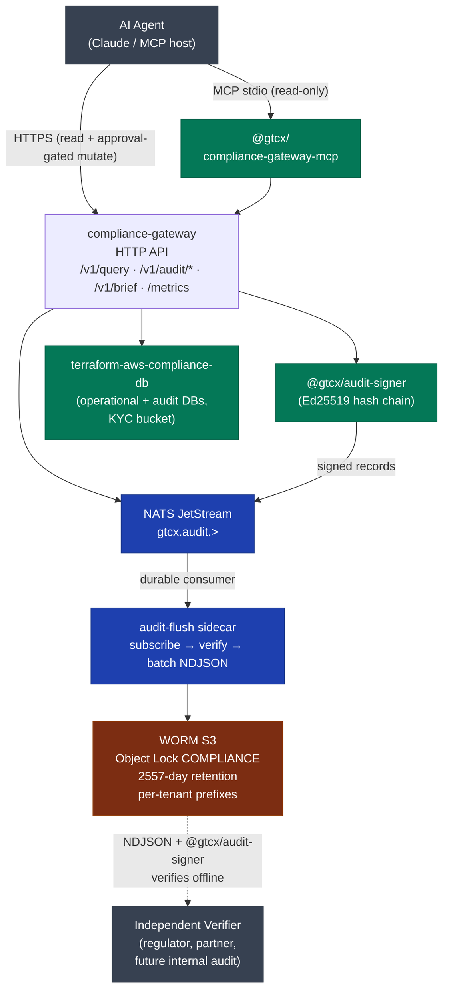

# Architecture — GTCX Compliance Substrate

How the three primitives compose into the substrate behind GTCX's compliance gateway.

## The picture

## The contract

- **Every consequential decision** the compliance-gateway makes produces a signed audit record (`@gtcx/audit-signer`).
- **Every signed record** flows through NATS JetStream's per-tenant subject hierarchy (ADR-014, ADR-015) to the audit-flush sidecar.
- **Every batch** the sidecar emits is verified locally, written to WORM S3 with Object Lock COMPLIANCE mode (retention enforced at the bucket policy level, not the IAM level — even a root-key compromise can't delete a record before retention expires).
- **Any third party** with the NDJSON file and `@gtcx/audit-signer` can verify the entire chain offline. No GTCX-side trust step is required.

## Why each primitive is its own package

The primitives compose, but you can adopt one without the others:

| Use `@gtcx/audit-signer` standalone if                  | Use `terraform-aws-compliance-db` standalone if                  | Use `@gtcx/compliance-gateway-mcp` standalone if                |
| ------------------------------------------------------- | ---------------------------------------------------------------- | --------------------------------------------------------------- |
| You need tamper-evident audit but have your own gateway | You need the dual-DB pattern but have your own application logic | You have your own compliance backend and just want MCP exposure |

Each package is small (< 500 LOC for the audit-signer) and minimally opinionated about its consumers.

## How it composes for the GTCX testnet pilot

In the live Zimbabwe testnet:

1. A field operator submits a compliance query via the mobile bot
2. The compliance-gateway receives it on `/v1/query`, authenticates the operator, routes to the appropriate protocol tools
3. The gateway signs an `auth:success` record, then a `query:success` record after the LLM returns
4. Both records publish to `gtcx.audit.compliance-gateway.zimbabwe-pilot` on JetStream
5. The audit-flush sidecar consumes them, verifies the chain, batches every 10 seconds
6. Batches land in `s3://gtcx-worm-audit-production-af-south-1/tenant=zimbabwe-pilot/2026/05/22/14/...ndjson`
7. After Object Lock retention expires (2031-05), the records become deletable; until then they are mathematically immutable

A future regulator's auditor can pull any object from the bucket and run `verifyChain` on its NDJSON content. They need nothing from GTCX.

## Related

- [ADR-014 — NATS JetStream Audit Transport](https://github.com/gtcx-ecosystem/gtcx-infrastructure/blob/main/docs/architecture/decisions/ADR-014-nats-jetstream-audit-transport.md)
- [ADR-015 — Per-Tenant Subject Routing](https://github.com/gtcx-ecosystem/gtcx-infrastructure/blob/main/docs/architecture/decisions/ADR-015-per-tenant-jetstream-subject-routing.md)
- [ADR-016 — Fail-Closed Audit Signing](https://github.com/gtcx-ecosystem/gtcx-infrastructure/blob/main/docs/architecture/decisions/ADR-016-fail-closed-audit-signing.md)
- [SIGNAL Scorecard (v2, 9.60/10)](https://github.com/gtcx-ecosystem/gtcx-infrastructure/blob/main/docs/audit/signal-scorecard.json)
