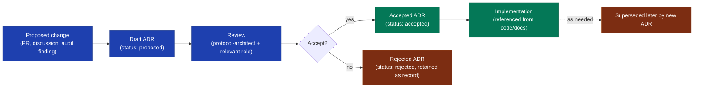

# Governance — GTCX Compliance Substrate

> **Audience:** External regulators, pilot governments, partners, board, and the substrate engineering team.
> **Purpose:** How decisions get made in this repo, who has authority over what, how external stakeholders interact with substrate governance, and how the substrate itself enforces its governance commitments.

## Scope

- **In scope:** Decision-making model, ADR process, maintainer roles, release governance, cross-repo coordination, external-stakeholder interface, AI model governance.
- **Out of scope:** Day-to-day code review (covered by [`agents/workflows/agent-safety-rules.md`](../agents/workflows/agent-safety-rules.md)), incident response (covered by [`operations/runbooks/incident-response.md`](../operations/runbooks/incident-response.md)), internal corporate governance (covered by board charter at [`../compliance/board-security-committee-charter.md`](../compliance/board-security-committee-charter.md)).

## Decision-making model

Three decision tiers, mapped to three authority levels:

| Decision class                                                                                          | Authority                                                                   | Visibility                                 | Reversibility                                |
| ------------------------------------------------------------------------------------------------------- | --------------------------------------------------------------------------- | ------------------------------------------ | -------------------------------------------- |
| **Code-change-level** (single PR, no architectural shift)                                               | Reviewer + author consensus                                                 | Public PR                                  | Easy (revert)                                |
| **Architectural** (cross-module, new boundary, new dependency)                                          | ADR + protocol architect approval                                           | Public ADR                                 | Hard (new ADR superseding the old)           |
| **Substrate-contract** (changes the audit chain, signing scheme, trust boundary, or external API shape) | ADR + protocol architect + security lead approval + cross-repo coordination | Public ADR + cross-team standup discussion | Very hard (back-compat shim or version bump) |

The full architectural decision register is at [`../decisions/README.md`](../decisions/README.md) — 21 ADRs as of 2026-05-24.

## Roles + responsibilities

| Role                                 | Owns                                                                           | Examples                                                                                                                                                                                     |
| ------------------------------------ | ------------------------------------------------------------------------------ | -------------------------------------------------------------------------------------------------------------------------------------------------------------------------------------------- |
| **Protocol Architect**               | Substrate-level architectural decisions, ADR approval, cross-repo coordination | ADR-014 (NATS transport), ADR-016 (fail-closed signing)                                                                                                                                      |
| **Crypto / Security Engineer**       | Threat model, key ceremonies, VDP, security architecture                       | [`../security/threat-model-2026-05.md`](../security/threat-model-2026-05.md), [`../operations/runbooks/audit-signing-key-rotation.md`](../operations/runbooks/audit-signing-key-rotation.md) |
| **Frontier Infrastructure Engineer** | Substrate runtime, deployment topology, IaC                                    | [`../architecture/system-overview.md`](../architecture/system-overview.md), Terraform modules under `infra/terraform/`                                                                       |
| **Quality / Evidence Lead**          | Audit cycles, compliance evidence, master-validation gates                     | [`../audit/full-audit-2026-05-22.md`](../audit/full-audit-2026-05-22.md), [`../audit/score-evidence-ledger.json`](../audit/score-evidence-ledger.json)                                       |
| **Product Lead**                     | GTM artifacts, pilot agreements, business model                                | GTM evidence pack (on `docs/v2-standard-alignment` branch — PR #57)                                                                                                                          |

Role definitions follow Protocol 1's role enum. The same person may hold multiple roles; the role is the authority lens, not the person.

## ADR (Architecture Decision Record) process

Every architectural decision goes through this flow:

Rules:

- ADRs are **immutable once accepted**. To change a decision, write a new ADR that supersedes the old one.
- Rejected ADRs are retained as a record of what was considered and ruled out — context for future decision-makers.
- Every ADR includes Status, Context, Decision, Alternatives Considered, Consequences, and Threat coverage (where applicable).

## Release governance

| Release tier                                               | Approval gate                                          | Audit evidence                                                                                                                                                                         |
| ---------------------------------------------------------- | ------------------------------------------------------ | -------------------------------------------------------------------------------------------------------------------------------------------------------------------------------------- |
| **Substrate primitives** (npm packages, Terraform modules) | ADR-021 four-rule npm publish discipline               | [`../decisions/ADR-021-npm-publish-discipline.md`](../decisions/ADR-021-npm-publish-discipline.md), [`../security/credential-rotation-log.md`](../security/credential-rotation-log.md) |
| **Substrate runtime** (compliance-gateway, audit-flush)    | Canary deploy + automated rollback                     | [`../operations/runbooks/deploy.md`](../operations/runbooks/deploy.md), [`../operations/runbooks/automated-rollback.md`](../operations/runbooks/automated-rollback.md)                 |
| **Production deployment**                                  | Approval ticket (`GTCX-NNN`) required + human approval | [`../operations/runbooks/deploy.md`](../operations/runbooks/deploy.md) §Approval gates                                                                                                 |
| **Master validation**                                      | 17/17 gates pass on every PR (block merge on failure)  | [`../../tools/scripts/validate-all.mjs`](../../tools/scripts/validate-all.mjs)                                                                                                         |

## Cross-repo coordination

The substrate sits at the intersection of every signing path in the ecosystem. Cross-repo decisions involving the substrate follow these conventions:

| Coordination type              | Forum                                                                                             | Cadence         |
| ------------------------------ | ------------------------------------------------------------------------------------------------- | --------------- |
| Mobile-prod cross-repo standup | `#gtcx-mobile-prod` Slack                                                                         | Daily 09:00 GMT |
| Architectural cross-repo ADR   | Substrate-side ADR + sibling-repo issue + cross-link both                                         | Per decision    |
| Security cross-repo finding    | Coordinated disclosure per [`../security/bug-bounty-policy.md`](../security/bug-bounty-policy.md) | Per incident    |
| Wire-shape contract change     | Issue on both repos with `wire-shape-change` label                                                | Per change      |

Current cross-repo state: see Sprint MOB-W1 in [`../agile/execution-roadmap-2026-05-22.md`](../agile/execution-roadmap-2026-05-22.md).

## External-stakeholder interface

How regulators, pilot governments, and partners interact with substrate governance:

| Stakeholder                        | Interface                                                                                     | Examples                                                       |
| ---------------------------------- | --------------------------------------------------------------------------------------------- | -------------------------------------------------------------- |
| Regulators                         | WORM bucket direct read + `verifyChain` offline                                               | Independent audit trail verification — no GTCX-side trust step |
| Pilot governments                  | MOU + per-sovereign tenant + dedicated WORM prefix                                            | Zimbabwe pilot (W4 go-live, MOB-W1)                            |
| Partners (banks, buyers, auditors) | Read access to evidence bundles via `/v1/audit/evidence-bundle`                               | Tenant-scoped, time-bounded                                    |
| Security researchers               | [`../security/bug-bounty-policy.md`](../security/bug-bounty-policy.md) coordinated disclosure | VDP + bug bounty                                               |
| Sibling-repo engineering           | Issue cross-references + `#gtcx-mobile-prod` standup                                          | gtcx-mobile MOB-W1 issues #49-#52 + tracker #55                |

## AI model governance

The substrate's compliance-gateway routes queries across multiple LLM providers (Anthropic Claude, OpenAI, Google Gemini, DeepSeek, Groq, OpenRouter). Each provider has a defined role in the routing layer:

| Tier        | Providers                          | When used                                           |
| ----------- | ---------------------------------- | --------------------------------------------------- |
| **Simple**  | Gemini Flash, Groq Llama           | Free-tier; classification, simple lookups           |
| **Medium**  | DeepSeek, Gemini, GPT-4.1-mini     | Cost-optimized; routine compliance queries          |
| **Complex** | Claude Sonnet, GPT-4.1, Gemini Pro | Frontier; novel jurisdictions, multi-step reasoning |

Substrate-level AI governance properties:

| Property                  | Implementation                                                                                                                                                                      |
| ------------------------- | ----------------------------------------------------------------------------------------------------------------------------------------------------------------------------------- |
| Provider failure handling | Fallback chain per [`tools/compliance-gateway/src/providers.mjs`](../../tools/compliance-gateway/src/providers.mjs)                                                                 |
| Cost gating               | Per-principal QPS + daily USD budget (ADR not yet published — see [`tools/compliance-gateway/src/budget.mjs`](../../tools/compliance-gateway/src/budget.mjs))                       |
| Prompt injection defense  | Zod schema validation + delimited untrusted-context block + 18-payload injection suite ([`tools/eval-pipeline/injection-suite.mjs`](../../tools/eval-pipeline/injection-suite.mjs)) |
| Adaptive degradation      | Auto / reduced / minimal modes per ADR-017                                                                                                                                          |
| Audit trail of LLM use    | Every consequential query produces a signed audit record                                                                                                                            |

Individual provider model cards are not currently maintained — provider docs are the canonical source. If we move to fine-tuned or hosted models, per-model cards become part of this governance surface.

## What this governance model does NOT cover

- **Substrate-consumer governance** (how sibling repos like gtcx-protocols, gtcx-mobile govern their own decisions) — each sibling owns its own model
- **Sovereign jurisdiction governance** (how Zimbabwe RBZ or Ghana FRC governs in-country) — separate per-jurisdiction agreement
- **Corporate / legal entity governance** — board charter at [`../compliance/board-security-committee-charter.md`](../compliance/board-security-committee-charter.md)

## Related documents

- [`../README.md`](../README.md) — docs index
- [`../decisions/README.md`](../decisions/README.md) — full ADR register (21 ADRs)
- [`../security/bug-bounty-policy.md`](../security/bug-bounty-policy.md) — coordinated security disclosure
- [`../compliance/board-security-committee-charter.md`](../compliance/board-security-committee-charter.md) — corporate-side governance
- [`../agents/workflows/agent-safety-rules.md`](../agents/workflows/agent-safety-rules.md) — AI agent authority tiers
- Cross-team trust portal + GTM evidence pack — landed on `docs/v2-standard-alignment` (PR #57), pending merge
