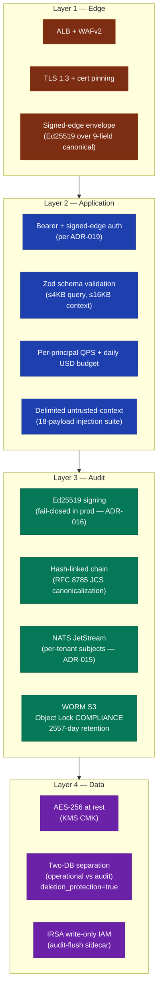

# Security Posture — GTCX Compliance Substrate

> **Audience:** Enterprise buyers, regulators, security teams evaluating the substrate for pilot or production adoption.
> **Companion docs:** [`02-compliance-matrix.md`](./02-compliance-matrix.md), [`../security/threat-model-2026-05.md`](../security/threat-model-2026-05.md), [`../audit/full-audit-2026-05-22.md`](../audit/full-audit-2026-05-22.md).

## Headline posture (as of 2026-05-24)

| Dimension                | Status                                                                                                                                           | Evidence                                                                       |
| ------------------------ | ------------------------------------------------------------------------------------------------------------------------------------------------ | ------------------------------------------------------------------------------ |
| Substrate audit score    | 9.60 / 10 (SIGNAL v2)                                                                                                                            | [`../audit/signal-scorecard.json`](../audit/signal-scorecard.json)             |
| Threat model             | STRIDE — 20 threats categorized; 3 spoofing, 4 tampering, 2 repudiation, 4 information-disclosure, 4 denial-of-service, 3 elevation-of-privilege | [`../security/threat-model-2026-05.md`](../security/threat-model-2026-05.md)   |
| Critical open findings   | 0                                                                                                                                                | [`../audit/full-audit-2026-05-22.md`](../audit/full-audit-2026-05-22.md)       |
| Penetration test         | RFP sent to 4 firms; engagement target 2026-07                                                                                                   | [`../security/red-team-playbook.md`](../security/red-team-playbook.md)         |
| Bug bounty               | Policy published; scope live for substrate primitives                                                                                            | [`../security/bug-bounty-policy.md`](../security/bug-bounty-policy.md)         |
| Signed-commits policy    | Enforced on `main`                                                                                                                               | [`../security/signed-commits-policy.md`](../security/signed-commits-policy.md) |
| Container image signing  | Cosign keyless via OIDC                                                                                                                          | [`../security/cosign-ci-integration.md`](../security/cosign-ci-integration.md) |
| Vulnerability disclosure | Coordinated VDP published                                                                                                                        | [`../security/bug-bounty-policy.md`](../security/bug-bounty-policy.md)         |

## Defense in depth



## Cryptography

| Primitive            | Choice                                      | Rationale                                                                                        |
| -------------------- | ------------------------------------------- | ------------------------------------------------------------------------------------------------ |
| Signature algorithm  | Ed25519                                     | Modern, fast, side-channel resistant, ubiquitous library support                                 |
| Hash function        | SHA-256                                     | FIPS 180-4 approved; pairs with Ed25519                                                          |
| Canonicalization     | RFC 8785 JCS                                | Eliminates whitespace + key-order ambiguity from signed payloads                                 |
| Key storage          | AWS KMS CMK + Kubernetes Secret             | Private key never lands on disk in plaintext outside `tmpfs`                                     |
| Key rotation         | 365-day scheduled + immediate-on-compromise | Runbook: [`audit-signing-key-rotation.md`](../operations/runbooks/audit-signing-key-rotation.md) |
| Transport encryption | TLS 1.3                                     | Forward secrecy, no legacy cipher suites                                                         |
| At-rest encryption   | AES-256-GCM (KMS-managed)                   | RDS, S3, and KMS-backed key material                                                             |

FIPS 140-3 posture: see [`../security/fips-assessment.md`](../security/fips-assessment.md). The substrate uses Node.js `crypto.subtle` Web Crypto API exclusively — no userspace cryptographic primitives. FIPS validation status follows the underlying Node.js + OpenSSL builds used by the runtime container image.

## Tenant isolation

Per-tenant isolation is **structural**, not declarative. Each tenant's audit records flow through its own JetStream subject (`gtcx.audit.<service>.<tenantId>`) and land at its own WORM prefix (`s3://gtcx-worm-audit-production-af-south-1/tenant=<tenantId>/...`). Even a misbehaving compliance-gateway tool cannot write tenant A's data to tenant B's WORM prefix — the audit-flush sidecar routes by the subject the gateway published on, not by the tool's claim.

ADR-015: [`../decisions/ADR-015-per-tenant-jetstream-subject-routing.md`](../decisions/ADR-015-per-tenant-jetstream-subject-routing.md).

## Fail-closed contract

In production, the compliance-gateway **refuses to start** if the audit signing key is not configured. `process.exit(78)` (EX_CONFIG) on startup if the signing material is absent. This means a misconfigured deploy fails fast and visibly, instead of silently running unsigned. ADR-016: [`../decisions/ADR-016-fail-closed-audit-signing.md`](../decisions/ADR-016-fail-closed-audit-signing.md).

## Independent verifiability

Any third party with the WORM NDJSON file and the public `@gtcx/audit-signer` npm package can verify the entire chain offline — no GTCX-side trust step is required. The substrate's tamper-evidence guarantee is therefore mathematical, not operational.

```bash
npx -y @gtcx/audit-signer verify --file /path/to/batch.ndjson
# expected: { valid: true } or { valid: false, firstInvalidIndex: <n> }
```

Substitution attacks (forging the entire chain with a substitute key) require the attacker to control every WORM object since the original key was last used. Object Lock COMPLIANCE mode makes that impossible: not even AWS root can delete an object before retention expires.

## Open security follow-ups

| ID           | Status      | Description                                            | Tracked                                  |
| ------------ | ----------- | ------------------------------------------------------ | ---------------------------------------- |
| SEC-OPEN-001 | In-progress | Signed approval tickets for mutating tools             | gtcx-infrastructure backlog              |
| SEC-OPEN-002 | In-progress | Sigstore/SLSA provenance on npm publishes              | ADR-021 + pre-`@gtcx/audit-signer@0.2.0` |
| SEC-OPEN-003 | Scheduled   | Linkerd mTLS sidecar at runtime (ADR-013)              | Q3 2026                                  |
| SEC-OPEN-004 | Scheduled   | Cross-region WORM replication for regulator-visible DR | Post-pilot                               |
| SEC-OPEN-005 | Scheduled   | JetStream cluster HA (single broker today)             | Post-pilot                               |

## Compliance framework coverage

See [`02-compliance-matrix.md`](./02-compliance-matrix.md) for the framework-by-framework mapping (SOC 2 Type 1 in flight, GDPR DPIA published, PCI-DSS scoping draft, FIPS posture).

## Related documents

- [`00-executive-brief.md`](./00-executive-brief.md) — one-pager
- [`02-compliance-matrix.md`](./02-compliance-matrix.md) — framework mapping
- [`../security/threat-model-2026-05.md`](../security/threat-model-2026-05.md) — STRIDE
- [`../security/security-architecture.md`](../security/security-architecture.md) — detailed architecture
- [`../audit/full-audit-2026-05-22.md`](../audit/full-audit-2026-05-22.md) — most recent audit
- [`../operations/runbooks/audit-chain-incident-response.md`](../operations/runbooks/audit-chain-incident-response.md) — P0 response for chain failures
