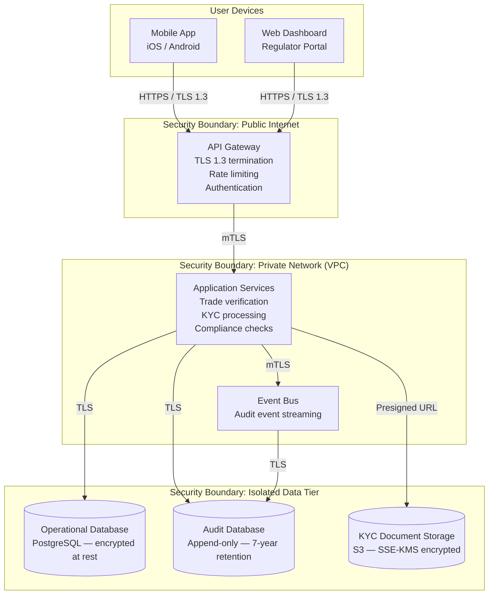

# GTCX Platform Architecture Overview

**Prepared for:** Regulatory Sandbox Application  
**Classification:** Confidential  
**Version:** 1.0  
**Date:** May 2026  
**Contact:** [Name, Title, Email, Phone — to be completed before submission]

---

## What GTCX Does

GTCX (Global Trade & Compliance Exchange) is a trade compliance platform for African commodity markets. It enables buyers, sellers, and regulators to verify the provenance, quality, and regulatory compliance of commodity transactions in real time. The platform provides digital identity verification (KYC), tamper-evident audit trails, and automated compliance checks against local AML/CFT regulations — replacing paper-based processes that currently slow cross-border trade by days or weeks.

---

## System Architecture

The diagram below shows how data flows through the platform, from the user's mobile device to the database, and where security boundaries are enforced.

**Key points:**

- All communication between components is encrypted (TLS 1.3 or mutual TLS).
- The database tier is isolated in a private subnet with no direct internet access.
- The audit database is append-only — records cannot be modified or deleted.
- KYC documents are stored with server-side encryption using dedicated encryption keys.

---

## Data Residency

All data is stored in **AWS af-south-1 (Cape Town, South Africa)**. No data leaves the African continent. Backups are encrypted and stored in the same region. Cross-border data transfers, where required between African jurisdictions, comply with the data protection law of each jurisdiction (see Compliance Alignment below).

For specific jurisdictions:

| Jurisdiction | AWS Region             | Regulator                  | Data Protection Law                         |
| ------------ | ---------------------- | -------------------------- | ------------------------------------------- |
| Zimbabwe     | af-south-1 (Cape Town) | Reserve Bank of Zimbabwe   | Cyber and Data Protection Act (2021)        |
| South Africa | af-south-1 (Cape Town) | South African Reserve Bank | POPIA (2013)                                |
| Kenya        | af-south-1 (Cape Town) | Central Bank of Kenya      | Data Protection Act (2019)                  |
| Nigeria      | af-south-1 (Cape Town) | Central Bank of Nigeria    | Nigeria Data Protection Act (2023)          |
| Rwanda       | af-south-1 (Cape Town) | National Bank of Rwanda    | Law N 058/2021                              |
| Tanzania     | af-south-1 (Cape Town) | Bank of Tanzania           | Personal Data Protection Act (pending)      |
| Ghana        | eu-west-1 (Ireland)    | Bank of Ghana              | Data Protection Act (Act 843, 2012)         |
| Egypt        | me-south-1 (Bahrain)   | Central Bank of Egypt      | Personal Data Protection Law No. 151 (2020) |

Ghana and Egypt use the nearest permitted AWS regions as approved by their respective regulators. All other jurisdictions use Cape Town.

---

## Security Controls

The following controls protect the platform and its data:

- **Encryption everywhere.** All data is encrypted in transit (TLS 1.3) and at rest (AES-256). Encryption keys are managed by AWS Key Management Service (KMS) and rotated annually. Database connections require TLS. Internal service communication uses mutual TLS (mTLS).

- **Identity and access control.** All users authenticate with multi-factor authentication (MFA). Staff access follows least-privilege principles — engineers cannot access production data without explicit approval. Privileged access is logged and reviewed quarterly. API tokens rotate every 90 days.

- **Separation of duties.** No single person can deploy code, approve changes, and access the database. Code changes require peer review. Production deployments require separate approval. The audit database cannot be written to by any human — only the system can append records.

- **Tamper-evident audit trail.** Every significant action (transaction, KYC check, compliance decision) is recorded in an append-only audit database with a 7-year retention period. Audit records cannot be modified or deleted. Audit backups are exported to encrypted, immutable storage.

- **Incident response.** A formal Incident Response Plan (IRP) defines severity levels, escalation procedures, containment actions, and regulatory notification timelines. The CISO has authority to invoke containment without waiting for executive approval. The plan is tested quarterly via tabletop exercises.

- **Business continuity.** Critical systems are deployed across multiple availability zones with automated failover. Recovery targets: API services restore within 5 minutes, databases within 30 minutes. Backups are tested monthly. A full disaster recovery simulation is conducted annually.

- **Vulnerability management.** Container images are scanned on every build. Dependencies are audited for known vulnerabilities. Infrastructure code is scanned for misconfigurations. Penetration testing is conducted by an independent firm annually.

---

## Compliance Alignment

| Control               | Regulation                                           | How We Comply                                                                                                    |
| --------------------- | ---------------------------------------------------- | ---------------------------------------------------------------------------------------------------------------- |
| Data residency        | Data Protection Act (jurisdiction-specific)          | All data stored in-region (af-south-1 for most jurisdictions). No cross-continental transfers.                   |
| KYC record retention  | AML/CFT regulations (5-7 years by jurisdiction)      | Automated retention policies per jurisdiction. Zimbabwe: 5 years. Nigeria: 6 years. All others: 5 years minimum. |
| Audit trail           | Companies Act (7-year record keeping)                | Append-only audit database with 7-year retention and encrypted backups.                                          |
| Encryption            | Data Protection Act (appropriate technical measures) | AES-256 at rest, TLS 1.3 in transit, KMS-managed keys, mTLS between services.                                    |
| Access control        | Data Protection Act (prevent unauthorized access)    | MFA, least privilege, quarterly access reviews, 4-hour revocation on termination.                                |
| Incident notification | Data Protection Act (breach notification)            | Formal IRP with regulator notification timelines. CISO authorized to notify without executive delay.             |
| Data minimization     | Data Protection Act (purpose limitation)             | PII retained only for stated purpose + 30 days. Session data deleted within 24 hours.                            |

---

## Contact Information

| Role           | Name                      | Email            | Phone         |
| -------------- | ------------------------- | ---------------- | ------------- |
| CEO            | [To be appointed]         | ceo@gtcx.io      | +27 [pending] |
| CISO           | [To be appointed]         | security@gtcx.io | +27 [pending] |
| Legal Counsel  | [External counsel]        | legal@gtcx.io    | +27 [pending] |
| Technical Lead | Platform Engineering Lead | platform@gtcx.io | +27 [pending] |

---

_This document is prepared for regulatory review as part of a sandbox license application. For questions or additional evidence, please contact the persons listed above._
