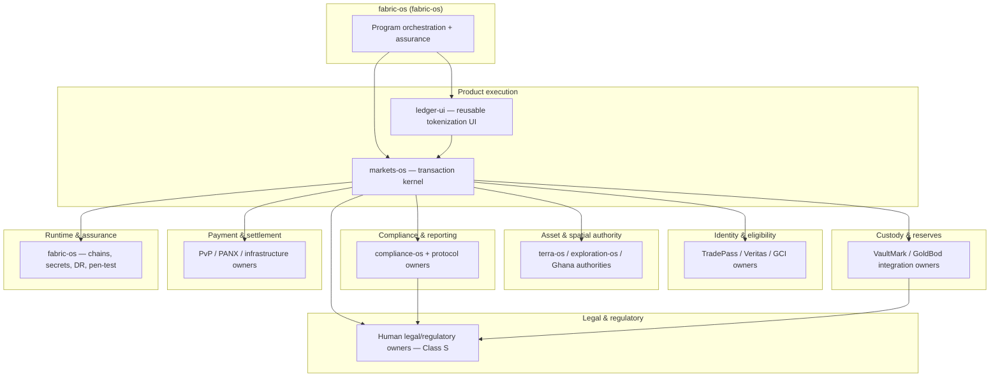

# PROG-TOKENIZATION-001 — Tokenization platform (configuration-first)

> **North star:** One bounded pilot transaction — verified asset → investable
> instrument → compliant issuance → transfer → distribution → redemption — with
> regulator-ready evidence.
>
> **Fabric role:** Program orchestration only. Authority SoR remains with named
> product, protocol, institution, and human owners below.

**Ack:** [`from-fabric-os-xr-mkt-fabric-001-ack-2026-06-11.md`](./from-fabric-os-xr-mkt-fabric-001-ack-2026-06-11.md)  
**Originating handoff:** markets-os `to-fabric-os-tokenization-platform-scope-2026-06-11.md`

---

## 1. Phase map

```
P0 contracts ──► P1 bounded pilot ──► P2 live permissioned tokenization ──► P3 portfolio expansion
     │                    │                           │                                    │
  Markets +           one asset +                  audited contracts +               multi-asset +
  ledger-ui           one instrument +             live custody/settlement           sovereign nodes
  fixtures            one investor cohort
```

| Phase  | Label                                  | Exit witness                                                                                 |
| ------ | -------------------------------------- | -------------------------------------------------------------------------------------------- |
| **P0** | Contracts and demonstrable workflow    | Typed lifecycle contracts frozen; ledger-ui fixtures; Markets stub-to-API wiring green in CI |
| **P1** | Bounded Ghana pilot                    | One end-to-end subscription → issuance → transfer → redemption + daily reconciliation pack   |
| **P2** | Live permissioned tokenization         | Regulatory approval + production chain + live custody attestations                           |
| **P3** | Portfolio and sovereign-node expansion | Multi-asset onboarding + federation corridors                                                |

---

## 2. Dependency graph (authority ownership)



**Hard rule:** Fabric, bridge-os, and baseline-os **do not** own transaction state,
legal register, chain supply, or compliance decisions.

---

## 3. Parallel workplan

### 3a. markets-os (backend track) — primary executor

| Story      | Title                                       | Acceptance evidence                  | Depends on                        |
| ---------- | ------------------------------------------- | ------------------------------------ | --------------------------------- |
| MKT-TKN-00 | Freeze tokenization lifecycle API contracts | OpenAPI/types PR + CI contract tests | —                                 |
| MKT-TKN-01 | Production issuance + allotment path        | Integration tests + signed receipt   | MKT-TKN-00, identity stubs → live |
| MKT-TKN-02 | Transfer policy + concentration limits      | Fail-closed transfer tests           | MKT-TKN-01, TP claims             |
| MKT-TKN-03 | Distribution + redemption orchestration     | End-to-end pilot script              | MKT-TKN-02, PvP stubs → live      |
| MKT-TKN-04 | Multi-ledger reconciliation job             | Daily reconciliation report JSON     | MKT-TKN-03                        |
| MKT-TKN-05 | Operator + investor API routes              | Route tests + auth matrix            | MKT-TKN-00                        |

**Existing baseline:** pilot engines documented in originating handoff; chain,
custody, GoldBod, and fund-admin integrations remain stubbed until P1 gates clear.

### 3b. ledger-ui (design track) — parallel from P0

| Story     | Title                                                | Acceptance evidence            | Depends on                |
| --------- | ---------------------------------------------------- | ------------------------------ | ------------------------- |
| UI-TKN-00 | Tokenization lifecycle fixture pack                  | Storybook/fixture JSON in repo | MKT-TKN-00 contract draft |
| UI-TKN-01 | Lifecycle stepper + assurance timeline               | Component tests + a11y         | UI-TKN-00                 |
| UI-TKN-02 | Issuance wizard primitives                           | Fixture-driven stories         | UI-TKN-00                 |
| UI-TKN-03 | Reserve attestation + claims matrix panels           | Visual regression              | UI-TKN-00                 |
| UI-TKN-04 | Ownership register + transfer/redemption patterns    | Component tests                | UI-TKN-01                 |
| UI-TKN-05 | Reconciliation drift + kill-switch recommendation UI | Fixture: normal + drift states | UI-TKN-04                 |

**Split:** ledger-ui owns **reusable, fixture-driven components**; markets-os
owns routes, permissions, API clients, regulatory behavior, and integration tests.

**Inbound to ledger-ui:** fabric-os to open
`to-ledger-ui-tokenization-ui-track-2026-06-11.md` in ledger-ui repo
(owner-repo action).

### 3c. fabric-os (orchestration track)

| Story      | Title                                | Acceptance evidence                           |
| ---------- | ------------------------------------ | --------------------------------------------- |
| FAB-TKN-00 | Ack + execution plan                 | This document + ack                           |
| FAB-TKN-01 | Phase 0 assurance at contract freeze | `audit/evidence/fabric-assurance-latest.json` |
| FAB-TKN-02 | Hub milestone rows per phase seal    | baseline-os agentic-state update              |
| FAB-TKN-03 | Runtime readiness matrix for P1      | Infra staging matrix + pen-test window        |

---

## 4. Named owners (live dependencies)

| Domain                         | Primary owner                                       | Fabric coordination                  |
| ------------------------------ | --------------------------------------------------- | ------------------------------------ |
| Transaction kernel             | **markets-os**                                      | Weekly status via hub                |
| Tokenization UI primitives     | **ledger-ui**                                       | Parallel track from P0               |
| Identity / AML / accreditation | TradePass / Veritas / GCI                           | Block MKT-TKN-02 until claims live   |
| Cadastre / asset passport      | **terra-os**, **exploration-os**, Ghana authorities | Block P1 asset selection             |
| Compliance decisions / filings | **compliance-os**, protocol owners                  | Evidence pack template               |
| Custody / reserves             | VaultMark / GoldBod integrators                     | Block P2                             |
| Settlement / DvP               | PvP / PANX / **fabric-os**                          | XR-MKT-011 authority matrix extended |
| Runtime / DR / pen-test        | **fabric-os**                                       | EXT-INF-002 window 2026-06-17..21    |
| Legal / regulatory             | **Human (Class S)**                                 | See §7                               |
| ZenHub / fleet gates           | **bridge-os**                                       | `pnpm ecosystem:fabric:check`        |

---

## 5. Phase 0 stories (immediate)

| ID         | Owner         | Done when                                                            |
| ---------- | ------------- | -------------------------------------------------------------------- |
| MKT-TKN-00 | markets-os    | Lifecycle types + OpenAPI frozen; CI contract gate green             |
| UI-TKN-00  | ledger-ui     | Fixture pack covers normal, rejected, pending, default, drift        |
| FAB-TKN-00 | fabric-os     | Ack + plan published (**done**)                                      |
| COS-TKN-00 | compliance-os | Instrument classification checklist for first SPV/right type         |
| INF-TKN-00 | fabric-os     | Staging secrets matrix row for tokenization operators (no prod keys) |

**P0 exit:** Interactive operator + investor workflows against controlled stubs;
fail-closed behavior and signed evidence chain preserved.

---

## 6. Phase 1 stories (bounded Ghana pilot)

| ID         | Owner                             | Done when                                                      |
| ---------- | --------------------------------- | -------------------------------------------------------------- |
| P1-ASSET   | terra-os + exploration-os + human | One verified cooperative/project cohort selected               |
| P1-LEGAL   | human (Class S)                   | One SPV or issuance vehicle + offering terms executed          |
| P1-ID      | TradePass / Veritas               | One investor cohort with live claims                           |
| P1-TX      | markets-os                        | Subscription → issuance → distribution → transfer → redemption |
| P1-RECON   | markets-os                        | Daily multi-ledger reconciliation + regulator evidence pack    |
| P1-RUNTIME | fabric-os                         | Staging deploy proof + observability + incident runbook        |

**P1 exit:** Single bounded transaction with daily reconciliation and exportable
evidence pack. **Not** national scale, **not** committed $250M financing.

---

## 7. Human / legal gates (Class S — parallel, not repo-blocked)

| Gate                                            | Owner                     | Blocks                |
| ----------------------------------------------- | ------------------------- | --------------------- |
| Instrument legal structure + offering docs      | Human legal               | P1-LEGAL              |
| Regulatory sandbox / VASP approval              | Human regulatory          | P2                    |
| Custody + reserve attestation agreements        | Human + VaultMark/GoldBod | P2                    |
| Partner LOIs (government, refinery, fund admin) | Human GTM                 | P1 asset selection    |
| EXT-INF-002 pen-test SOW countersign            | Human Security            | Production assurance  |
| EXT-INF-014 DPA + pilot agreement               | Human Legal               | ZWCMP-adjacent pilots |
| Production issuance / fund movement             | Human sovereign           | P2+                   |

Fabric **records** these gates; it does **not** execute Class S approvals.

---

## 8. Assumptions (explicit — no false claims)

- Source proposal documents (`GTCX-Ghana-Detailed-Proposal*.docx`) are **not** in
  repo; scope is captured only via the markets handoff.
- Partner commitments, financing amounts, and regulatory approvals are **not**
  assumed production-ready without dated evidence artifacts.
- Permissioned-token mainnet deployment requires P2 gates; P0–P1 use controlled
  stubs or approved sandbox only.
- National-scale expansion is **P3**; not in scope for current sprint selection.

---

## 9. Sequencing (next 14 days)

| Week | Markets                    | ledger-ui                | fabric-os                      | bridge-os                               |
| ---- | -------------------------- | ------------------------ | ------------------------------ | --------------------------------------- |
| W1   | MKT-TKN-00 contract freeze | UI-TKN-00 fixtures       | FAB-TKN-01 assurance at freeze | ZenHub epic under PROG-TOKENIZATION-001 |
| W2   | MKT-TKN-01 issuance path   | UI-TKN-01..02 components | INF-TKN-00 staging matrix      | Fleet fabric check                      |
| W3   | MKT-TKN-02 transfers       | UI-TKN-03..04            | P1 gate review                 | Delegate REM-\* from assurance          |

---

## 10. References

- markets-os: `docs/architecture/eix/fractionalization.md`, `authority-model.md`
- fabric-os: XR-MKT-011 authority URL matrix
- bridge-os: `pm/spec/service-fabric.json`, `pm/spec/gtcx-execution-engine.json`
- compliance-os: cloud placement + W2 hub witnesses
