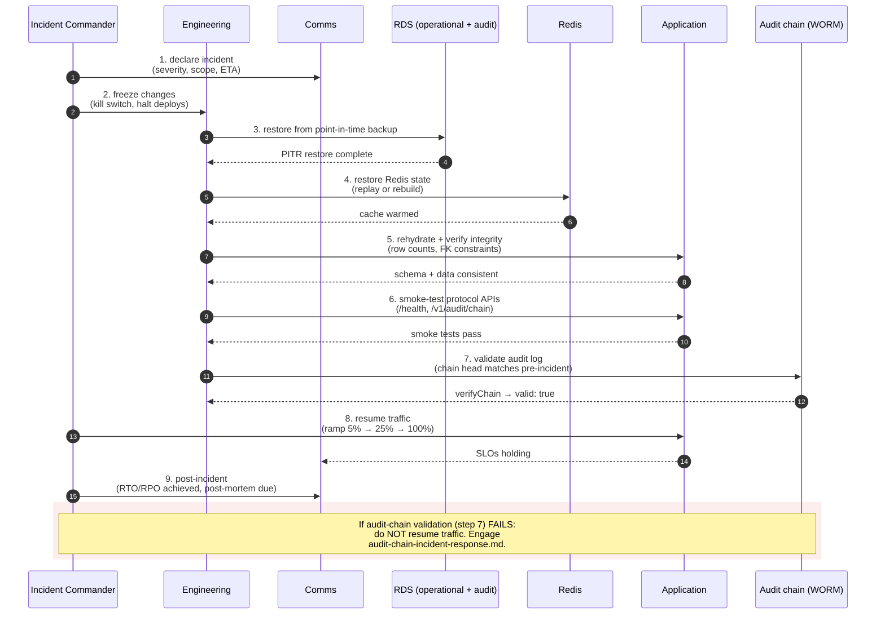

# Disaster Recovery Runbook

Recovery procedures for protocol services (TradePass, GeoTag, GCI, VaultMark, PvP, PANX), shared packages, and supporting state stores (audit logs, replay cache, rate limits).

---

## Recovery Targets

| Target                             | Value      |
| ---------------------------------- | ---------- |
| **RTO** (Recovery Time Objective)  | 4 hours    |
| **RPO** (Recovery Point Objective) | 15 minutes |

### Per-Component Targets

| Component            | RPO                                   | RTO    | Recovery Method                                    |
| -------------------- | ------------------------------------- | ------ | -------------------------------------------------- |
| Operational DB (RDS) | 5 min (automated snapshots)           | 30 min | Multi-AZ failover (prod), snapshot restore (pilot) |
| Audit DB (RDS)       | 5 min                                 | 1 hour | Snapshot restore only (never delete audit data)    |
| KYC Documents (S3)   | 0 (versioned)                         | 15 min | S3 versioning recovery                             |
| K8s workloads        | 0 (stateless, git is source of truth) | 15 min | `kubectl apply -k overlays/<env>/`                 |
| NATS JetStream       | 30 min (disk-persisted)               | 15 min | Re-deploy from manifests                           |
| Terraform state      | 0 (versioned S3)                      | 5 min  | S3 versioning recovery                             |

### DR Test Schedule

DR tests run on three schedules:

1. **Per-PR gate** — `ci.yml` runs `dr-test.sh` against local Docker Compose Postgres (required, not `continue-on-error`)
2. **Weekly schedule** — `.github/workflows/dr-test.yml` runs Mondays at 06:00 UTC against testnet via EKS port-forward
3. **On-demand** — `workflow_dispatch` via GitHub Actions for staging or testnet

Evidence artifacts (SQL dump + JSON with RTO/RPO ms) are uploaded automatically.

| Date       | Test Type           | RTO Achieved | RPO Achieved | Issues | Status  |
| ---------- | ------------------- | ------------ | ------------ | ------ | ------- |
| 2026-05-11 | CI gate (compose)   | automated    | automated    | none   | ✅ PASS |
| —          | Scheduled (testnet) | —            | —            | —      | —       |

---

## Preconditions

Before starting recovery:

- Backup snapshots available for audit store and protocol state
- Redis/Postgres adapters configured for production stores (see [production-store-integration.md](production-store-integration.md))
- Access to release runbook for rollback steps (see [release.md](release.md))
- Incident commander declared and team notified

---

## Recovery Procedure



### Step 1 — Declare incident

- Designate an incident commander.
- Open incident channel and begin timeline log.
- Page on-call team members per escalation policy.

### Step 2 — Freeze changes

- Halt all active deployments.
- Pause scheduled batch jobs and background tasks.
- Set service status to degraded/unavailable.

### Step 3 — Restore database state

- Restore Postgres audit store from latest backup snapshot.
- Restore protocol state stores from backup.
- Verify snapshot timestamp against RPO target (≤ 15 minutes of data loss).

### Step 4 — Restore Redis state

- Restore Redis replay cache and rate-limit store from backup.
- If backup is unavailable, warm-start: the replay window will have a gap. Accept this — the 5-minute replay window provides partial protection. Log the gap in the incident timeline.

### Step 5 — Rehydrate and verify integrity

- Run cache rehydration scripts if applicable.
- Run audit log integrity check: verify hash chain continuity for the restored range.
- Confirm `sequence` column is monotonically increasing with no gaps.

### Step 6 — Smoke test protocol APIs

```bash
# Run full validation suite in recovery environment.
# `pnpm test:full` exercises terraform, kustomize, compose, deploy
# dry-run, and audit-immutability fixtures in addition to the quick
# gates (policy + shellcheck + smoke + replay-protection +
# compliance-gateway + control-plane + docs-standard + ledger).
pnpm test
pnpm test:full

# Capture runtime smoke evidence against the recovered endpoint.
# Compare against the last green pre-DR runtime-smoke artifact in
# infra/security/reports/release-evidence/ to confirm parity.
pnpm ctl evidence runtime-smoke \
  --environment="${ENVIRONMENT}" \
  --base-url="${RECOVERY_BASE_URL}" \
  --strict
```

All tests must pass and the runtime-smoke evidence must be parity-clean before resuming traffic. (A dedicated performance/baseline gate is on the roadmap — for now compare evidence bundles by hand and escalate any latency regression > 25% to the protocol-architect lead.)

### Step 7 — Validate audit log

- Execute range read on restored audit entries.
- Verify audit log verification passes end-to-end.
- Spot-check 10–20 entries across the restored range for hash chain validity.

### Step 8 — Resume traffic

- Re-enable services with reduced traffic (20% → 50% → 100% over 30 minutes).
- Monitor error rates, latency, and audit log write throughput at each step.
- Only progress to full traffic when metrics are within normal bounds.

### Step 9 — Post-incident

- Record complete incident timeline in incident log.
- Identify root cause and contributing factors.
- Create remediation items for any gaps surfaced.
- Schedule DR test if the incident revealed an untested failure path.

---

## Rollback Guidance

If validation fails after restore, roll back to the last known-good release:

1. Identify the last known-good release tag from `git log --tags`.
2. Deploy that tag via the [release runbook](release.md).
3. Re-run the restore procedure starting at Step 3 using the backup that aligns with that release.

Prefer forward-fix patch releases over destructive state rollback once consumers may have received data.

---

## DR Test Schedule

| Test Type                       | Frequency   | Required Participants                |
| ------------------------------- | ----------- | ------------------------------------ |
| Tabletop review                 | Quarterly   | Engineering lead, incident commander |
| Partial restore test (non-prod) | Bi-annually | Engineering team                     |
| Full failover test              | Annually    | Engineering + operations             |

Document all test results. Update this runbook after each test.

---

## Reference

- [production-store-integration.md](production-store-integration.md)
- [release.md](release.md)
