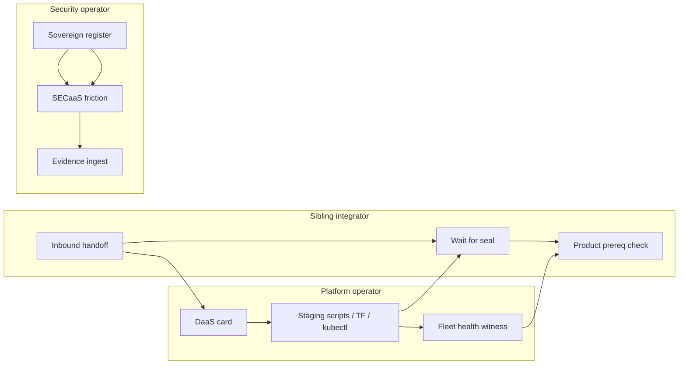

# Operator journey map

Control-plane journeys for **gtcx-infrastructure** (not end-user trade flows).

| Phase     | Journey                    | EXR     | JTBD                         |
| --------- | -------------------------- | ------- | ---------------------------- |
| Handoff   | Staging substrate delivery | EXR-001 | JTBD-staging-substrate-ready |
| Witness   | Fleet health proof         | EXR-002 | JTBD-fleet-health-witness    |
| Assurance | Security evidence path     | EXR-003 | JTBD-security-evidence-path  |

Sibling product journeys: link only — e.g. compliance-os EXR-001 evidence intake.
