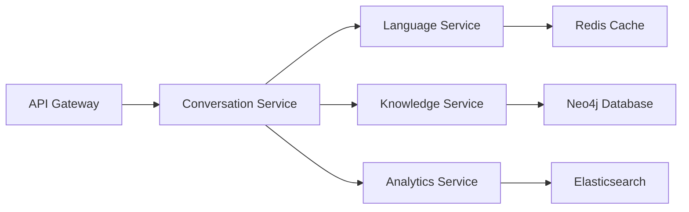

# AMANI - Backend API & Services Architecture

**Version**: 1.0.0  
**Last Updated**: November 15, 2024  
**Status**: In Development  


## 1. API Overview

### Core Services
```yaml
Services:
  conversation_service:
    port: 8080
    description: "Main conversational AI service"
    
  language_service:
    port: 8081
    description: "Translation and NLP processing"
    
  knowledge_service:
    port: 8082
    description: "Knowledge graph queries"
    
  channel_service:
    port: 8083
    description: "Multi-channel integration"
    
  analytics_service:
    port: 8084
    description: "Metrics and analytics"
```


## 2. REST API Endpoints

### 2.1 Conversation API
```yaml
POST /api/v1/conversations/start
  Description: Start new conversation
  Request:
    user_id: string
    language: string
    channel: enum [web, whatsapp, sms, ussd]
  Response:
    session_id: string
    welcome_message: string
    suggested_actions: array

POST /api/v1/conversations/{session_id}/message
  Description: Send message in conversation
  Request:
    text: string
    attachments: array (optional)
  Response:
    response: string
    intent: string
    confidence: float
    actions: array

GET /api/v1/conversations/{session_id}/history
  Description: Get conversation history
  Response:
    messages: array
    context: object
    journey_stage: string
```

### 2.2 Language API
```yaml
POST /api/v1/language/detect
  Description: Detect language from text
  Request:
    text: string
  Response:
    language: string
    confidence: float
    alternatives: array

POST /api/v1/language/translate
  Description: Translate text
  Request:
    text: string
    source: string
    target: string
  Response:
    translated: string
    back_translation: string

GET /api/v1/language/supported
  Description: Get supported languages
  Response:
    languages: array
    offline_available: array
```


## 3. GraphQL Schema

```graphql
type Query {
  # Get user profile
  user(id: ID!): User
  
  # Get conversation
  conversation(sessionId: ID!): Conversation
  
  # Search knowledge base
  searchKnowledge(query: String!, language: String): [Knowledge!]!
  
  # Get available actions
  availableActions(context: Context!): [Action!]!
}

type Mutation {
  # Send message
  sendMessage(input: MessageInput!): MessageResponse!
  
  # Update user profile
  updateProfile(userId: ID!, profile: ProfileInput!): User!
  
  # Provide feedback
  provideFeedback(messageId: ID!, rating: Int!, comment: String): Feedback!
}

type Subscription {
  # Real-time conversation updates
  conversationUpdates(sessionId: ID!): ConversationUpdate!
  
  # System notifications
  notifications(userId: ID!): Notification!
}

type User {
  id: ID!
  name: String
  language: String!
  country: String!
  role: UserRole!
  profile: UserProfile
  conversations: [Conversation!]!
}

type Conversation {
  sessionId: ID!
  user: User!
  messages: [Message!]!
  context: Context!
  journeyStage: String!
  startedAt: DateTime!
  lastActivity: DateTime!
}

type Message {
  id: ID!
  text: String!
  sender: MessageSender!
  timestamp: DateTime!
  intent: String
  confidence: Float
  language: String!
}
```


## 4. WebSocket Events

### 4.1 Event Types
```javascript
// Client -> Server
{
  type: "message",
  payload: {
    text: "Hello",
    sessionId: "abc123"
  }
}

{
  type: "typing",
  payload: {
    sessionId: "abc123"
  }
}

// Server -> Client
{
  type: "response",
  payload: {
    text: "Hello! How can I help?",
    actions: ["Get Started", "Learn More"]
  }
}

{
  type: "agent_typing",
  payload: {
    isTyping: true
  }
}

{
  type: "context_update",
  payload: {
    journeyStage: "onboarding",
    progress: 0.25
  }
}
```


## 5. Channel Integration

### 5.1 WhatsApp Business API
```python
class WhatsAppService:
    async def handle_webhook(self, request):
        """Handle WhatsApp webhook"""
        
        # Verify webhook signature
        if not self.verify_signature(request):
            return {"error": "Invalid signature"}, 401
        
        # Process message
        message = request.json['entry'][0]['changes'][0]['value']['messages'][0]
        
        # Route to conversation service
        response = await self.conversation_service.process(
            text=message['text']['body'],
            user_id=message['from'],
            channel='whatsapp'
        )
        
        # Send response
        await self.send_message(
            to=message['from'],
            text=response.text,
            buttons=response.actions
        )
```

### 5.2 USSD Gateway
```python
class USSDService:
    async def handle_ussd(self, request):
        """Handle USSD request"""
        
        session_id = request.form['sessionId']
        service_code = request.form['serviceCode']
        phone_number = request.form['phoneNumber']
        text = request.form['text']
        
        # Process USSD input
        response = await self.process_ussd(
            session_id=session_id,
            input=text,
            phone=phone_number
        )
        
        # Format USSD response
        if response.is_end:
            return f"END {response.text}"
        else:
            return f"CON {response.text}"
```


## 6. Service Architecture

### 6.1 Microservices Communication
```yaml
Communication:
  Sync:
    - REST APIs
    - GraphQL
    - gRPC
  
  Async:
    - RabbitMQ
    - Apache Kafka
    - Redis Pub/Sub
  
  Service_Mesh:
    - Istio for traffic management
    - Envoy proxy
    - Circuit breakers
```

### 6.2 Service Dependencies



## 7. Database Design

### 7.1 PostgreSQL Schema
```sql
-- Users table
CREATE TABLE users (
    id UUID PRIMARY KEY DEFAULT gen_random_uuid(),
    phone_number VARCHAR(20) UNIQUE,
    name VARCHAR(255),
    language VARCHAR(10) DEFAULT 'en',
    country VARCHAR(2),
    role VARCHAR(50),
    created_at TIMESTAMPTZ DEFAULT NOW(),
    updated_at TIMESTAMPTZ DEFAULT NOW()
);

-- Conversations table
CREATE TABLE conversations (
    session_id UUID PRIMARY KEY DEFAULT gen_random_uuid(),
    user_id UUID REFERENCES users(id),
    channel VARCHAR(20),
    status VARCHAR(20) DEFAULT 'active',
    journey_stage VARCHAR(50),
    context JSONB,
    started_at TIMESTAMPTZ DEFAULT NOW(),
    last_activity TIMESTAMPTZ DEFAULT NOW()
);

-- Messages table
CREATE TABLE messages (
    id UUID PRIMARY KEY DEFAULT gen_random_uuid(),
    session_id UUID REFERENCES conversations(session_id),
    sender VARCHAR(10), -- 'user' or 'system'
    text TEXT,
    intent VARCHAR(100),
    confidence FLOAT,
    language VARCHAR(10),
    metadata JSONB,
    created_at TIMESTAMPTZ DEFAULT NOW()
);

-- Feedback table
CREATE TABLE feedback (
    id UUID PRIMARY KEY DEFAULT gen_random_uuid(),
    message_id UUID REFERENCES messages(id),
    rating INTEGER CHECK (rating >= 1 AND rating <= 5),
    comment TEXT,
    created_at TIMESTAMPTZ DEFAULT NOW()
);
```

### 7.2 Redis Data Structures
```python
# Session storage
session_key = f"session:{session_id}"
session_data = {
    "user_id": "uuid",
    "context": {...},
    "history": [...],
    "ttl": 86400  # 24 hours
}

# User profile cache
profile_key = f"profile:{user_id}"
profile_data = {
    "name": "John Doe",
    "language": "sw",
    "preferences": {...}
}

# Translation cache
translation_key = f"translate:{hash(text)}:{source}:{target}"
translation_data = "translated text"
```


## 8. Authentication & Authorization

### 8.1 JWT Token Structure
```json
{
  "sub": "user_id",
  "iat": 1699999999,
  "exp": 1700003599,
  "roles": ["user"],
  "channel": "web",
  "session_id": "abc123"
}
```

### 8.2 API Key Management
```python
class APIKeyAuth:
    def validate(self, request):
        api_key = request.headers.get('X-API-Key')
        
        if not api_key:
            raise AuthError("Missing API key")
        
        # Validate against database
        key_data = self.db.get_api_key(api_key)
        
        if not key_data or not key_data.is_active:
            raise AuthError("Invalid API key")
        
        # Check rate limits
        if self.rate_limiter.is_exceeded(api_key):
            raise RateLimitError("Rate limit exceeded")
        
        return key_data
```


## 9. Error Handling

### 9.1 Error Response Format
```json
{
  "error": {
    "code": "LANGUAGE_NOT_SUPPORTED",
    "message": "The requested language is not supported",
    "details": {
      "requested": "ig",
      "supported": ["en", "sw", "fr", "ar", "pt"]
    },
    "timestamp": "2024-11-15T10:30:00Z",
    "request_id": "req_abc123"
  }
}
```

### 9.2 Error Codes
| Code | HTTP Status | Description |
|------|-------------|-------------|
| INVALID_REQUEST | 400 | Malformed request |
| UNAUTHORIZED | 401 | Missing or invalid auth |
| FORBIDDEN | 403 | Insufficient permissions |
| NOT_FOUND | 404 | Resource not found |
| RATE_LIMITED | 429 | Too many requests |
| INTERNAL_ERROR | 500 | Server error |


## 10. Performance Optimization

### 10.1 Caching Strategy
```yaml
Cache_Layers:
  L1_Application:
    - In-memory LRU cache
    - TTL: 5 minutes
    - Size: 1000 entries
  
  L2_Redis:
    - Distributed cache
    - TTL: 1 hour
    - Eviction: LRU
  
  L3_CDN:
    - Static content
    - TTL: 24 hours
    - Geo-distributed
```

### 10.2 Query Optimization
```python
# Use database connection pooling
pool = asyncpg.create_pool(
    min_size=10,
    max_size=50,
    max_queries=50000,
    max_inactive_connection_lifetime=300
)

# Batch queries
async def get_messages_batch(session_ids):
    query = """
        SELECT * FROM messages 
        WHERE session_id = ANY($1)
        ORDER BY created_at DESC
    """
    return await pool.fetch(query, session_ids)
```


**Document Status**: Backend architecture specification  
**Review Cycle**: Every sprint  
**Approval**: Backend Team Lead
