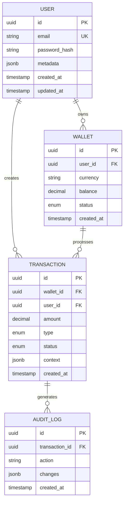

# Database Schema Design Template

## Database Overview
**Project**: [PROJECT_NAME]  
**Database Type**: [PostgreSQL/MongoDB/DynamoDB/MySQL]  
**Version**: [Version Number]  
**Environment**: [Development/Staging/Production]  
**Last Updated**: [DATE]


## Schema Architecture

### Database Selection Rationale
```yaml
Requirements:
  - Data Structure: [Relational/Document/Key-Value]
  - Consistency: [ACID/BASE]
  - Scale: [Vertical/Horizontal]
  - Performance: [Read-heavy/Write-heavy/Balanced]
  
Choice: [Database Type]
Reason: [Detailed justification]
```

## Entity Relationship Diagram



## Table Definitions

### Core Tables

#### users
```sql
CREATE TABLE users (
    id UUID PRIMARY KEY DEFAULT gen_random_uuid(),
    email VARCHAR(255) UNIQUE NOT NULL,
    password_hash VARCHAR(255) NOT NULL,
    first_name VARCHAR(100),
    last_name VARCHAR(100),
    phone_number VARCHAR(20),
    email_verified BOOLEAN DEFAULT FALSE,
    phone_verified BOOLEAN DEFAULT FALSE,
    status VARCHAR(50) DEFAULT 'active',
    metadata JSONB DEFAULT '{}',
    created_at TIMESTAMP WITH TIME ZONE DEFAULT CURRENT_TIMESTAMP,
    updated_at TIMESTAMP WITH TIME ZONE DEFAULT CURRENT_TIMESTAMP,
    deleted_at TIMESTAMP WITH TIME ZONE
);

-- Indexes
CREATE INDEX idx_users_email ON users(email);
CREATE INDEX idx_users_status ON users(status) WHERE deleted_at IS NULL;
CREATE INDEX idx_users_created_at ON users(created_at DESC);
CREATE INDEX idx_users_metadata ON users USING GIN(metadata);
```

#### wallets
```sql
CREATE TABLE wallets (
    id UUID PRIMARY KEY DEFAULT gen_random_uuid(),
    user_id UUID NOT NULL REFERENCES users(id) ON DELETE CASCADE,
    wallet_address VARCHAR(255) UNIQUE NOT NULL,
    currency VARCHAR(10) NOT NULL,
    balance DECIMAL(19,8) DEFAULT 0,
    locked_balance DECIMAL(19,8) DEFAULT 0,
    status VARCHAR(50) DEFAULT 'active',
    wallet_type VARCHAR(50) NOT NULL,
    metadata JSONB DEFAULT '{}',
    created_at TIMESTAMP WITH TIME ZONE DEFAULT CURRENT_TIMESTAMP,
    updated_at TIMESTAMP WITH TIME ZONE DEFAULT CURRENT_TIMESTAMP,
    
    CONSTRAINT chk_balance CHECK (balance >= 0),
    CONSTRAINT chk_locked_balance CHECK (locked_balance >= 0)
);

-- Indexes
CREATE INDEX idx_wallets_user_id ON wallets(user_id);
CREATE INDEX idx_wallets_currency ON wallets(currency);
CREATE INDEX idx_wallets_status ON wallets(status);
CREATE UNIQUE INDEX idx_wallets_user_currency ON wallets(user_id, currency) WHERE status = 'active';
```

#### transactions
```sql
CREATE TABLE transactions (
    id UUID PRIMARY KEY DEFAULT gen_random_uuid(),
    transaction_hash VARCHAR(255) UNIQUE,
    from_wallet_id UUID REFERENCES wallets(id),
    to_wallet_id UUID REFERENCES wallets(id),
    amount DECIMAL(19,8) NOT NULL,
    fee DECIMAL(19,8) DEFAULT 0,
    currency VARCHAR(10) NOT NULL,
    type VARCHAR(50) NOT NULL, -- deposit, withdrawal, transfer, payment
    status VARCHAR(50) NOT NULL DEFAULT 'pending',
    context JSONB DEFAULT '{}',
    error_message TEXT,
    processed_at TIMESTAMP WITH TIME ZONE,
    created_at TIMESTAMP WITH TIME ZONE DEFAULT CURRENT_TIMESTAMP,
    updated_at TIMESTAMP WITH TIME ZONE DEFAULT CURRENT_TIMESTAMP,
    
    CONSTRAINT chk_amount CHECK (amount > 0),
    CONSTRAINT chk_fee CHECK (fee >= 0),
    CONSTRAINT chk_different_wallets CHECK (from_wallet_id != to_wallet_id)
);

-- Indexes
CREATE INDEX idx_transactions_from_wallet ON transactions(from_wallet_id);
CREATE INDEX idx_transactions_to_wallet ON transactions(to_wallet_id);
CREATE INDEX idx_transactions_status ON transactions(status);
CREATE INDEX idx_transactions_type ON transactions(type);
CREATE INDEX idx_transactions_created_at ON transactions(created_at DESC);
CREATE INDEX idx_transactions_hash ON transactions(transaction_hash) WHERE transaction_hash IS NOT NULL;
```

## Security Tables

### audit_logs
```sql
CREATE TABLE audit_logs (
    id UUID PRIMARY KEY DEFAULT gen_random_uuid(),
    entity_type VARCHAR(100) NOT NULL,
    entity_id UUID NOT NULL,
    action VARCHAR(100) NOT NULL,
    user_id UUID REFERENCES users(id),
    ip_address INET,
    user_agent TEXT,
    changes JSONB,
    metadata JSONB DEFAULT '{}',
    created_at TIMESTAMP WITH TIME ZONE DEFAULT CURRENT_TIMESTAMP
);

-- Indexes
CREATE INDEX idx_audit_entity ON audit_logs(entity_type, entity_id);
CREATE INDEX idx_audit_user ON audit_logs(user_id);
CREATE INDEX idx_audit_action ON audit_logs(action);
CREATE INDEX idx_audit_created ON audit_logs(created_at DESC);

-- Partitioning by month for large-scale audit logs
CREATE TABLE audit_logs_2024_01 PARTITION OF audit_logs
    FOR VALUES FROM ('2024-01-01') TO ('2024-02-01');
```

### sessions
```sql
CREATE TABLE sessions (
    id UUID PRIMARY KEY DEFAULT gen_random_uuid(),
    user_id UUID NOT NULL REFERENCES users(id) ON DELETE CASCADE,
    token_hash VARCHAR(255) UNIQUE NOT NULL,
    ip_address INET,
    user_agent TEXT,
    expires_at TIMESTAMP WITH TIME ZONE NOT NULL,
    revoked_at TIMESTAMP WITH TIME ZONE,
    created_at TIMESTAMP WITH TIME ZONE DEFAULT CURRENT_TIMESTAMP,
    last_activity TIMESTAMP WITH TIME ZONE DEFAULT CURRENT_TIMESTAMP
);

-- Indexes
CREATE INDEX idx_sessions_user ON sessions(user_id);
CREATE INDEX idx_sessions_token ON sessions(token_hash);
CREATE INDEX idx_sessions_expires ON sessions(expires_at) WHERE revoked_at IS NULL;
```

## Performance Optimization

### Indexing Strategy
```yaml
Primary_Keys:
  - Always UUID for distributed systems
  - Use serial/bigserial for single-instance

Indexes:
  Foreign_Keys: Always index
  Query_Filters: Index columns in WHERE clauses
  Sort_Columns: Index columns in ORDER BY
  Composite: For multi-column queries
  Partial: For filtered queries
  GIN/GIST: For JSONB and full-text search
```

### Partitioning Strategy
```sql
-- Time-based partitioning for large tables
CREATE TABLE transactions_2024 PARTITION OF transactions
    FOR VALUES FROM ('2024-01-01') TO ('2025-01-01')
    PARTITION BY RANGE (created_at);

-- List partitioning by status
CREATE TABLE transactions_pending PARTITION OF transactions
    FOR VALUES IN ('pending', 'processing');
```

## Migration Strategy

### Migration Files Structure
```
migrations/
├── 001_initial_schema.sql
├── 002_add_wallets.sql
├── 003_add_transactions.sql
├── 004_add_indexes.sql
├── 005_add_audit_logs.sql
└── rollback/
    ├── 001_rollback.sql
    ├── 002_rollback.sql
    └── ...
```

### Migration Template
```sql
-- Migration: 006_add_user_preferences.sql
-- Author: [Your Name]
-- Date: [Date]
-- Description: Add user preferences table

BEGIN;

-- Create table
CREATE TABLE IF NOT EXISTS user_preferences (
    id UUID PRIMARY KEY DEFAULT gen_random_uuid(),
    user_id UUID NOT NULL REFERENCES users(id) ON DELETE CASCADE,
    preferences JSONB DEFAULT '{}',
    created_at TIMESTAMP WITH TIME ZONE DEFAULT CURRENT_TIMESTAMP,
    updated_at TIMESTAMP WITH TIME ZONE DEFAULT CURRENT_TIMESTAMP,
    CONSTRAINT uk_user_preferences_user_id UNIQUE (user_id)
);

-- Create indexes
CREATE INDEX idx_user_preferences_user_id ON user_preferences(user_id);

-- Add comments
COMMENT ON TABLE user_preferences IS 'User preference settings';
COMMENT ON COLUMN user_preferences.preferences IS 'JSON object containing all user preferences';

COMMIT;

-- Rollback script
-- DROP TABLE IF EXISTS user_preferences CASCADE;
```

## NoSQL Schema (MongoDB Example)

### Collections Design
```javascript
// users collection
{
  "_id": ObjectId("..."),
  "email": "user@example.com",
  "profile": {
    "firstName": "John",
    "lastName": "Doe",
    "phone": "+1234567890"
  },
  "wallets": [
    {
      "walletId": "wallet_123",
      "currency": "USD",
      "balance": NumberDecimal("1000.00")
    }
  ],
  "preferences": {
    "notifications": true,
    "language": "en"
  },
  "metadata": {},
  "createdAt": ISODate("2024-01-01T00:00:00Z"),
  "updatedAt": ISODate("2024-01-01T00:00:00Z")
}

// transactions collection
{
  "_id": ObjectId("..."),
  "transactionHash": "tx_abc123",
  "from": {
    "userId": ObjectId("..."),
    "walletId": "wallet_123"
  },
  "to": {
    "userId": ObjectId("..."),
    "walletId": "wallet_456"
  },
  "amount": NumberDecimal("100.00"),
  "currency": "USD",
  "type": "transfer",
  "status": "completed",
  "context": {
    "description": "Payment for services",
    "metadata": {}
  },
  "timestamps": {
    "created": ISODate("2024-01-01T00:00:00Z"),
    "processed": ISODate("2024-01-01T00:00:01Z")
  }
}
```

### MongoDB Indexes
```javascript
// User indexes
db.users.createIndex({ "email": 1 }, { unique: true });
db.users.createIndex({ "createdAt": -1 });
db.users.createIndex({ "wallets.walletId": 1 });

// Transaction indexes
db.transactions.createIndex({ "transactionHash": 1 }, { unique: true });
db.transactions.createIndex({ "from.userId": 1, "createdAt": -1 });
db.transactions.createIndex({ "to.userId": 1, "createdAt": -1 });
db.transactions.createIndex({ "status": 1, "type": 1 });
```

## Query Optimization

### Common Query Patterns
```sql
-- Optimized: Get user with wallets
SELECT 
    u.*,
    json_agg(
        json_build_object(
            'id', w.id,
            'currency', w.currency,
            'balance', w.balance
        )
    ) as wallets
FROM users u
LEFT JOIN wallets w ON w.user_id = u.id
WHERE u.id = $1
GROUP BY u.id;

-- Optimized: Get transaction history with pagination
SELECT 
    t.*,
    fw.wallet_address as from_address,
    tw.wallet_address as to_address
FROM transactions t
LEFT JOIN wallets fw ON fw.id = t.from_wallet_id
LEFT JOIN wallets tw ON tw.id = t.to_wallet_id
WHERE t.from_wallet_id = $1 OR t.to_wallet_id = $1
ORDER BY t.created_at DESC
LIMIT 20 OFFSET $2;
```

## Maintenance Scripts

### Data Cleanup
```sql
-- Archive old transactions
INSERT INTO transactions_archive
SELECT * FROM transactions
WHERE created_at < NOW() - INTERVAL '1 year'
AND status = 'completed';

-- Delete archived transactions
DELETE FROM transactions
WHERE created_at < NOW() - INTERVAL '1 year'
AND status = 'completed';

-- Vacuum and analyze
VACUUM ANALYZE transactions;
```

### Statistics Update
```sql
-- Update table statistics for query planner
ANALYZE users;
ANALYZE wallets;
ANALYZE transactions;

-- Check table sizes
SELECT 
    schemaname,
    tablename,
    pg_size_pretty(pg_total_relation_size(schemaname||'.'||tablename)) AS size
FROM pg_tables
WHERE schemaname = 'public'
ORDER BY pg_total_relation_size(schemaname||'.'||tablename) DESC;
```

## Monitoring Queries

### Performance Monitoring
```sql
-- Slow queries
SELECT 
    query,
    calls,
    total_time,
    mean,
    max
FROM pg_stat_statements
ORDER BY mean DESC
LIMIT 10;

-- Table bloat
SELECT 
    schemaname,
    tablename,
    pg_size_pretty(pg_relation_size(schemaname||'.'||tablename)) AS size,
    n_live_tup,
    n_dead_tup,
    round(n_dead_tup::numeric / NULLIF(n_live_tup, 0), 2) AS dead_ratio
FROM pg_stat_user_tables
ORDER BY dead_ratio DESC;
```


*This template ensures comprehensive database design documentation for GTCX projects.*
