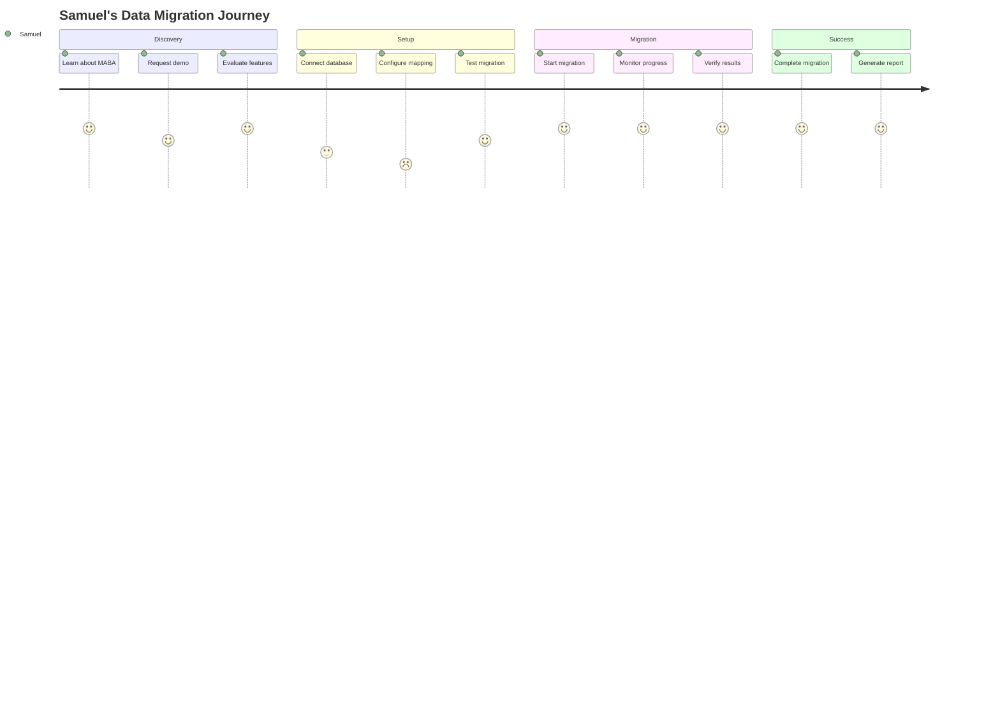

# MABA - User Experience Design

**Version**: 1.0.0  
**Last Updated**: November 15, 2024  
**Status**: In Development  


## 1. Design Principles

### Core Principles
- **Simplicity**: Complex data operations should feel simple
- **Transparency**: Always show what's happening with data
- **Reliability**: Build trust through consistent performance
- **Accessibility**: Usable by technical and non-technical users
- **Progressive Disclosure**: Advanced features available when needed


## 2. User Personas & Journeys

### Primary Persona: Government Data Administrator
```yaml
Name: Samuel Okonkwo
Role: Senior Data Administrator
Location: Lagos, Nigeria
Tech Level: Intermediate
Goals:
  - Migrate 10 million land records
  - Maintain data integrity
  - Complete migration in 6 months
Pain Points:
  - Legacy systems are slow
  - Manual data entry errors
  - Vendor lock-in concerns
```

#### User Journey: First-Time Data Migration



## 3. Interface Design

### 3.1 Dashboard Layout
```
┌────────────────────────────────────────────────────────┐
│  MABA Transformation Engine         [Help] [User] [⚙]  │
├────────────────────────────────────────────────────────┤
│                                                         │
│  ┌──────────────────────────────────────────────────┐  │
│  │  Active Transformations                          │  │
│  │  ┌────────────┐ ┌────────────┐ ┌────────────┐  │  │
│  │  │ PostgreSQL │ │   CSV      │ │    API     │  │  │
│  │  │  ▓▓▓▓░░░░ │ │  ▓▓▓▓▓▓▓▓ │ │  ▓░░░░░░░ │  │  │
│  │  │    67%     │ │    100%    │ │    12%     │  │  │
│  │  └────────────┘ └────────────┘ └────────────┘  │  │
│  └──────────────────────────────────────────────────┘  │
│                                                         │
│  ┌──────────────────────────────────────────────────┐  │
│  │  Quick Actions                                   │  │
│  │  [+ New Source] [▶ Run Test] [📊 Reports]       │  │
│  └──────────────────────────────────────────────────┘  │
│                                                         │
│  ┌──────────────────────────────────────────────────┐  │
│  │  Recent Activity                                 │  │
│  │  • Ghana Cadastre: 1.2M records processed ✓     │  │
│  │  • Kenya Registry: Schema mapping complete ✓    │  │
│  │  • Nigeria Database: Connection established ✓   │  │
│  └──────────────────────────────────────────────────┘  │
└────────────────────────────────────────────────────────┘
```

### 3.2 Schema Mapping Interface
```
┌────────────────────────────────────────────────────────┐
│  Schema Mapping - Intelligent Field Matching           │
├────────────────────────────────────────────────────────┤
│                                                         │
│  Source Fields          →    Target Fields             │
│  ┌──────────────┐           ┌──────────────┐         │
│  │ owner_name   │ ═══95%═══▶│ full_name    │         │
│  │ parcel_id    │ ═══99%═══▶│ parcel_number│         │
│  │ area_size    │ ═══88%═══▶│ area_hectares│         │
│  │ location_desc│ ───72%───▶│ ? Review     │         │
│  │ reg_date     │ ═══92%═══▶│ registered_on│         │
│  └──────────────┘           └──────────────┘         │
│                                                         │
│  Confidence: ■■■■■■■■□□ 85%                           │
│  [✓ Accept All] [⚙ Manual Review] [↻ Re-analyze]     │
└────────────────────────────────────────────────────────┘
```


## 4. Interaction Patterns

### 4.1 Progressive Disclosure
```yaml
Levels:
  Basic:
    - Connect data source
    - Auto-map fields
    - Start transformation
  
  Advanced:
    - Custom field mappings
    - Transformation rules
    - Error handling config
  
  Expert:
    - SQL transformations
    - Custom scripts
    - API webhooks
```

### 4.2 Error Handling
```yaml
Error_Types:
  Connection_Failed:
    message: "Unable to connect to {source}"
    action: "Check credentials"
    recovery: "Retry with correct details"
  
  Mapping_Uncertain:
    message: "Low confidence mapping for {field}"
    action: "Review mapping"
    recovery: "Manual selection or skip"
  
  Transformation_Error:
    message: "Error processing record {id}"
    action: "View details"
    recovery: "Fix and retry or skip"
```


## 5. Visual Design System

### 5.1 Color Palette
```css
:root {
  /* Primary */
  --primary-blue: #2563EB;
  --primary-dark: #1E40AF;
  
  /* Status */
  --success-green: #10B981;
  --warning-amber: #F59E0B;
  --error-red: #EF4444;
  
  /* Neutral */
  --gray-900: #111827;
  --gray-100: #F3F4F6;
  
  /* Semantic */
  --processing: #3B82F6;
  --complete: #10B981;
  --failed: #EF4444;
}
```

### 5.2 Typography
```css
.heading-1 {
  font-family: 'Inter', sans-serif;
  font-size: 2.5rem;
  font-weight: 700;
}

.body-text {
  font-family: 'Inter', sans-serif;
  font-size: 1rem;
  line-height: 1.5;
}

.data-label {
  font-family: 'IBM Plex Mono', monospace;
  font-size: 0.875rem;
  text-transform: uppercase;
}
```


## 6. Mobile Responsiveness

### 6.1 Breakpoints
```css
/* Mobile: 320px - 768px */
/* Tablet: 768px - 1024px */
/* Desktop: 1024px+ */
```

### 6.2 Mobile Layout
```
┌─────────────────┐
│ MABA  [☰]       │
├─────────────────┤
│ Active Jobs: 3  │
│                 │
│ ┌─────────────┐ │
│ │ PostgreSQL  │ │
│ │ ▓▓▓░░ 67%  │ │
│ └─────────────┘ │
│                 │
│ ┌─────────────┐ │
│ │ CSV Upload  │ │
│ │ ▓▓▓▓▓ 100% │ │
│ └─────────────┘ │
│                 │
│ [+ New Source]  │
└─────────────────┘
```


## 7. Accessibility

### 7.1 WCAG 2.1 Compliance
- **Level AA**: Full compliance
- **Contrast Ratio**: 4.5:1 minimum
- **Keyboard Navigation**: All features
- **Screen Reader**: ARIA labels
- **Focus Indicators**: Visible

### 7.2 Accessibility Features
```html
<!-- Example accessible button -->
<button 
  aria-label="Start new data transformation"
  aria-describedby="transform-help"
  role="button"
  tabindex="0">
  Start Transformation
</button>
<span id="transform-help" class="sr-only">
  Begin processing data from selected source
</span>
```


## 8. Workflow Optimization

### 8.1 Quick Actions
```yaml
Shortcuts:
  - Cmd/Ctrl + N: New source
  - Cmd/Ctrl + R: Run transformation
  - Cmd/Ctrl + S: Save mapping
  - Cmd/Ctrl + /: Help
```

### 8.2 Batch Operations
- Select multiple sources
- Apply bulk transformations
- Schedule batch jobs
- Export multiple reports


## 9. Real-time Feedback

### 9.1 Progress Indicators
```javascript
// Live progress updates
{
  status: "processing",
  progress: 67,
  rate: "10,000 records/sec",
  estimated_time: "5 minutes",
  records_processed: 670000,
  records_total: 1000000
}
```

### 9.2 Notifications
```yaml
Types:
  - Toast: Temporary status updates
  - Banner: Important system messages
  - Modal: Critical actions required
  - Badge: Unread notifications count
```


## 10. Help & Onboarding

### 10.1 Guided Tour
```yaml
Steps:
  1. Welcome:
     title: "Welcome to MABA"
     content: "Let's transform your data"
  2. Connect:
     title: "Connect Your Data"
     content: "Choose from 100+ sources"
  3. Map:
     title: "Intelligent Mapping"
     content: "AI maps your fields automatically"
  4. Transform:
     title: "Start Transformation"
     content: "Watch your data transform in real-time"
```

### 10.2 Contextual Help
- Tooltips on hover
- Inline documentation
- Video tutorials
- Example templates


**Document Status**: Design specification for development  
**Review Cycle**: Every sprint  
**Approval**: UX Team Lead
