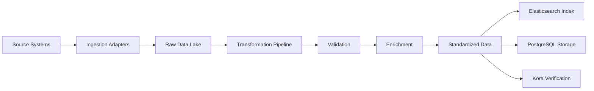

# MABA - Technical Architecture Specification

**Version**: 1.0.0  
**Last Updated**: November 15, 2024  
**Author**: GTCX Engineering Team  
**Status**: In Development  


## 1. System Overview

### Architecture Philosophy
MABA follows a **microservices-based, event-driven architecture** designed for:
- **Scalability**: Horizontal scaling of processing nodes
- **Resilience**: Fault-tolerant with automatic recovery
- **Flexibility**: Pluggable adapters for new data sources
- **Performance**: Distributed processing for high throughput
- **Maintainability**: Modular design with clear boundaries

### High-Level Architecture
```
┌─────────────────────────────────────────────────────────────┐
│                    MABA TRANSFORMATION ENGINE                │
├─────────────────────────────────────────────────────────────┤
│                                                              │
│  ┌──────────────┐  ┌──────────────┐  ┌──────────────┐     │
│  │   Ingestion  │  │Transformation│  │    Index     │     │
│  │   Adapters   │→ │   Pipeline   │→ │  Generator   │     │
│  └──────────────┘  └──────────────┘  └──────────────┘     │
│         ↑                ↑                   ↓              │
│  ┌──────────────────────────────────────────────────────┐  │
│  │            AI Schema Intelligence Layer               │  │
│  │         (Learning & Reconciliation Engine)            │  │
│  └──────────────────────────────────────────────────────┘  │
│                           ↓                                 │
│  ┌──────────────────────────────────────────────────────┐  │
│  │              Distributed Processing Layer             │  │
│  │                  (Ray + Apache Spark)                 │  │
│  └──────────────────────────────────────────────────────┘  │
│                                                              │
└─────────────────────────────────────────────────────────────┘
```


## 2. Component Architecture

### 2.1 Ingestion Layer

#### Purpose
Universal data intake from heterogeneous sources

#### Components
```yaml
Ingestion_Adapters:
  Database_Connectors:
    - PostgreSQL Adapter
    - MySQL Adapter
    - Oracle Adapter
    - MongoDB Adapter
    
  File_Processors:
    - CSV/TSV Parser
    - Excel Processor
    - JSON/XML Handler
    - PDF Extractor (with OCR)
    
  API_Integrators:
    - REST Client
    - GraphQL Client
    - SOAP Client
    - Webhook Receiver
    
  Stream_Processors:
    - Kafka Consumer
    - Pulsar Subscriber
    - MQTT Client
```

#### Technical Implementation
```python
# Base Adapter Interface
from abc import ABC, abstractmethod

class IngestionAdapter(ABC):
    """Base class for all ingestion adapters"""
    
    @abstractmethod
    async def connect(self, config: Dict) -> None:
        """Establish connection to data source"""
        pass
    
    @abstractmethod
    async def extract(self, query: Query) -> DataFrame:
        """Extract data based on query parameters"""
        pass
    
    @abstractmethod
    def validate_schema(self, data: DataFrame) -> ValidationResult:
        """Validate extracted data schema"""
        pass
    
    @abstractmethod
    async def checkpoint(self, state: IngestionState) -> None:
        """Save progress for resumable operations"""
        pass
```

### 2.2 Transformation Pipeline

#### Purpose
Convert heterogeneous data into standardized format

#### Components
```yaml
Transformation_Pipeline:
  Schema_Mapper:
    - AI-powered field matching
    - Semantic similarity engine
    - Confidence scoring
    - Manual override capability
    
  Data_Cleanser:
    - Null value handling
    - Data type conversion
    - Format standardization
    - Outlier detection
    
  Validator:
    - Completeness checks
    - Consistency validation
    - Business rule application
    - Cross-reference verification
    
  Enricher:
    - Geocoding services
    - Reference data lookup
    - Calculated fields
    - Metadata addition
```

#### Processing Flow
```python
class TransformationPipeline:
    def __init__(self):
        self.schema_mapper = SchemaMapper()
        self.cleanser = DataCleanser()
        self.validator = DataValidator()
        self.enricher = DataEnricher()
    
    async def transform(self, raw_data: DataFrame) -> TransformedData:
        # Step 1: Map schema
        mapped_data = await self.schema_mapper.map(raw_data)
        
        # Step 2: Cleanse data
        clean_data = await self.cleanser.clean(mapped_data)
        
        # Step 3: Validate
        valid_data = await self.validator.validate(clean_data)
        
        # Step 4: Enrich
        enriched_data = await self.enricher.enrich(valid_data)
        
        return TransformedData(
            data=enriched_data,
            metadata=self.generate_metadata(),
            quality_score=self.calculate_quality()
        )
```

### 2.3 AI Schema Intelligence

#### Purpose
Intelligent schema mapping and error resolution

#### Components
```yaml
AI_Intelligence:
  LLM_Engine:
    - Model: Fine-tuned GPT-4 for schema mapping
    - Training: Domain-specific cadastre data
    - Inference: Real-time field matching
    
  Vector_Store:
    - Embeddings: Field name and description vectors
    - Similarity: Cosine similarity matching
    - Index: FAISS/Pinecone for fast retrieval
    
  Learning_System:
    - Feedback loop from corrections
    - Pattern recognition
    - Continuous model improvement
    
  Error_Resolution:
    - Pattern-based fixes
    - Confidence thresholds
    - Human-in-the-loop for edge cases
```

#### Implementation
```python
class SchemaIntelligence:
    def __init__(self):
        self.llm = load_model("maba-schema-gpt4-v1")
        self.vector_store = VectorStore("schema-embeddings")
        self.learning_db = LearningDatabase()
    
    async def map_schema(self, source: Schema, target: Schema) -> MappingResult:
        # Generate embeddings
        source_embeddings = self.embed_schema(source)
        target_embeddings = self.embed_schema(target)
        
        # Find similarities
        similarities = self.vector_store.similarity_search(
            source_embeddings,
            target_embeddings
        )
        
        # Use LLM for ambiguous cases
        if similarities.max_confidence < 0.8:
            llm_suggestions = await self.llm.suggest_mappings(
                source=source,
                target=target,
                context=self.get_domain_context()
            )
            similarities = self.merge_suggestions(similarities, llm_suggestions)
        
        # Apply learned patterns
        mappings = self.apply_learned_patterns(similarities)
        
        return MappingResult(
            mappings=mappings,
            confidence=self.calculate_confidence(mappings)
        )
```

### 2.4 Distributed Processing

#### Purpose
Scale processing across multiple nodes

#### Technology Stack
```yaml
Distributed_Processing:
  Orchestration:
    - Ray: For distributed Python workloads
    - Apache Spark: For large-scale batch processing
    - Dask: For parallel computing
    
  Message_Queue:
    - Apache Kafka: Event streaming
    - Redis Streams: In-memory queue
    - RabbitMQ: Task distribution
    
  Coordination:
    - Apache Zookeeper: Distributed coordination
    - etcd: Configuration management
    - Consul: Service discovery
```

#### Scaling Strategy
```python
import ray

@ray.remote
class ProcessingWorker:
    def process_batch(self, batch: DataBatch) -> ProcessedBatch:
        # Process data batch
        transformed = self.transform(batch)
        validated = self.validate(transformed)
        indexed = self.index(validated)
        return ProcessedBatch(data=indexed, metrics=self.get_metrics())

class DistributedProcessor:
    def __init__(self, num_workers: int = 32):
        ray.init(num_cpus=num_workers)
        self.workers = [ProcessingWorker.remote() for _ in range(num_workers)]
    
    async def process_dataset(self, dataset: Dataset) -> Result:
        # Partition dataset
        batches = self.partition(dataset, batch_size=10000)
        
        # Distribute work
        futures = []
        for i, batch in enumerate(batches):
            worker = self.workers[i % len(self.workers)]
            futures.append(worker.process_batch.remote(batch))
        
        # Collect results
        results = await ray.get(futures)
        return self.merge_results(results)
```


## 3. Data Architecture

### 3.1 Data Model

#### Core Entities
```sql
-- Source Data Registry
CREATE TABLE source_systems (
    id UUID PRIMARY KEY,
    name VARCHAR(255) NOT NULL,
    type VARCHAR(50), -- database, file, api, stream
    connection_config JSONB,
    schema_definition JSONB,
    created_at TIMESTAMP DEFAULT NOW(),
    updated_at TIMESTAMP DEFAULT NOW()
);

-- Ingestion Jobs
CREATE TABLE ingestion_jobs (
    id UUID PRIMARY KEY,
    source_id UUID REFERENCES source_systems(id),
    status VARCHAR(50), -- pending, running, completed, failed
    started_at TIMESTAMP,
    completed_at TIMESTAMP,
    records_processed BIGINT DEFAULT 0,
    records_failed BIGINT DEFAULT 0,
    error_log JSONB,
    checkpoint JSONB -- for resumable operations
);

-- Transformed Data
CREATE TABLE transformed_parcels (
    id UUID PRIMARY KEY,
    maba_id VARCHAR(255) UNIQUE NOT NULL, -- Universal identifier
    source_id VARCHAR(255),
    source_system_id UUID REFERENCES source_systems(id),
    
    -- Core fields
    parcel_number VARCHAR(255),
    owner_name VARCHAR(255),
    owner_id VARCHAR(255),
    
    -- Spatial data
    geometry GEOMETRY(Polygon, 4326),
    area_hectares DECIMAL(10,4),
    
    -- Metadata
    ingestion_job_id UUID REFERENCES ingestion_jobs(id),
    transformation_version VARCHAR(20),
    quality_score DECIMAL(3,2),
    confidence_score DECIMAL(3,2),
    
    -- Audit
    created_at TIMESTAMP DEFAULT NOW(),
    updated_at TIMESTAMP DEFAULT NOW(),
    
    -- Search
    search_vector TSVECTOR,
    embedding VECTOR(768) -- for semantic search
);

-- Create indexes
CREATE INDEX idx_parcels_geometry ON transformed_parcels USING GIST (geometry);
CREATE INDEX idx_parcels_search ON transformed_parcels USING GIN (search_vector);
CREATE INDEX idx_parcels_embedding ON transformed_parcels USING ivfflat (embedding vector_cosine_ops);
```

### 3.2 Data Flow




## 4. API Architecture

### 4.1 REST API Design

#### Endpoints
```yaml
API_Endpoints:
  /api/v1/maba:
    /sources:
      GET: List all data sources
      POST: Register new source
      PUT /{id}: Update source configuration
      DELETE /{id}: Remove source
    
    /ingestion:
      POST /start: Start ingestion job
      GET /jobs: List ingestion jobs
      GET /jobs/{id}: Get job status
      POST /jobs/{id}/retry: Retry failed job
      DELETE /jobs/{id}: Cancel job
    
    /transform:
      POST /preview: Preview transformation
      POST /execute: Execute transformation
      GET /mappings: Get schema mappings
      PUT /mappings: Update mappings
    
    /search:
      POST /query: Search transformed data
      GET /suggest: Autocomplete suggestions
    
    /admin:
      GET /health: System health check
      GET /metrics: Performance metrics
      GET /logs: System logs
```

#### API Gateway Configuration
```nginx
# NGINX configuration for API Gateway
upstream maba_backend {
    least_conn;
    server maba-node-1:8000 weight=1;
    server maba-node-2:8000 weight=1;
    server maba-node-3:8000 weight=1;
}

server {
    listen 443 ssl http2;
    server_name api.maba.gtcx.global;
    
    # Rate limiting
    limit_req_zone $binary_remote_addr zone=api:10m rate=100r/s;
    limit_req zone=api burst=20 nodelay;
    
    # Caching
    proxy_cache_path /var/cache/nginx levels=1:2 keys_zone=maba:10m;
    
    location /api/v1/maba {
        proxy_pass http://maba_backend;
        proxy_cache maba;
        proxy_cache_valid 200 1m;
        
        # CORS headers
        add_header Access-Control-Allow-Origin *;
        add_header Access-Control-Allow-Methods "GET, POST, PUT, DELETE";
    }
}
```

### 4.2 GraphQL Schema

```graphql
type Query {
  # Data sources
  sources: [DataSource!]!
  source(id: ID!): DataSource
  
  # Ingestion jobs
  ingestionJobs(status: JobStatus, limit: Int): [IngestionJob!]!
  ingestionJob(id: ID!): IngestionJob
  
  # Transformed data
  searchParcels(query: String!, limit: Int): [Parcel!]!
  parcel(id: ID!): Parcel
  
  # Metrics
  systemMetrics: Metrics!
}

type Mutation {
  # Source management
  createSource(input: CreateSourceInput!): DataSource!
  updateSource(id: ID!, input: UpdateSourceInput!): DataSource!
  deleteSource(id: ID!): Boolean!
  
  # Ingestion control
  startIngestion(sourceId: ID!, options: IngestionOptions): IngestionJob!
  cancelIngestion(jobId: ID!): IngestionJob!
  retryIngestion(jobId: ID!): IngestionJob!
  
  # Transformation
  updateMapping(sourceId: ID!, mapping: MappingInput!): SchemaMapping!
}

type Subscription {
  # Real-time updates
  ingestionProgress(jobId: ID!): IngestionProgress!
  dataQualityAlerts: QualityAlert!
}
```


## 5. Infrastructure Architecture

### 5.1 Deployment Architecture

#### Kubernetes Configuration
```yaml
apiVersion: apps/v1
kind: Deployment
metadata:
  name: maba-transformation-engine
  namespace: gtcx-core
spec:
  replicas: 3
  selector:
    matchLabels:
      app: maba
  template:
    metadata:
      labels:
        app: maba
    spec:
      containers:
      - name: maba-api
        image: gtcx/maba:v1.0.0
        ports:
        - containerPort: 8000
        resources:
          requests:
            memory: "4Gi"
            cpu: "2"
          limits:
            memory: "8Gi"
            cpu: "4"
        env:
        - name: DATABASE_URL
          valueFrom:
            secretKeyRef:
              name: maba-secrets
              key: database-url
        - name: REDIS_URL
          valueFrom:
            secretKeyRef:
              name: maba-secrets
              key: redis-url
---
apiVersion: autoscaling/v2
kind: HorizontalPodAutoscaler
metadata:
  name: maba-hpa
  namespace: gtcx-core
spec:
  scaleTargetRef:
    apiVersion: apps/v1
    kind: Deployment
    name: maba-transformation-engine
  minReplicas: 3
  maxReplicas: 50
  metrics:
  - type: Resource
    resource:
      name: cpu
      target:
        type: Utilization
        averageUtilization: 70
  - type: Resource
    resource:
      name: memory
      target:
        type: Utilization
        averageUtilization: 80
```

### 5.2 Database Architecture

#### PostgreSQL Cluster
```yaml
Primary_Database:
  Type: PostgreSQL 15+
  Extensions:
    - PostGIS (spatial data)
    - pg_partman (partitioning)
    - pgvector (embeddings)
  Configuration:
    - max_connections: 500
    - shared_buffers: 8GB
    - work_mem: 256MB
  Replication:
    - 2 synchronous replicas
    - 1 asynchronous replica for analytics
  Backup:
    - Continuous archiving (WAL)
    - Daily snapshots
    - 30-day retention
```

#### Elasticsearch Cluster
```yaml
Search_Cluster:
  Version: 8.x
  Nodes:
    - 3 master nodes
    - 5 data nodes
    - 2 coordinating nodes
  Indices:
    - parcels (primary data)
    - parcels_staging (transformation preview)
    - audit_logs (system logs)
  Configuration:
    - Heap: 16GB per node
    - Shards: 5 primary, 1 replica
    - Refresh interval: 1s
```


## 6. Security Architecture

### 6.1 Authentication & Authorization

#### Authentication Methods
```yaml
Authentication:
  API_Keys:
    - For service-to-service communication
    - Rotated every 90 days
    - Stored in HashiCorp Vault
  
  OAuth2:
    - For user authentication
    - Supports SSO via SAML
    - JWT tokens with 1-hour expiry
  
  mTLS:
    - For internal service communication
    - Certificate-based authentication
    - Auto-renewal via cert-manager
```

#### Authorization Model
```python
# Role-based access control
class Roles(Enum):
    ADMIN = "admin"              # Full system access
    OPERATOR = "operator"        # Manage ingestion jobs
    ANALYST = "analyst"          # Read-only access
    SERVICE = "service"          # Service accounts

# Permission matrix
PERMISSIONS = {
    Roles.ADMIN: ["*"],
    Roles.OPERATOR: [
        "sources:read", "sources:write",
        "ingestion:read", "ingestion:write",
        "transform:read", "transform:write"
    ],
    Roles.ANALYST: [
        "sources:read",
        "ingestion:read",
        "transform:read",
        "search:read"
    ],
    Roles.SERVICE: [
        "search:read",
        "metrics:read"
    ]
}
```

### 6.2 Data Security

#### Encryption
```yaml
Encryption:
  At_Rest:
    - Database: Transparent Data Encryption (TDE)
    - File storage: AES-256
    - Backups: Encrypted with separate keys
  
  In_Transit:
    - TLS 1.3 for all API communication
    - IPSec for cross-region replication
    - Encrypted message queue (Kafka SSL)
  
  Key_Management:
    - HashiCorp Vault for key storage
    - Automatic key rotation
    - Hardware security module (HSM) for root keys
```

#### Data Privacy
```yaml
Privacy_Controls:
  PII_Detection:
    - Automatic scanning for personal data
    - Masking/tokenization options
    - Audit trail of access
  
  GDPR_Compliance:
    - Right to be forgotten
    - Data portability
    - Consent management
  
  Data_Residency:
    - Region-specific deployments
    - No cross-border transfers without approval
    - Local data processing requirements
```


## 7. Monitoring & Observability

### 7.1 Metrics

#### Application Metrics
```yaml
Application_Metrics:
  Throughput:
    - Records processed per hour
    - Ingestion rate (records/second)
    - Transformation speed (ms/record)
  
  Quality:
    - Schema mapping accuracy (%)
    - Error rate (%)
    - Data quality score (0-100)
  
  Performance:
    - API response time (p50, p95, p99)
    - Database query time
    - Cache hit rate (%)
```

#### Infrastructure Metrics
```yaml
Infrastructure_Metrics:
  Compute:
    - CPU utilization (%)
    - Memory usage (%)
    - Disk I/O (MB/s)
  
  Network:
    - Bandwidth usage (Mbps)
    - Packet loss (%)
    - Latency (ms)
  
  Storage:
    - Disk usage (%)
    - IOPS
    - Queue depth
```

### 7.2 Logging

#### Log Architecture
```yaml
Logging_Stack:
  Collection:
    - Fluentd agents on each node
    - Structured JSON logging
    - Log levels: DEBUG, INFO, WARN, ERROR
  
  Storage:
    - Elasticsearch for search
    - S3 for long-term archive
    - 90-day hot storage, 1-year cold storage
  
  Analysis:
    - Kibana dashboards
    - Automated anomaly detection
    - Alert generation
```

### 7.3 Tracing

#### Distributed Tracing
```yaml
Tracing:
  Implementation:
    - OpenTelemetry instrumentation
    - Jaeger for trace storage
    - Sampling rate: 1% (adjustable)
  
  Key_Traces:
    - End-to-end ingestion flow
    - Transformation pipeline
    - API request lifecycle
    - Database query execution
```


## 8. Disaster Recovery

### 8.1 Backup Strategy

```yaml
Backup_Strategy:
  Database:
    - Continuous replication
    - Point-in-time recovery (PITR)
    - Daily snapshots
    - Cross-region backup
  
  Application:
    - Container images in registry
    - Configuration in git
    - Secrets in Vault (backed up)
  
  Data:
    - Raw data lake backup
    - Transformed data backup
    - Index snapshots
```

### 8.2 Recovery Procedures

```yaml
Recovery_Procedures:
  RTO: 4 hours  # Recovery Time Objective
  RPO: 1 hour   # Recovery Point Objective
  
  Scenarios:
    Database_Failure:
      - Automatic failover to replica
      - Promote read replica if needed
      - Restore from backup if catastrophic
    
    Region_Failure:
      - DNS failover to backup region
      - Restore from cross-region backup
      - Replay message queue from checkpoint
    
    Data_Corruption:
      - Identify corruption timeframe
      - Restore to point before corruption
      - Replay valid transactions
```


## 9. Performance Optimization

### 9.1 Caching Strategy

```yaml
Caching_Layers:
  Application_Cache:
    - Redis for session data
    - In-memory cache for hot data
    - TTL: 5 minutes for dynamic, 1 hour for static
  
  Database_Cache:
    - PostgreSQL buffer cache
    - Prepared statement cache
    - Result set caching
  
  CDN:
    - CloudFront for static assets
    - API response caching
    - Geographic distribution
```

### 9.2 Query Optimization

```sql
-- Optimized query example
WITH filtered_parcels AS (
    SELECT p.*, 
           ts_rank(search_vector, plainto_tsquery($1)) AS rank
    FROM transformed_parcels p
    WHERE search_vector @@ plainto_tsquery($1)
      AND geometry && ST_MakeEnvelope($2, $3, $4, $5, 4326)
    ORDER BY rank DESC
    LIMIT 100
)
SELECT * FROM filtered_parcels
WHERE ST_Within(geometry, ST_GeomFromGeoJSON($6));

-- Explain analyze for optimization
EXPLAIN (ANALYZE, BUFFERS) SELECT ...;
```


## 10. Integration Specifications

### 10.1 Kora Integration

```yaml
Kora_Integration:
  Protocol: gRPC
  Endpoint: kora.gtcx.internal:50051
  
  Data_Flow:
    - MABA transforms and standardizes data
    - Sends to Kora for verification
    - Receives verification status
    - Updates records with verification proof
  
  Contract:
    - Max payload: 10MB
    - Timeout: 30 seconds
    - Retry: 3 attempts with exponential backoff
```

### 10.2 Amani Integration

```yaml
Amani_Integration:
  Protocol: REST + WebSocket
  Endpoint: amani.gtcx.internal:8080
  
  Data_Flow:
    - Amani queries MABA for data context
    - MABA provides indexed, searchable data
    - Real-time updates via WebSocket
  
  Features:
    - Full-text search
    - Semantic search via embeddings
    - Faceted filtering
    - Real-time notifications
```


## Appendix A: Technology Decisions

| Decision | Choice | Rationale |
|----------|--------|-----------|
| Language | Python 3.11+ | AI/ML ecosystem, rapid development |
| Framework | FastAPI | High performance, async support |
| Database | PostgreSQL | Reliability, PostGIS for spatial |
| Search | Elasticsearch | Scalability, full-text search |
| Queue | Kafka | High throughput, durability |
| Processing | Ray | Python-native distributed computing |
| Container | Docker | Standard, portable |
| Orchestration | Kubernetes | Industry standard, scalability |


## Appendix B: Capacity Planning

| Metric | Current | 6 Months | 1 Year | 3 Years |
|--------|---------|----------|--------|---------|
| Daily Records | 1M | 10M | 50M | 200M |
| Storage (TB) | 1 | 10 | 50 | 500 |
| API Requests/sec | 100 | 1,000 | 5,000 | 20,000 |
| Compute Nodes | 10 | 50 | 200 | 1,000 |
| Countries | 1 | 5 | 15 | 50 |


**Document Status**: Technical specification for implementation  
**Review Cycle**: Every sprint  
**Approval**: Chief Architect
