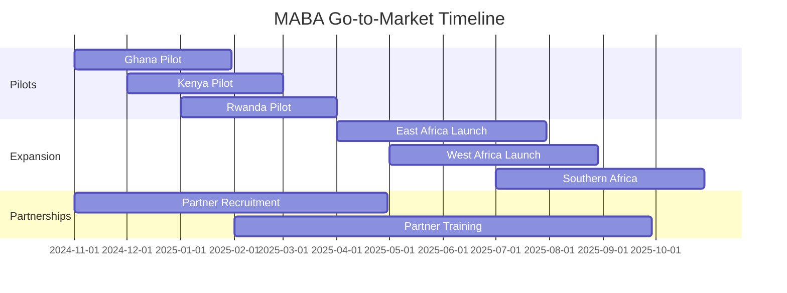

# MABA - Go-to-Market Strategy

**Version**: 1.0.0  
**Last Updated**: November 15, 2024  
**Status**: Strategic Planning  


## 1. Executive Summary

MABA targets the $2.8 billion African GovTech market, focusing on land registry modernization. With 90% of African land records still paper-based, MABA offers a critical transformation engine for the digital transition.

**Value Proposition**: Transform any land data format into a unified, verified digital registry in weeks, not years.

## 2. Market Analysis

### Total Addressable Market (TAM)
```yaml
African_Governments: 54 countries
  - Primary targets: 15 countries (active digitization)
  - Secondary: 20 countries (planning phase)
  - Future: 19 countries (awareness stage)

Market_Size:
  - Land registry modernization: $1.2B
  - Data transformation services: $800M
  - Ongoing maintenance: $500M/year
  - Training and support: $300M

Growth_Rate: 23% CAGR
```

### Competitive Landscape
| Competitor | Strengths | Weaknesses | Our Advantage |
|------------|-----------|------------|---------------|
| Thomson Reuters | Brand, resources | Expensive, slow | 10x faster, 70% cheaper |
| Local vendors | Regional knowledge | Limited scale | Pan-African solution |
| Big 4 Consultancies | Expertise | Manual processes | Automated AI-driven |
| In-house teams | Control | Lack expertise | Proven methodology |

## 3. Target Customer Segments

### Primary: Government Ministries
```yaml
Decision_Makers:
  - Minister of Lands
  - Director of Land Registry
  - Chief Digital Officer
  
Pain_Points:
  - 6-month backlog in registrations
  - 30% error rate in manual entry
  - No integration between systems
  - Compliance challenges
  
Budget: $5M - $50M per country
Timeline: 6-24 month projects
```

### Secondary: Development Partners
- World Bank
- African Development Bank
- UN-Habitat
- USAID
- GIZ

### Tertiary: Private Sector
- Banks (collateral verification)
- Insurance companies
- Real estate developers
- Agricultural businesses

## 4. Go-to-Market Approach

### Phase 1: Lighthouse Projects (Q4 2024 - Q1 2025)
```yaml
Countries: Ghana, Kenya, Rwanda
Strategy: Direct government engagement
Approach:
  - Free pilot for 100,000 records
  - Success metrics demonstration
  - Case study development
  - Reference customer creation
```

### Phase 2: Regional Expansion (Q2-Q3 2025)
```yaml
Regions:
  - East Africa: Tanzania, Uganda, Ethiopia
  - West Africa: Nigeria, Senegal, Côte d'Ivoire
  - Southern Africa: South Africa, Zambia, Botswana

Strategy: Partner-led growth
Channels:
  - System integrators
  - Regional consultancies
  - Development banks
```

### Phase 3: Continental Scale (Q4 2025+)
```yaml
Coverage: 25+ countries
Model: Platform + Services
Revenue: $100M ARR target
```

## 5. Pricing Strategy

### Pricing Models
```yaml
Transformation_Pricing:
  Tier_1: <1M records
    - $0.50 per record
    - Minimum $50,000
  
  Tier_2: 1M-10M records
    - $0.30 per record
    - Volume discount 40%
  
  Tier_3: >10M records
    - $0.15 per record
    - Enterprise agreement

Subscription_Model:
  - Monthly maintenance: $10,000
  - API access: $5,000/month
  - Support: 20% of license

Implementation_Services:
  - Setup: $25,000
  - Training: $10,000
  - Custom development: $1,500/day
```

### ROI Calculator
```
Traditional Manual Process:
- 10M records × 5 minutes/record = 833,333 hours
- Cost: $5M (labor) + $2M (errors) = $7M
- Timeline: 3 years

MABA Solution:
- Cost: $1.5M (transformation) + $500K (setup) = $2M
- Timeline: 3 months
- ROI: 250% in Year 1
```

## 6. Sales Strategy

### Direct Sales
```yaml
Team_Structure:
  - Regional Directors: 3
  - Account Executives: 6
  - Solution Engineers: 4
  - Customer Success: 3

Sales_Process:
  1. Awareness: Conferences, webinars
  2. Interest: Demo, pilot proposal
  3. Evaluation: POC, ROI analysis
  4. Negotiation: Contract terms
  5. Close: Implementation plan
  6. Success: Ongoing support

Sales_Cycle: 3-6 months
Average_Deal_Size: $2.5M
```

### Channel Partners
- IBM Africa
- Microsoft Africa
- Accenture Development
- Local system integrators

## 7. Marketing Strategy

### Content Marketing
```yaml
Thought_Leadership:
  - White papers on digital transformation
  - Case studies from pilot countries
  - ROI reports and benchmarks
  - Best practices guides

Webinars:
  - Monthly technical deep-dives
  - Quarterly executive briefings
  - Partner training sessions

SEO_Keywords:
  - "land registry digitization Africa"
  - "cadastral data transformation"
  - "government digital transformation"
```

### Events & Conferences
- Africa GovTech Summit
- Transform Africa Summit
- Smart Africa Conference
- AU Digital Transformation Forum
- World Bank Land Conference

### Digital Marketing
```yaml
Channels:
  - LinkedIn: Government decision makers
  - Twitter: Thought leadership
  - YouTube: Product demos, tutorials
  - Email: Nurture campaigns

Budget_Allocation:
  - Events: 40%
  - Digital: 30%
  - Content: 20%
  - PR: 10%
```

## 8. Partnership Strategy

### Technology Partners
```yaml
Cloud_Providers:
  - AWS: Infrastructure, credits
  - Azure: Government cloud
  - Google Cloud: AI/ML services

Integration_Partners:
  - ESRI: GIS integration
  - Oracle: Database systems
  - SAP: ERP connectivity
```

### Implementation Partners
- Regional consultancies
- System integrators
- Training organizations

### Strategic Alliances
- African Union Commission
- UNECA (UN Economic Commission for Africa)
- Smart Africa Alliance
- African Development Bank

## 9. Success Metrics

### Key Performance Indicators
| Metric | Q4 2024 | Q1 2025 | Q2 2025 | Q3 2025 |
|--------|---------|---------|---------|---------|
| Countries active | 3 | 5 | 10 | 15 |
| Records processed | 1M | 5M | 20M | 50M |
| ARR | $500K | $2M | $8M | $20M |
| Partner network | 5 | 10 | 25 | 50 |
| NPS Score | 50 | 60 | 70 | 80 |

### Customer Success Metrics
- Time to value: <30 days
- Adoption rate: >80%
- Renewal rate: >90%
- Expansion revenue: >120%

## 10. Risk Mitigation

### Market Risks
| Risk | Impact | Mitigation |
|------|--------|------------|
| Slow government adoption | High | Free pilots, success guarantees |
| Budget constraints | Medium | Flexible payment terms, donor funding |
| Competition | Medium | First-mover advantage, superior tech |
| Regulatory changes | Low | Compliance team, local partnerships |

## 11. 18-Month Roadmap




**Document Status**: Strategic document  
**Review Cycle**: Quarterly  
**Owner**: Chief Revenue Officer  
**Next Review**: January 2025
